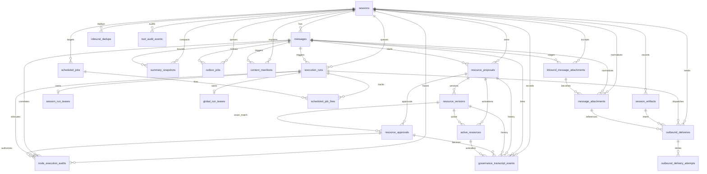
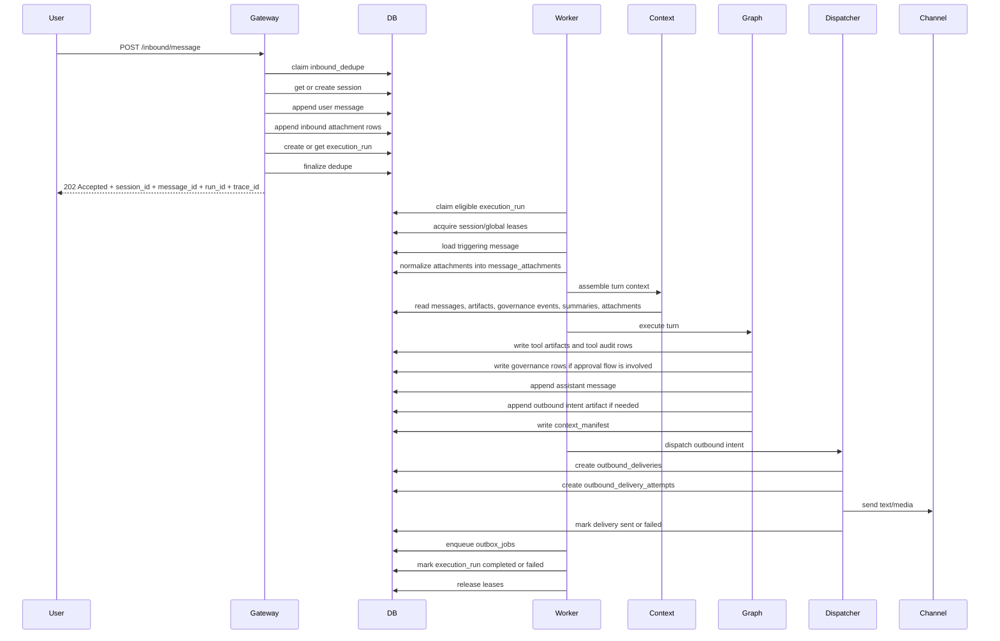

# Database Overview

This document explains the database schema in `python-claw`, how the code uses each table, and how data moves from the first inbound user message through the end of a conversation turn.

It is written for junior developers, so it focuses on three questions:

1. What does each table store?
2. Which code writes or reads it?
3. When in the application flow does that happen?

## 1. Big Picture

The database is the durable source of truth for the application. The main idea across Specs 001 through 008 is:

- the gateway accepts a message and writes canonical state first
- the worker executes the turn later from durable state
- the runtime appends assistant, tool, governance, and continuity records instead of mutating past transcript state
- diagnostics read durable records instead of reconstructing everything from logs

In practice, the tables fall into these groups:

- Conversation core: `sessions`, `messages`, `inbound_dedupe`
- Runtime and tool artifacts: `session_artifacts`, `tool_audit_events`
- Governance and approvals: `governance_transcript_events`, `resource_proposals`, `resource_versions`, `resource_approvals`, `active_resources`
- Queueing and scheduling: `execution_runs`, `session_run_leases`, `global_run_leases`, `scheduled_jobs`, `scheduled_job_fires`
- Continuity and context: `summary_snapshots`, `outbox_jobs`, `context_manifests`
- Media and outbound delivery: `inbound_message_attachments`, `message_attachments`, `outbound_deliveries`, `outbound_delivery_attempts`
- Remote execution and sandboxing: `node_execution_audits`, `agent_sandbox_profiles`

## 2. How The Specs Built The Schema

| Spec | Main database impact |
| --- | --- |
| 001 Gateway Sessions | Added durable session routing, transcript storage, and inbound dedupe with `sessions`, `messages`, `inbound_dedupe`. |
| 002 Runtime Tools | Added append-only runtime artifacts with `session_artifacts` and `tool_audit_events`. |
| 003 Capability Governance | Added governance and approval lifecycle tables. |
| 004 Context Continuity | Added summaries, outbox jobs, and manifest persistence. |
| 005 Async Queueing | Added queued execution runs, leases, and scheduler fire tracking. |
| 006 Node Sandbox | Added remote execution audit rows and agent sandbox profiles. |
| 007 Channels Media | Added inbound attachment staging, normalized attachments, and outbound delivery auditing. |
| 008 Observability Hardening | Extended existing operational tables with `trace_id`, failure metadata, and diagnostics reads. |

## 3. Main Code Paths That Touch The Database

These are the most important DB-facing code entry points:

- `apps/gateway/api/inbound.py`
  - Starts inbound acceptance with one transaction around `SessionService.process_inbound()`.
- `src/sessions/service.py`
  - Orchestrates session lookup, message append, attachment staging, run creation, and read APIs.
- `src/sessions/repository.py`
  - The main repository for transcript, artifacts, governance, continuity, attachments, and deliveries.
- `src/gateway/idempotency.py`
  - Owns `inbound_dedupe` claim/finalize logic.
- `src/jobs/repository.py`
  - Owns `execution_runs`, lease tables, and scheduler fire rows.
- `src/jobs/service.py`
  - Worker-side run claiming, execution, retries, and post-turn outbox enqueueing.
- `src/context/service.py`
  - Reads transcript, summaries, governance state, and attachments to assemble context; writes `context_manifests`.
- `src/graphs/nodes.py`
  - Appends assistant messages, runtime artifacts, governance state, and approval-driven changes.
- `src/media/processor.py`
  - Turns accepted inbound attachment references into normalized `message_attachments`.
- `src/channels/dispatch.py`
  - Creates and updates outbound delivery and attempt rows.
- `src/execution/audit.py`
  - Creates and updates `node_execution_audits`.
- `src/capabilities/repository.py` and `src/sandbox/service.py`
  - Read and update sandbox profile and approval-related execution metadata.
- `src/observability/diagnostics.py`
  - Reads operational tables for `/diagnostics/*` routes.

## 4. ERD

## 5. Sequence Diagram For One Normal User Turn

## 6. Step-By-Step Conversation Flow

This is the normal user-message flow from start to end of one conversation turn.

### Step 1: The gateway accepts an inbound message

Code:

- `apps/gateway/api/inbound.py`
- `src/sessions/service.py::SessionService.process_inbound`
- `src/gateway/idempotency.py::IdempotencyService`

Tables used:

- `inbound_dedupe`
- `sessions`
- `messages`
- `inbound_message_attachments`
- `execution_runs`

What happens:

1. The API receives `POST /inbound/message`.
2. `IdempotencyService.claim()` checks or creates an `inbound_dedupe` row so the same external message is not processed twice.
3. `SessionRepository.get_or_create_session()` finds or creates the durable conversation row in `sessions`.
4. `SessionRepository.append_message()` writes the user message into `messages`.
5. If attachments are present, `SessionRepository.append_inbound_attachments()` writes the accepted attachment metadata into `inbound_message_attachments`.
6. `JobsRepository.create_or_get_execution_run()` creates the queued worker task in `execution_runs`.
7. `IdempotencyService.finalize()` updates `inbound_dedupe` with the final `session_id` and `message_id`.
8. The gateway commits and returns `202 Accepted`.

Important design rule:

- the user-visible turn is durable before the worker starts

### Step 2: The worker claims the run

Code:

- `src/jobs/service.py::RunExecutionService.process_next_run`
- `src/jobs/repository.py::JobsRepository`
- `src/sessions/concurrency.py::SessionConcurrencyService`

Tables used:

- `execution_runs`
- `session_run_leases`
- `global_run_leases`

What happens:

1. The worker asks for the next eligible queued run.
2. `JobsRepository.claim_next_eligible_run()` picks an `execution_runs` row.
3. It acquires a per-session lane lease in `session_run_leases`.
4. It acquires a global concurrency slot in `global_run_leases`.
5. It marks the run `claimed` and then `running`.

Why these tables matter:

- `execution_runs` is the canonical queue
- `session_run_leases` prevents two workers from processing the same conversation at once
- `global_run_leases` enforces a whole-system concurrency cap

### Step 3: Attachments are normalized before context assembly

Code:

- `src/media/processor.py::MediaProcessor.normalize_message_attachments`

Tables used:

- `inbound_message_attachments`
- `message_attachments`

What happens:

1. The worker reads canonical accepted attachment inputs from `inbound_message_attachments`.
2. For each one, it validates scheme, MIME type, and size.
3. It stages safe content into runtime-owned storage.
4. It writes a new append-only normalized result row into `message_attachments`.

Important design rule:

- `inbound_message_attachments` is the accepted input record
- `message_attachments` is the normalized record the rest of the runtime consumes

### Step 4: Context is assembled from durable state

Code:

- `src/graphs/assistant_graph.py::AssistantGraph.invoke`
- `src/context/service.py::ContextService.assemble`

Tables used:

- `messages`
- `session_artifacts`
- `governance_transcript_events`
- `summary_snapshots`
- `message_attachments`

What happens:

1. The context service reads transcript rows from `messages`.
2. It reads prior tool and outbound artifacts from `session_artifacts`.
3. It reads approval and revocation history from `governance_transcript_events`.
4. It reads the latest valid summary from `summary_snapshots` if the transcript is too large.
5. It reads normalized stored attachments from `message_attachments`.
6. It builds `AssistantState` with the selected context.

If the turn overflows the context window:

- the service retries with summary compaction if possible
- if that still fails, it marks the turn degraded and the worker later queues repair work

### Step 5: The graph executes the assistant turn

Code:

- `src/graphs/nodes.py::execute_turn`

Tables used:

- `session_artifacts`
- `tool_audit_events`
- `governance_transcript_events`
- `resource_proposals`
- `resource_versions`
- `resource_approvals`
- `active_resources`
- `messages`

What happens:

1. The graph builds policy context and active approval visibility.
2. If the user is approving or revoking something, governance tables are updated.
3. If the turn needs approval for a gated action, the graph writes proposal and approval-request state instead of executing the action.
4. If tools run, the graph writes:
   - proposal/result artifacts to `session_artifacts`
   - audit rows to `tool_audit_events`
5. The graph always appends the assistant reply to `messages`.
6. If a tool produced a transport-independent outbound intent, it is stored in `session_artifacts` as `artifact_kind="outbound_intent"`.

Important design rule:

- the graph does not call channel transports directly

### Step 6: The manifest for the turn is persisted

Code:

- `src/context/service.py::ContextService.persist_manifest`
- called from `src/graphs/nodes.py::execute_turn`

Tables used:

- `context_manifests`

What happens:

1. After the turn finishes, the runtime writes one `context_manifests` row.
2. That manifest records what transcript range, summary, governance artifacts, and attachments were used.

Why it matters:

- it explains why the runtime saw the context it saw
- it is useful for debugging and replay reasoning

### Step 7: Outbound delivery is dispatched

Code:

- `src/channels/dispatch.py::OutboundDispatcher.dispatch_run`

Tables used:

- `session_artifacts`
- `outbound_deliveries`
- `outbound_delivery_attempts`
- `message_attachments`
- `execution_runs`

What happens:

1. The dispatcher loads outbound intents from `session_artifacts`.
2. It parses reply/media/voice directives from the intent text.
3. It chunks text for the destination channel.
4. For each logical send, it creates or reuses one `outbound_deliveries` row.
5. For each send attempt, it appends one `outbound_delivery_attempts` row.
6. It may read `message_attachments` if the outbound intent references normalized media.
7. It marks the delivery sent or failed after the adapter call returns.

Important design rule:

- one logical chunk or media send equals one `outbound_deliveries` row
- retries create new attempt rows, not duplicate logical delivery rows

### Step 8: Follow-up continuity work is queued

Code:

- `src/jobs/service.py::RunExecutionService._enqueue_after_turn_jobs`
- `src/sessions/repository.py::enqueue_outbox_job`

Tables used:

- `outbox_jobs`

What happens:

1. After the worker finishes the user-visible turn, it enqueues derived follow-up jobs.
2. It always queues:
   - `summary_generation`
   - `retrieval_index`
3. If the turn degraded, it also queues:
   - `continuity_repair`

Important design rule:

- `outbox_jobs` are derived work, not the canonical user-visible run queue

### Step 9: The run is completed, retried, or failed

Code:

- `src/jobs/service.py::RunExecutionService.process_next_run`
- `src/jobs/repository.py`

Tables used:

- `execution_runs`
- `session_run_leases`
- `global_run_leases`
- optionally `scheduled_job_fires`

What happens:

1. If everything succeeds, the worker marks the `execution_runs` row `completed`.
2. If a retryable failure happens, it updates the row to `retry_wait` or `dead_letter`.
3. If a non-retryable failure happens, it marks the run `failed`.
4. It releases the lane and global lease rows.
5. If the run came from the scheduler, it also updates `scheduled_job_fires`.

After that, the next inbound user message for the same routing identity repeats the same overall flow but reuses the existing `sessions` row. That is how a multi-turn conversation stays continuous over time instead of creating a brand-new conversation record for every message.

## 7. Table-By-Table Reference

### 7.1 Conversation Core

#### `sessions`

Purpose:

- One durable conversation identity for a routing tuple.

Written by:

- `SessionRepository.get_or_create_session()`

Read by:

- `SessionService.get_session()`
- `SessionService.process_inbound()`
- `RunExecutionService`
- `OutboundDispatcher`
- scheduler session resolution

Typical usage:

- Created on the first message for a peer/group route.
- Reused for later turns so one conversation keeps the same `session_id`.

Important columns:

- `id`: primary session identifier used everywhere else
- `session_key`: deterministic routing identity
- `channel_kind`, `channel_account_id`, `peer_id`, `group_id`, `scope_kind`, `scope_name`
- `last_activity_at`

#### `messages`

Purpose:

- Canonical append-only transcript.

Written by:

- `SessionRepository.append_message()`
- called from inbound acceptance, scheduler submission, and graph turn completion

Read by:

- `ContextService.assemble()`
- admin read endpoints
- diagnostics indirectly through correlated tables

Typical usage:

- User messages are appended on gateway accept.
- Assistant messages are appended after graph execution.
- Scheduler-triggered work creates a synthetic user-role message so it can reuse the same runtime path.

Important columns:

- `session_id`
- `role`
- `content`
- `external_message_id`
- `sender_id`

#### `inbound_dedupe`

Purpose:

- Prevent duplicate processing of the same external inbound message.

Written by:

- `IdempotencyService.claim()`
- `IdempotencyService.finalize()`

Read by:

- `IdempotencyService.claim()`
- duplicate replay handling in `SessionService.process_inbound()`

Typical usage:

- Claimed before transcript mutation.
- Finalized after the session, message, and run are durable.

Important columns:

- `(channel_kind, channel_account_id, external_message_id)` unique identity
- `status`
- `session_id`, `message_id`
- `first_seen_at`, `expires_at`

### 7.2 Runtime And Tool Artifact Tables

#### `session_artifacts`

Purpose:

- Append-only runtime-owned artifacts linked to a session.

What is stored here:

- tool proposals
- tool results
- outbound intents

Written by:

- `SessionRepository.append_tool_proposal()`
- `SessionRepository.append_tool_event()`
- `SessionRepository.append_outbound_intent()`

Read by:

- `ContextService.assemble()`
- `OutboundDispatcher.list_outbound_intents_for_run()`

Typical usage:

- The graph writes these during tool execution.
- Context assembly reuses them to explain prior tool activity.
- The dispatcher uses outbound intent artifacts after the turn ends.

#### `tool_audit_events`

Purpose:

- Structured audit trail for tool execution attempts and results.

Written by:

- `ToolAuditSink.record()`
- called from `src/graphs/nodes.py`

Read by:

- mainly for audit/inspection workflows; not heavily consumed in the current runtime

Typical usage:

- One row per governance-aware tool audit event.

### 7.3 Governance And Approval Tables

#### `governance_transcript_events`

Purpose:

- Append-only governance history linked to transcript turns.

Written by:

- `SessionRepository.append_governance_event()`
- `ActivationController.activate()`
- approval, denial, revocation paths in `src/graphs/nodes.py`

Read by:

- `ContextService.assemble()`
- `PolicyService.build_policy_context()`
- `SessionRepository.replay_active_approvals()`

Typical usage:

- Records proposal creation, approval requested, approval decision, activation result, and revocation result.

#### `resource_proposals`

Purpose:

- One proposed approval-gated capability/action request.

Written by:

- `SessionRepository.create_governance_proposal()`

Read by:

- pending approval endpoints
- approval/deny/revoke flows
- active approval lookup joins

Typical usage:

- Created when a gated action is requested without an active matching approval.

#### `resource_versions`

Purpose:

- Immutable versioned payload of what was proposed.

Written by:

- `SessionRepository.create_governance_proposal()`
- `CapabilitiesRepository.create_remote_exec_capability()`

Read by:

- approval matching
- node-runner authorization
- packet reconstruction

Typical usage:

- Stores the canonical payload hash and immutable version body.

#### `resource_approvals`

Purpose:

- Exact-match approval records for a proposal version and canonical parameters.

Written by:

- `SessionRepository.approve_proposal()`
- `CapabilitiesRepository.create_remote_exec_capability()`

Read by:

- `PolicyService.build_policy_context()`
- `PolicyService.assert_execution_allowed()`
- node execution audit correlation

Typical usage:

- A tool can execute only when there is a matching active approval.

#### `active_resources`

Purpose:

- Durable record that an approved resource/action is active and reusable under the exact approved scope.

Written by:

- `SessionRepository.activate_approved_resource()`

Read by:

- `SessionRepository.list_active_approvals()`
- revocation logic

Typical usage:

- Created or refreshed during approval activation.
- Revoked when the user revokes the proposal.

### 7.4 Queueing And Scheduling Tables

#### `execution_runs`

Purpose:

- Canonical async work queue for user-visible execution.

Written by:

- `JobsRepository.create_or_get_execution_run()`
- then updated by `mark_running()`, `complete_run()`, `fail_run()`, `retry_run()`

Read by:

- worker claim loop
- session and run read APIs
- diagnostics
- outbound dispatcher for trace correlation
- remote execution runtime

Typical usage:

- Created when the gateway accepts a user message.
- Claimed by workers.
- Moved through queued, running, retry, or terminal states.

Important columns:

- `trigger_kind`, `trigger_ref`: idempotent run identity
- `lane_key`: per-session ordering key
- `status`
- `attempt_count`, `max_attempts`
- `worker_id`
- `trace_id`, `correlation_id`
- `failure_category`, `degraded_reason`

#### `session_run_leases`

Purpose:

- One active per-session execution lease.

Written by:

- `JobsRepository.acquire_session_lease()`
- refreshed and released through `JobsRepository`

Read by:

- worker claim and stale recovery
- run diagnostics detail

Typical usage:

- Prevents two runs in the same session lane from running at the same time.

#### `global_run_leases`

Purpose:

- One active slot per global concurrency lane.

Written by:

- `JobsRepository.acquire_global_slot()`

Read by:

- worker claim and stale recovery
- run diagnostics detail

Typical usage:

- Limits total concurrent graph executions across all sessions.

#### `scheduled_jobs`

Purpose:

- Durable scheduler configuration.

Written by:

- currently read-heavy in the runtime; creation is expected through future/admin setup paths

Read by:

- `SchedulerService.submit_due_job()`
- `SessionService.submit_scheduler_fire()`

Typical usage:

- Defines a cron-like job and target session or routing tuple.

#### `scheduled_job_fires`

Purpose:

- Durable record of each concrete scheduled firing.

Written by:

- `JobsRepository.create_or_get_scheduled_fire()`
- `link_fire_to_run()`
- `mark_fire_terminal()` or `mark_fire_by_key()`

Read by:

- scheduler flow

Typical usage:

- Prevents duplicate scheduler submission for the same scheduled instant.

### 7.5 Continuity Tables

#### `summary_snapshots`

Purpose:

- Versioned compact summaries for older transcript ranges.

Written by:

- `SessionRepository.append_summary_snapshot()`

Read by:

- `ContextService.assemble()`
- continuity diagnostics

Typical usage:

- Used only when the full transcript no longer fits the context window.

#### `outbox_jobs`

Purpose:

- Derived post-turn background work queue.

Written by:

- `SessionRepository.enqueue_outbox_job()`
- called by `RunExecutionService._enqueue_after_turn_jobs()`

Read by:

- `SessionRepository.claim_outbox_jobs()`
- continuity diagnostics
- diagnostics list endpoint

Typical usage:

- Stores summary generation, retrieval indexing, and continuity repair work.

#### `context_manifests`

Purpose:

- Per-turn explanation of what context the runtime assembled.

Written by:

- `ContextService.persist_manifest()`

Read by:

- continuity diagnostics
- debugging and replay analysis

Typical usage:

- One row per executed turn, with bounded retention per session.

### 7.6 Media And Delivery Tables

#### `inbound_message_attachments`

Purpose:

- Canonical accepted attachment inputs from the gateway request.

Written by:

- `SessionRepository.append_inbound_attachments()`

Read by:

- `MediaProcessor.normalize_message_attachments()`
- replay/re-normalization workflows

Typical usage:

- Stores what the channel told the gateway before worker-side normalization.

#### `message_attachments`

Purpose:

- Canonical normalized attachment metadata consumed by runtime and delivery code.

Written by:

- `SessionRepository.append_message_attachment()`
- called by `MediaProcessor`

Read by:

- `ContextService.assemble()`
- `OutboundDispatcher`
- diagnostics attachments endpoint

Typical usage:

- Each row represents a normalization outcome such as `stored`, `rejected`, or `failed`.

#### `outbound_deliveries`

Purpose:

- One logical outbound send per chunk or media item.

Written by:

- `SessionRepository.create_or_get_outbound_delivery()`
- then updated by `mark_outbound_delivery_sent()` or `mark_outbound_delivery_failed()`

Read by:

- dispatcher retry/idempotency logic
- diagnostics delivery endpoint

Typical usage:

- Ensures retries reuse the same logical delivery identity.

#### `outbound_delivery_attempts`

Purpose:

- Append-only attempts for one logical delivery.

Written by:

- `SessionRepository.create_outbound_delivery_attempt()`
- then updated by sent/failed methods

Read by:

- diagnostics delivery endpoint

Typical usage:

- A failed retry creates a new attempt row under the same delivery row.

### 7.7 Remote Execution And Sandboxing Tables

#### `node_execution_audits`

Purpose:

- Durable audit row for a remote execution attempt handled by the node runner.

Written by:

- `ExecutionAuditRepository.insert_or_get()`
- `mark_rejected()`
- `mark_running()`
- `mark_finished()`

Read by:

- `NodeRunnerPolicy.authorize()`
- node-runner status API
- diagnostics node-executions endpoint

Typical usage:

- Tracks request identity, sandbox settings, execution status, stdout/stderr previews, and denial reasons.

#### `agent_sandbox_profiles`

Purpose:

- Per-agent default sandbox policy.

Written by:

- `CapabilitiesRepository.upsert_agent_sandbox_profile()`

Read by:

- `SandboxService.resolve()`
- `CapabilitiesRepository.get_agent_sandbox_profile()`

Typical usage:

- Controls whether an agent defaults to `off`, `shared`, or `agent` mode and what timeout/workspace rules apply.

## 8. Which Code Calls The Database, And When?

This section is the shortest mental model to keep in your head while reading the code.

### On inbound HTTP accept

- `SessionService.process_inbound()`
  - session lookup/create
  - append user message
  - append inbound attachment inputs
  - create or reuse execution run
- `IdempotencyService`
  - claim and finalize dedupe row

### On worker claim and execution

- `JobsRepository`
  - claim run
  - manage leases
  - mark running/completed/failed/retry
- `MediaProcessor`
  - convert accepted attachments into normalized attachment rows
- `ContextService`
  - read the history used for the turn
- `execute_turn()` in `src/graphs/nodes.py`
  - append assistant message
  - append tool artifacts and governance records
  - persist the context manifest
- `OutboundDispatcher`
  - create delivery and attempt rows and update statuses

### On approval-gated actions

- `SessionRepository.create_governance_proposal()`
  - creates `resource_proposals`, `resource_versions`, and governance history
- `SessionRepository.approve_proposal()`
  - creates `resource_approvals` and governance decision history
- `ActivationController.activate()`
  - creates or refreshes `active_resources` and writes activation history

### On diagnostics

- `DiagnosticsService`
  - reads `execution_runs`, lease tables, `outbox_jobs`, `node_execution_audits`, `outbound_deliveries`, `outbound_delivery_attempts`, `message_attachments`, `summary_snapshots`, and `context_manifests`

## 9. Practical Reading Order For Junior Developers

If you want to understand the database by following the code, use this order:

1. Read `src/db/models.py` to see every table.
2. Read `src/sessions/service.py::process_inbound()` for the gateway write path.
3. Read `src/sessions/repository.py` for the main persistence methods.
4. Read `src/jobs/service.py::process_next_run()` for the worker lifecycle.
5. Read `src/context/service.py` for continuity reads.
6. Read `src/graphs/nodes.py` for assistant/tool/governance writes.
7. Read `src/media/processor.py` and `src/channels/dispatch.py` for media and delivery records.
8. Read `src/observability/diagnostics.py` to see how operators inspect the system from durable state.

## 10. Final Mental Model

If you remember only one thing, remember this:

- `messages` is the canonical transcript
- `execution_runs` is the canonical user-visible async work queue
- `session_artifacts` and `governance_transcript_events` explain what happened during execution
- `summary_snapshots`, `outbox_jobs`, and `context_manifests` support continuity and inspection
- `message_attachments`, `outbound_deliveries`, and `outbound_delivery_attempts` explain media and transport work
- `node_execution_audits` explains privileged execution attempts

Everything else in the application is built to read from or append to those durable records rather than relying on in-memory state.
