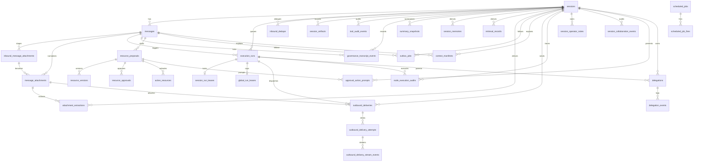
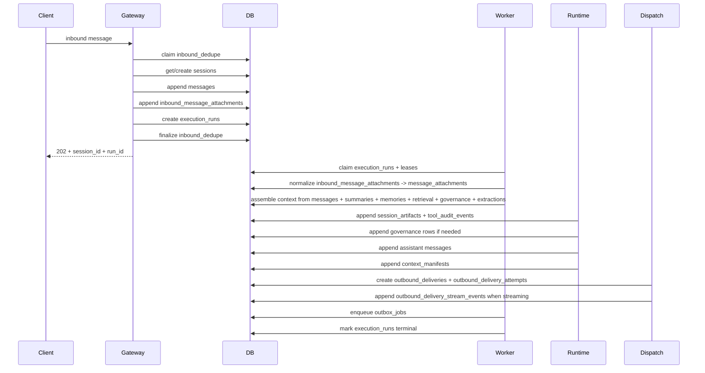

# Database Overview

This document explains the database structure for `python-claw` as it exists after Specs `001` through `017`.

It is written to answer four practical questions:

1. what durable records exist
2. why each table exists
3. which feature slice introduced it
4. how the records work together during runtime, approvals, delivery, delegation, collaboration, and recovery

The schema authority is the code in [`src/db/models.py`](/Users/scottcornell/src/my-projects/python-claw/src/db/models.py) plus the migration history in [`migrations/versions`](/Users/scottcornell/src/my-projects/python-claw/migrations/versions).

## 1. Big Picture

The database is the durable source of truth for the system.

The platform follows a few consistent rules across all specs:

- the gateway writes canonical inbound state first
- transcript rows are append-only
- workers execute from durable queue state rather than request memory
- approvals, deliveries, streaming events, node executions, delegations, and collaboration actions are all durable records
- summaries, memories, retrieval rows, extraction rows, and manifests are additive derived state, not canonical transcript truth
- diagnostics read the same durable records that runtime code uses

At a high level, the tables fall into these groups:

- conversation core
- runtime artifacts and tool auditing
- governance and approval state
- queueing and scheduling
- media, extraction, and outbound delivery
- context continuity and retrieval
- agent profiles, sandboxing, and node execution
- delegation and child-session orchestration
- collaboration and operator workflow
- rate limiting and production hardening

## 2. Spec-to-Schema Map

| Spec | Database impact |
| --- | --- |
| `001` Gateway Sessions | `sessions`, `messages`, `inbound_dedupe` |
| `002` Runtime Tools | `session_artifacts`, `tool_audit_events` |
| `003` Capability Governance | `governance_transcript_events`, `resource_proposals`, `resource_versions`, `resource_approvals`, `active_resources` |
| `004` Context Continuity | `summary_snapshots`, `outbox_jobs`, `context_manifests` |
| `005` Async Queueing | `execution_runs`, `session_run_leases`, `global_run_leases`, `scheduled_jobs`, `scheduled_job_fires` |
| `006` Node Sandbox | `node_execution_audits`, `agent_sandbox_profiles` |
| `007` Channels Media | `inbound_message_attachments`, `message_attachments`, `outbound_deliveries`, `outbound_delivery_attempts` |
| `008` Observability Hardening | adds trace/failure metadata to operational tables |
| `009` Provider Runtime | no major new table family, but later uses `model_profiles` and run metadata heavily |
| `010` Typed Tool Schemas | no standalone table family, but tightens governance identity and runtime artifact usage |
| `011` Retrieval / Memory / Attachment Understanding | `session_memories`, `retrieval_records`, `attachment_extractions` |
| `012` Production Channel Integration | expands session transport metadata and delivery/provider metadata usage |
| `013` Streaming Real-Time Delivery | `outbound_delivery_stream_events`, streaming fields on delivery attempts |
| `014` Agent Profiles | `model_profiles`, `agent_profiles`; adds session ownership and run profile binding fields |
| `015` Sub-Agent Delegation | `delegations`, `delegation_events`; child-session links on `sessions` |
| `016` Human Handoff / Collaboration | collaboration fields on `sessions`, `session_operator_notes`, `session_collaboration_events`, `approval_action_prompts`, blocked-run fields on `execution_runs` |
| `017` Production Hardening | `rate_limit_counters`; stronger operational ownership of existing run, outbox, delivery, node-exec, auth, and recovery metadata |

## 3. Core Design Rules

### Canonical vs derived state

Canonical state:

- `sessions`
- `messages`
- `inbound_dedupe`
- `execution_runs`
- governance approval/activation records
- outbound delivery records
- delegation records
- collaboration state on `sessions`

Derived or additive state:

- `summary_snapshots`
- `session_memories`
- `retrieval_records`
- `attachment_extractions`
- `context_manifests`
- `outbox_jobs`
- diagnostics-facing failure metadata

### Append-only expectations

The system prefers append-only records for auditability:

- `messages`
- `session_artifacts`
- `tool_audit_events`
- `governance_transcript_events`
- `delegation_events`
- `session_operator_notes`
- `session_collaboration_events`
- `outbound_delivery_attempts`
- `outbound_delivery_stream_events`

Some tables track current state and therefore update in place:

- `sessions`
- `execution_runs`
- `scheduled_jobs`
- `scheduled_job_fires`
- `resource_proposals`
- `active_resources`
- `outbox_jobs`
- `outbound_deliveries`
- `approval_action_prompts`
- `node_execution_audits`
- `rate_limit_counters`

### Durable identity boundaries

Important durable identities in the schema:

- session identity: `sessions.session_key`
- inbound dedupe identity: `channel_kind + channel_account_id + external_message_id`
- run identity: `execution_runs(trigger_kind, trigger_ref)`
- summary identity: `summary_snapshots(session_id, snapshot_version)`
- outbox identity: `outbox_jobs.job_dedupe_key`
- delivery identity: `outbound_deliveries(outbound_intent_id, chunk_index)`
- delivery attempt identity: `outbound_delivery_attempts(outbound_delivery_id, attempt_number)`
- stream event identity: `outbound_delivery_stream_events(outbound_delivery_attempt_id, sequence_number)`
- exact approval identity: proposal + version + typed action + canonical params hash
- delegation identity: `delegations(parent_run_id, parent_tool_call_correlation_id)`
- collaboration concurrency identity: `sessions.collaboration_version`

## 4. Main Runtime Relationships

## 5. Table-by-Table Reference

## Conversation Core

### `sessions`

Purpose:

- the durable identity of a conversation
- the routing anchor for direct, group, child, and system sessions
- the current source of truth for ownership and collaboration state

Important columns:

- `id`
- `session_key`
- `channel_kind`
- `channel_account_id`
- `scope_kind`
- `peer_id`
- `group_id`
- `scope_name`
- `owner_agent_id`
- `session_kind`
- `parent_session_id`
- `transport_address_key`
- `transport_address_json`
- `automation_state`
- `assigned_operator_id`
- `assigned_queue_key`
- `automation_state_reason`
- `automation_state_changed_at`
- `assignment_updated_at`
- `collaboration_version`
- `created_at`
- `last_activity_at`

Key behaviors from the specs:

- Spec `001`: direct and group routing identity
- Spec `012`: transport address metadata for provider-backed channels
- Spec `014`: durable session ownership by `owner_agent_id`
- Spec `015`: child-session support via `session_kind` and `parent_session_id`
- Spec `016`: automation state, assignment, and optimistic concurrency

Important indexes:

- unique `session_key`
- direct lookup on channel/account/peer/scope
- group lookup on channel/account/group
- owner-agent lookup
- parent-session lookup
- session-kind lookup
- automation and assignment lookups

Read/write code:

- [`src/routing/service.py`](/Users/scottcornell/src/my-projects/python-claw/src/routing/service.py)
- [`src/sessions/service.py`](/Users/scottcornell/src/my-projects/python-claw/src/sessions/service.py)
- [`src/sessions/repository.py`](/Users/scottcornell/src/my-projects/python-claw/src/sessions/repository.py)
- [`src/sessions/collaboration.py`](/Users/scottcornell/src/my-projects/python-claw/src/sessions/collaboration.py)
- [`src/delegations/service.py`](/Users/scottcornell/src/my-projects/python-claw/src/delegations/service.py)

### `messages`

Purpose:

- canonical append-only transcript rows

Important columns:

- `id`
- `session_id`
- `role`
- `content`
- `external_message_id`
- `sender_id`
- `created_at`

Key behaviors:

- Spec `001`: inbound transcript storage
- later specs: assistant/system rows, scheduler trigger rows, child-session rows, approval fallback text, delegation results

Important index:

- `messages(session_id, id)` for ordered paging

### `inbound_dedupe`

Purpose:

- idempotency guard for inbound message acceptance

Important columns:

- `status`
- `channel_kind`
- `channel_account_id`
- `external_message_id`
- `session_id`
- `message_id`
- `first_seen_at`
- `expires_at`

Key rule:

- a duplicate inbound delivery must not create a second canonical message row

## Runtime Artifacts and Tool Audit

### `session_artifacts`

Purpose:

- append-only runtime-owned artifacts linked to a session
- used for tool proposals, outbound intents, and other internal runtime records

Important columns:

- `artifact_kind`
- `correlation_id`
- `capability_name`
- `status`
- `payload_json`

### `tool_audit_events`

Purpose:

- append-only audit trail of tool requests, execution, and outcomes

Important columns:

- `correlation_id`
- `capability_name`
- `event_kind`
- `status`
- `payload_json`

Key rule from Spec `002`:

- the assistant must not claim a tool result that was never durably recorded

## Governance and Approval State

### `governance_transcript_events`

Purpose:

- append-only governance event log linked to transcript turns

Important columns:

- `event_kind`
- `proposal_id`
- `resource_version_id`
- `approval_id`
- `approval_prompt_id`
- `active_resource_id`
- `event_payload`

Use cases:

- proposal created
- awaiting approval
- approval granted or denied
- activation succeeded or failed
- revocation recorded

### `resource_proposals`

Purpose:

- one risky or approval-gated action proposal

Important columns:

- `resource_kind`
- `requested_by`
- `current_state`
- `latest_version_id`
- transition timestamps such as `proposed_at`, `pending_approval_at`, `approved_at`, `denied_at`, `expired_at`

### `resource_versions`

Purpose:

- immutable versioned payload for a proposal

Important columns:

- `proposal_id`
- `version_number`
- `content_hash`
- `resource_payload`

### `resource_approvals`

Purpose:

- exact approval record for a proposal version and action

Important columns:

- `proposal_id`
- `resource_version_id`
- `approval_packet_hash`
- `typed_action_id`
- `canonical_params_json`
- `canonical_params_hash`
- `scope_kind`
- `approver_id`
- `approved_at`
- `expires_at`
- `revoked_at`
- `revoked_by`

Key rule:

- approval is exact to resource version, action, and canonicalized parameters

### `active_resources`

Purpose:

- activation lifecycle after approval

Important columns:

- `proposal_id`
- `resource_version_id`
- `typed_action_id`
- `canonical_params_hash`
- `activation_state`
- `activated_at`
- `revoked_at`
- `revocation_reason`

### `approval_action_prompts`

Purpose:

- durable presentation state for structured approval UX

Introduced by:

- Spec `016`

Important columns:

- `proposal_id`
- `session_id`
- `agent_id`
- `message_id`
- `channel_kind`
- `channel_account_id`
- `transport_address_key`
- `approve_token_hash`
- `deny_token_hash`
- `status`
- `expires_at`
- `decided_at`
- `decided_via`
- `decider_actor_id`
- `presentation_payload_json`

Important rule:

- prompt rows are not approval authority by themselves; they are the durable presentation and decision-tracking layer above the exact approval system

## Queueing, Scheduling, and Recovery-Owned Work

### `execution_runs`

Purpose:

- canonical queue record for assistant execution

Important columns:

- `session_id`
- `message_id`
- `agent_id`
- `model_profile_key`
- `policy_profile_key`
- `tool_profile_key`
- `trigger_kind`
- `trigger_ref`
- `lane_key`
- `status`
- `attempt_count`
- `max_attempts`
- `available_at`
- `claimed_at`
- `started_at`
- `finished_at`
- `worker_id`
- `blocked_reason`
- `blocked_at`
- `last_error`
- `trace_id`
- `correlation_id`
- `degraded_reason`
- `failure_category`
- `created_at`
- `updated_at`

Statuses include:

- `queued`
- `blocked`
- `claimed`
- `running`
- `retry_wait`
- `completed`
- `failed`
- `dead_letter`
- `cancelled`

Key behaviors:

- Spec `005`: queue identity and retry ownership
- Spec `014`: persisted agent/model/policy/tool binding
- Spec `016`: blocked runs when collaboration state pauses automation
- Spec `017`: recovery and retry diagnostics rely on these rows

### `session_run_leases`

Purpose:

- one active per-lane lease so the same session lane is not processed concurrently

### `global_run_leases`

Purpose:

- whole-system concurrency cap

### `scheduled_jobs`

Purpose:

- durable scheduler definitions

Important columns:

- `job_key`
- `agent_id`
- `target_kind`
- routing fields
- `cron_expr`
- `payload_json`
- `enabled`
- `last_fired_at`

### `scheduled_job_fires`

Purpose:

- durable record of a concrete scheduler fire

Important columns:

- `fire_key`
- `scheduled_for`
- `status`
- `execution_run_id`
- `last_error`

## Media, Extraction, and Outbound Delivery

### `inbound_message_attachments`

Purpose:

- canonical accepted attachment inputs attached to a user message

Important columns:

- `message_id`
- `session_id`
- `ordinal`
- `external_attachment_id`
- `source_url`
- `mime_type`
- `filename`
- `byte_size`
- `provider_metadata_json`

### `message_attachments`

Purpose:

- normalized runtime-owned attachment records after validation and staging

Important columns:

- `inbound_message_attachment_id`
- `message_id`
- `session_id`
- `ordinal`
- `source_url`
- `storage_key`
- `storage_bucket`
- `mime_type`
- `media_kind`
- `filename`
- `byte_size`
- `sha256`
- `normalization_status`
- `retention_expires_at`
- `provider_metadata_json`
- `error_detail`

Important rule:

- only normalized attachment records should be used for runtime context or outbound media dispatch

### `attachment_extractions`

Purpose:

- extracted text or structured content from normalized attachments

Important columns:

- `session_id`
- `attachment_id`
- `extractor_kind`
- `derivation_strategy_id`
- `status`
- `content_text`
- `content_metadata_json`
- `error_detail`

### `outbound_deliveries`

Purpose:

- one logical outbound delivery per outbound intent and chunk

Important columns:

- `session_id`
- `execution_run_id`
- `outbound_intent_id`
- `channel_kind`
- `channel_account_id`
- `delivery_kind`
- `chunk_index`
- `chunk_count`
- `reply_to_external_id`
- `attachment_id`
- `provider_message_id`
- `delivery_payload_json`
- `provider_metadata_json`
- `status`
- `completion_status`
- `error_code`
- `error_detail`
- `trace_id`
- `failure_category`

Key rule from Specs `007`, `013`, and `017`:

- once a logical delivery row exists, transport retry ownership belongs to the delivery row plus its attempts

### `outbound_delivery_attempts`

Purpose:

- append-only transport attempts for a delivery

Important columns:

- `outbound_delivery_id`
- `attempt_number`
- `provider_idempotency_key`
- `status`
- `stream_status`
- `provider_stream_id`
- `last_sequence_number`
- `completion_reason`
- `provider_message_id`
- `provider_metadata_json`
- `retryable`
- `error_code`
- `error_detail`
- `trace_id`

### `outbound_delivery_stream_events`

Purpose:

- append-only durable streaming events for webchat replay and diagnostics

Introduced by:

- Spec `013`

Important columns:

- `outbound_delivery_id`
- `outbound_delivery_attempt_id`
- `sequence_number`
- `event_kind`
- `payload_json`

## Context Continuity, Memory, and Retrieval

### `summary_snapshots`

Purpose:

- versioned summary compaction over a message range

Important columns:

- `session_id`
- `snapshot_version`
- `base_message_id`
- `through_message_id`
- `source_watermark_message_id`
- `summary_text`
- `summary_metadata_json`

### `session_memories`

Purpose:

- additive durable memory rows extracted from transcript or summaries

Important columns:

- `memory_kind`
- `content_text`
- `content_hash`
- `status`
- `confidence`
- `source_kind`
- source references back to messages or summary snapshots
- `derivation_strategy_id`
- `payload_json`

### `retrieval_records`

Purpose:

- chunked retrieval entries derived from summaries, memories, or attachment extractions

Important columns:

- `session_id`
- `source_kind`
- `source_id`
- source references back to messages, summaries, memories, or attachment extractions
- `chunk_index`
- `content_text`
- `content_hash`
- `ranking_metadata_json`
- `derivation_strategy_id`

### `outbox_jobs`

Purpose:

- after-turn derived-state work such as summaries, memory extraction, retrieval indexing, and repair

Important columns:

- `session_id`
- `message_id`
- `job_kind`
- `job_dedupe_key`
- `status`
- `attempt_count`
- `available_at`
- `payload_json`
- `last_error`
- `trace_id`
- `failure_category`

Important rule:

- outbox jobs are post-commit derived work, not the canonical queue for user-visible execution

### `context_manifests`

Purpose:

- durable explanation of which transcript, summaries, retrieval rows, memory rows, governance state, and attachment-derived inputs were used for a run

Important columns:

- `session_id`
- `message_id`
- `manifest_json`
- `degraded`

## Agent Profiles, Delegation, Sandboxing, and Node Execution

### `model_profiles`

Purpose:

- named runtime model configurations

Important columns:

- `profile_key`
- `runtime_mode`
- `provider`
- `model_name`
- `temperature`
- `max_output_tokens`
- `timeout_seconds`
- `tool_call_mode`
- `streaming_enabled`
- `enabled`
- `base_url`

### `agent_profiles`

Purpose:

- durable agent identity and default profile bindings

Important columns:

- `agent_id`
- `display_name`
- `role_kind`
- `description`
- `default_model_profile_id`
- `policy_profile_key`
- `tool_profile_key`
- `enabled`
- `disabled_at`

### `agent_sandbox_profiles`

Purpose:

- per-agent sandbox defaults for node execution

Important columns:

- `agent_id`
- `default_mode`
- `shared_profile_key`
- `allow_off_mode`
- `max_timeout_seconds`

### `node_execution_audits`

Purpose:

- durable audit trail of remote execution requests and outcomes

Important columns:

- `request_id`
- `execution_run_id`
- `tool_call_id`
- `execution_attempt_number`
- `message_id`
- `session_id`
- `agent_id`
- `requester_kind`
- `sandbox_mode`
- `sandbox_key`
- `workspace_root`
- `workspace_mount_mode`
- `command_fingerprint`
- `typed_action_id`
- `approval_id`
- `resource_version_id`
- `status`
- `deny_reason`
- `exit_code`
- `stdout_preview`
- `stderr_preview`
- truncation flags
- `started_at`
- `finished_at`
- `duration_ms`
- `trace_id`

Key behaviors:

- signed request correlation
- approval linkage
- sandbox identity
- execution result and denial tracking

### `delegations`

Purpose:

- one durable parent-to-child delegation

Introduced by:

- Spec `015`

Important columns:

- `parent_session_id`
- `parent_message_id`
- `parent_run_id`
- `parent_tool_call_correlation_id`
- `parent_agent_id`
- `child_session_id`
- `child_message_id`
- `child_run_id`
- `child_agent_id`
- `parent_result_message_id`
- `parent_result_run_id`
- `status`
- `depth`
- `delegation_kind`
- `task_text`
- `context_payload_json`
- `result_payload_json`
- `failure_detail`
- `cancel_reason`
- timestamps for queued/started/completed

### `delegation_events`

Purpose:

- append-only audit history of delegation lifecycle changes

Important columns:

- `delegation_id`
- `event_kind`
- `status`
- `actor_kind`
- `actor_ref`
- `payload_json`

## Collaboration and Operator Workflow

### `session_operator_notes`

Purpose:

- append-only internal notes attached to a session

Important columns:

- `session_id`
- `author_kind`
- `author_id`
- `note_kind`
- `body`

### `session_collaboration_events`

Purpose:

- append-only audit history of takeover, pause, resume, assignment, notes, suppressed dispatch, and operator-driven actions

Important columns:

- `session_id`
- `event_kind`
- `actor_kind`
- `actor_id`
- `automation_state_before`
- `automation_state_after`
- `assigned_operator_before`
- `assigned_operator_after`
- `assigned_queue_before`
- `assigned_queue_after`
- `related_run_id`
- `related_note_id`
- `related_proposal_id`
- `payload_json`

Key rule:

- mutable collaboration state lives on `sessions`; immutable history lives here

## Production Hardening and Quota State

### `rate_limit_counters`

Purpose:

- bounded durable quota counters for gateway and worker rate limits

Introduced by:

- Spec `017`

Important columns:

- `scope_kind`
- `scope_key`
- `window_seconds`
- `window_start`
- `count`
- `last_seen_at`

Used for:

- inbound request limits
- operator/admin request limits
- approval callback limits
- provider request and token budget enforcement

## 6. End-to-End Data Flow

## Normal inbound turn

## Approval-gated turn

When the assistant proposes a governed action:

1. the runtime appends a `resource_proposals` row
2. it appends a `resource_versions` row
3. it appends governance transcript events
4. if structured prompt UX is enabled, it creates `approval_action_prompts`
5. after approval, it creates `resource_approvals`
6. activation creates or updates `active_resources`
7. remote execution, if applicable, writes `node_execution_audits`

## Delegation turn

When a parent agent delegates:

1. the parent run writes a `delegations` row
2. a child `sessions` row exists or is created with `session_kind=child`
3. a child trigger `messages` row is appended
4. a child `execution_runs` row is created
5. child lifecycle changes append `delegation_events`
6. the parent continuation later writes `parent_result_message_id` and `parent_result_run_id`

## Collaboration-aware turn

When a session is under takeover or pause:

1. inbound `messages` still append normally
2. the corresponding `execution_runs` row is created as `blocked`
3. `blocked_reason` records why automation did not start
4. session state updates live on `sessions`
5. immutable history appends to `session_collaboration_events`
6. operator notes append to `session_operator_notes`

## 7. Important Invariants

- `sessions.session_key` is unique and stable for the same routing tuple
- `messages` are append-only transcript truth
- `inbound_dedupe` prevents duplicate external message ingestion
- each trigger identity maps to at most one `execution_runs` row
- per-session concurrency is enforced through `session_run_leases`
- global concurrency is enforced through `global_run_leases`
- derived context state can be rebuilt from canonical transcript plus attachments and governance records
- exact approvals are bound to versioned proposal payload plus canonical params hash
- a logical outbound delivery is unique per outbound intent and chunk
- stream replay is append-only and sequence ordered
- delegation identity is unique per parent run and tool-call correlation
- collaboration history is append-only, while current collaboration state lives on `sessions`
- quota counters are durable and bounded by window and scope

## 8. Primary Code Paths by Table Family

Conversation and routing:

- [`src/routing/service.py`](/Users/scottcornell/src/my-projects/python-claw/src/routing/service.py)
- [`src/sessions/service.py`](/Users/scottcornell/src/my-projects/python-claw/src/sessions/service.py)
- [`src/sessions/repository.py`](/Users/scottcornell/src/my-projects/python-claw/src/sessions/repository.py)
- [`src/gateway/idempotency.py`](/Users/scottcornell/src/my-projects/python-claw/src/gateway/idempotency.py)

Runs and scheduler:

- [`src/jobs/repository.py`](/Users/scottcornell/src/my-projects/python-claw/src/jobs/repository.py)
- [`src/jobs/service.py`](/Users/scottcornell/src/my-projects/python-claw/src/jobs/service.py)
- [`apps/worker/jobs.py`](/Users/scottcornell/src/my-projects/python-claw/apps/worker/jobs.py)
- [`apps/worker/scheduler.py`](/Users/scottcornell/src/my-projects/python-claw/apps/worker/scheduler.py)

Runtime, governance, and approvals:

- [`src/graphs/nodes.py`](/Users/scottcornell/src/my-projects/python-claw/src/graphs/nodes.py)
- [`src/policies/service.py`](/Users/scottcornell/src/my-projects/python-claw/src/policies/service.py)
- [`src/policies/approval_actions.py`](/Users/scottcornell/src/my-projects/python-claw/src/policies/approval_actions.py)
- [`src/capabilities/activation.py`](/Users/scottcornell/src/my-projects/python-claw/src/capabilities/activation.py)

Context, memory, retrieval, media, and delivery:

- [`src/context/service.py`](/Users/scottcornell/src/my-projects/python-claw/src/context/service.py)
- [`src/context/outbox.py`](/Users/scottcornell/src/my-projects/python-claw/src/context/outbox.py)
- [`src/memory/service.py`](/Users/scottcornell/src/my-projects/python-claw/src/memory/service.py)
- [`src/retrieval/service.py`](/Users/scottcornell/src/my-projects/python-claw/src/retrieval/service.py)
- [`src/media/processor.py`](/Users/scottcornell/src/my-projects/python-claw/src/media/processor.py)
- [`src/media/extraction.py`](/Users/scottcornell/src/my-projects/python-claw/src/media/extraction.py)
- [`src/channels/dispatch.py`](/Users/scottcornell/src/my-projects/python-claw/src/channels/dispatch.py)

Agents, delegation, collaboration, and diagnostics:

- [`src/agents/service.py`](/Users/scottcornell/src/my-projects/python-claw/src/agents/service.py)
- [`src/delegations/service.py`](/Users/scottcornell/src/my-projects/python-claw/src/delegations/service.py)
- [`src/sessions/collaboration.py`](/Users/scottcornell/src/my-projects/python-claw/src/sessions/collaboration.py)
- [`src/observability/diagnostics.py`](/Users/scottcornell/src/my-projects/python-claw/src/observability/diagnostics.py)
- [`src/execution/audit.py`](/Users/scottcornell/src/my-projects/python-claw/src/execution/audit.py)

## 9. What Changed Compared To The Older Database Doc

The previous version of this document stopped effectively around Spec `008`. The biggest gaps it had were:

- no coverage for `model_profiles` and `agent_profiles`
- no coverage for `session_memories`, `retrieval_records`, or `attachment_extractions`
- no coverage for `outbound_delivery_stream_events`
- no coverage for `delegations` or `delegation_events`
- no coverage for collaboration state on `sessions`
- no coverage for `session_operator_notes` or `session_collaboration_events`
- no coverage for `approval_action_prompts`
- no coverage for `rate_limit_counters`
- no explanation of how later specs changed `execution_runs`, `sessions`, and delivery ownership

This version closes those gaps and aligns the database guide with Specs `001` through `017`.
