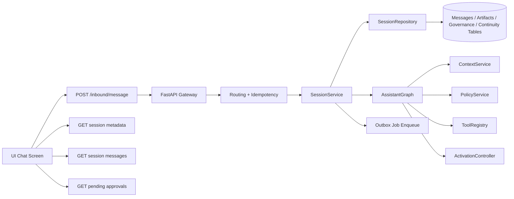
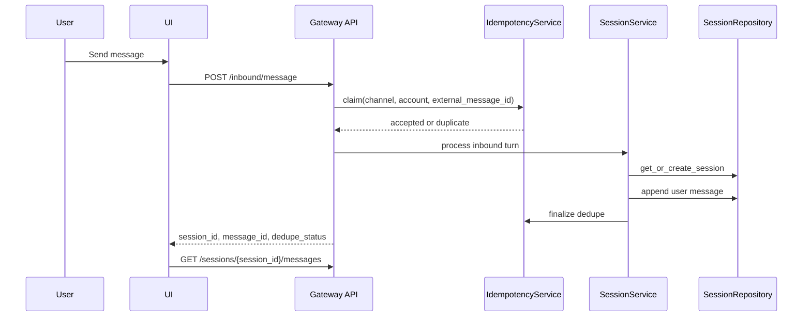
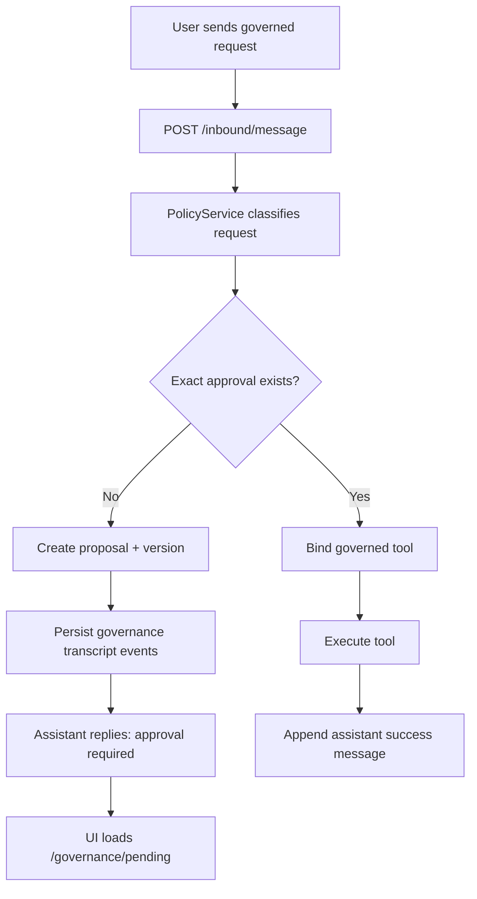
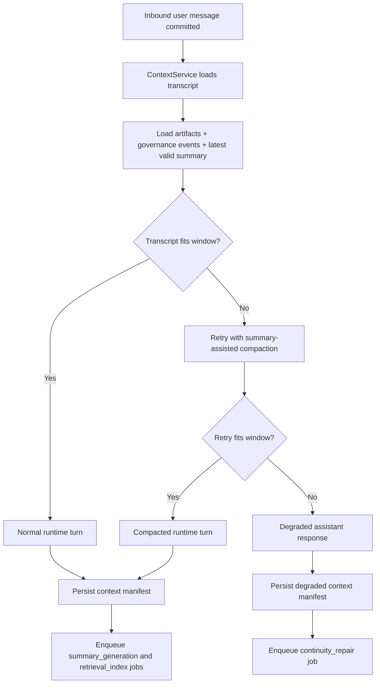

# UI Guide For Specs 001 To 004

This document explains how a future UI should interact with `python-claw` as implemented through Specs `001` to `004`.

The goal is not to design pixels yet. The goal is to make the interaction contract clear so a later web or desktop UI can be built without guessing how the backend behaves.

## Purpose

The UI should treat `python-claw` as a gateway-owned assistant runtime with four active layers:

1. Spec `001`: canonical session routing, append-only transcript storage, and inbound dedupe
2. Spec `002`: single-turn runtime with typed local tools
3. Spec `003`: approval-aware capability governance
4. Spec `004`: transcript-first context continuity, summaries, manifests, and repair jobs

The UI should never bypass the gateway and should never try to talk directly to graph, policy, or repository internals.

## Current Backend Surface

The backend currently exposes these HTTP endpoints:

- `GET /health`
- `POST /inbound/message`
- `GET /sessions/{session_id}`
- `GET /sessions/{session_id}/messages`
- `GET /sessions/{session_id}/governance/pending`

That means a first UI can already support:

- sending a message
- reloading a session transcript
- showing pending approvals

The backend already persists more state for Spec `004`, but read endpoints for that state are not exposed yet. A future UI will benefit from adding:

- `GET /sessions/{session_id}/context/latest`
- `GET /sessions/{session_id}/context/manifests`
- `GET /sessions/{session_id}/outbox`
- `GET /sessions/{session_id}/summaries/latest`
- `GET /sessions`

These are recommendations for the future UI phase, not current requirements.

## Main UI Surfaces

A practical UI for Specs `001` to `004` should have these surfaces:

- Chat view: transcript list, composer, send state, and assistant continuity notices
- Session metadata panel: session id, scope kind, peer or group identity, and last activity
- Pending approvals panel: proposal id, capability name, exact parameter packet, and approval controls
- Continuity inspector: latest assembly mode, degraded flag, summary usage, and repair-job status

## Interaction Model

## Core Flow 1: Start Or Resume A Conversation

This is the primary UI flow for Spec `001`.

### User Experience

1. The user opens the UI and selects or starts a conversation.
2. The user types a message and presses send.
3. The UI submits one inbound event to `POST /inbound/message`.
4. The UI stores the returned `session_id`.
5. The UI reloads transcript data from `GET /sessions/{session_id}/messages`.

### UI Inputs

The UI needs to send:

- `channel_kind`
- `channel_account_id`
- `external_message_id`
- `sender_id`
- `content`
- exactly one of `peer_id` or `group_id`

The UI should generate a unique `external_message_id` for each send attempt and reuse it if it retries the same client action.

### Backend Elements Involved

At this stage the backend path is:

- `apps/gateway/api/inbound.py`
- `src.routing.service.normalize_routing_input`
- `src.gateway.idempotency.IdempotencyService`
- `src.sessions.service.SessionService.process_inbound`
- `src.sessions.repository.SessionRepository`

### What The UI Should Expect

- A new conversation or existing conversation both return HTTP `201`
- The response includes `session_id`, `message_id`, and `dedupe_status`
- `dedupe_status` is `accepted` for a new inbound event and `duplicate` when the same inbound event was already processed
- The transcript is append-only

### Recommended UI Treatment

- Show optimistic local sending state only until the `201` returns
- If `dedupe_status` is `duplicate`, do not render a second local copy
- If the backend returns `400`, show a routing/input error
- If the backend returns `409`, show a retryable "message still processing" state

## Core Flow 2: Normal Assistant Turn

This is the standard Spec `002` experience when the message does not require approval.

### User Experience

1. The user sends a message like normal text or `echo hello`.
2. The UI waits for the request to finish.
3. The transcript reload shows the assistant reply.

### Backend Elements Involved

This stage adds:

- `src.context.service.ContextService`
- `src.graphs.assistant_graph.AssistantGraph`
- `src.graphs.nodes.execute_turn`
- `src.providers.models.ModelAdapter`
- `src.tools.registry.ToolRegistry`
- `src.observability.audit.ToolAuditSink`

### Backend Behavior

After the user message is stored, the backend:

1. assembles context from transcript and continuity data
2. builds policy context
3. binds currently allowed tools
4. runs the single-turn model
5. optionally executes safe tools
6. appends one final assistant message
7. persists one context manifest
8. enqueues continuity outbox jobs

### Recommended UI Treatment

- Keep the chat UI simple: one user message in, one assistant message out
- Do not expose low-level tool events in the main chat unless the product wants a developer mode
- If the assistant reply came from a tool, render it like any other assistant message
- Optionally surface a small "runtime used tools" badge later through a developer panel

## Core Flow 3: Approval Required For A Governed Action

This is the main Spec `003` UX.

If a user asks for a governed capability such as `send hello channel`, the assistant does not execute it immediately unless an exact approval already exists.

### User Experience

1. The user requests a governed action.
2. The assistant replies that approval is required.
3. The UI shows a pending approval card or drawer.
4. The user reviews the exact packet.
5. The user approves it.
6. The assistant confirms approval and activation.
7. The user retries the original request.

### Backend Elements Involved

This stage adds:

- `src.policies.service.PolicyService`
- `src.tools.typed_actions`
- `src.capabilities.activation.ActivationController`
- governance writes in `src.sessions.repository.SessionRepository`

The persistence layer now includes:

- `resource_proposals`
- `resource_versions`
- `resource_approvals`
- `active_resources`
- `governance_transcript_events`

### UI Step By Step

| UI step | UI action | Backend interaction | Main backend components |
|---|---|---|---|
| 1 | User sends governed request | `POST /inbound/message` | Gateway API, `SessionService`, `PolicyService`, `AssistantGraph` |
| 2 | UI reloads transcript | `GET /sessions/{session_id}/messages` | Admin API, `SessionService`, `SessionRepository` |
| 3 | UI loads pending approvals | `GET /sessions/{session_id}/governance/pending` | Admin API, `SessionService`, `SessionRepository` |
| 4 | User clicks approve | `POST /inbound/message` with `approve <proposal_id>` | Gateway API, `PolicyService`, `ActivationController`, repository governance writes |
| 5 | UI reloads pending approvals | `GET /sessions/{session_id}/governance/pending` | Admin API, repository pending-query path |
| 6 | User retries original action | `POST /inbound/message` | Gateway API, `PolicyService`, `ToolRegistry`, governed tool execution |

### Recommended UI Components

- Pending approval list
- Approval detail modal
- Packet viewer showing capability name, typed action id, canonical params, proposal id, and requester
- Approve button
- Revoke button for already active items in a later UI revision

### Important Product Rule

The UI should show that approval is exact-match. Approval is not "allow this tool forever." It is approval for a specific capability plus a specific normalized parameter payload.

## Core Flow 4: Approved Governed Action

Once approval exists and activation is active, the user retries the original request.

### User Experience

1. The user resubmits the same intent.
2. The assistant completes the action.
3. The transcript shows the successful assistant result.

In the current implementation, the governed `send_message` tool creates an outbound intent and the assistant response is `Prepared outbound message: <text>`.

### Backend Elements Involved

This path uses:

- `PolicyService.build_policy_context`
- `PolicyService.assert_execution_allowed`
- `ToolRegistry.bind_tools`
- the governed tool implementation
- `SessionRepository.append_outbound_intent`
- `SessionRepository.append_tool_event`
- `ToolAuditSink`

### Recommended UI Treatment

- Render the assistant success message in chat
- Optionally show a structured "prepared action" card in an inspector
- If the product later adds actual transport dispatch, keep that as a separate delivery state and do not blur it with "assistant prepared intent"

## Core Flow 5: Revoke A Previously Approved Capability

This is the second major Spec `003` administrative flow.

### User Experience

1. The user or admin revokes a proposal with `revoke <proposal_id>`.
2. The assistant confirms revocation.
3. A future governed request for the same payload requires approval again.

### Backend Elements Involved

This path uses:

- `PolicyService` classification
- repository revocation writes
- `ActivationController` state already persisted in `active_resources`
- governance transcript events for replay safety

### Recommended UI Treatment

- Show revoked state on approval history items
- Remove revoked items from "active" views
- Explain that future retries may create a fresh approval request

## Core Flow 6: Continuity, Compaction, And Repair

This is the main Spec `004` UX.

The canonical conversation state remains the transcript and transcript-linked artifacts. Summaries and manifests help the runtime fit and inspect context, but they do not replace the transcript.

### User Experience

Most of the time the user just chats normally and notices nothing special.

When history grows large:

1. the backend first tries full transcript assembly
2. if needed, it retries with summary-assisted compaction
3. if the turn still cannot fit safely, the assistant returns a bounded continuity failure
4. the backend queues repair work

### Backend Elements Involved

This stage relies on:

- `src.context.service.ContextService`
- `src.context.outbox.OutboxWorker`
- continuity reads and writes in `SessionRepository`

The main continuity tables are:

- `summary_snapshots`
- `context_manifests`
- `outbox_jobs`

### What The UI Should Show

For normal users:

- nothing extra during successful compacted turns
- a clear assistant notice if continuity degraded

For support or admin users:

- latest manifest assembly mode
- whether a summary snapshot was used
- whether the turn degraded
- whether a `continuity_repair` outbox job was queued

### Recommended Future UI Endpoints

To support this cleanly, add read endpoints for:

- latest manifest by session
- manifest by message id
- outbox jobs by session
- latest valid summary snapshot

### Continuity Flow Image

## UI-State Recommendations

The UI should model these states explicitly:

- `idle`
- `sending`
- `accepted`
- `duplicate`
- `processing_conflict`
- `approval_required`
- `approved`
- `revoked`
- `continuity_degraded`

These are UI states, not backend enum names, but they map well to the current backend behavior.

## Suggested First UI Build

A good first UI for the current backend should support:

1. Send a message and render transcript history
2. Persist and reuse `session_id`
3. Poll or refresh transcript after sends
4. Show pending approvals using `/sessions/{session_id}/governance/pending`
5. Support approve and revoke by sending normal inbound messages
6. Show continuity degradation messages in the chat stream

This keeps the first UI aligned with the gateway-first architecture without inventing extra backend contracts too early.

## Backend Mapping Summary

| UI concern | Primary backend API | Main backend services |
|---|---|---|
| Send message | `POST /inbound/message` | Gateway route, `SessionService`, `IdempotencyService`, `SessionRepository` |
| Load transcript | `GET /sessions/{session_id}/messages` | Admin route, `SessionService`, `SessionRepository` |
| Load session metadata | `GET /sessions/{session_id}` | Admin route, `SessionService`, `SessionRepository` |
| Show pending approvals | `GET /sessions/{session_id}/governance/pending` | Admin route, `SessionService`, `SessionRepository` |
| Governed action decision | `POST /inbound/message` with `approve <id>` or `revoke <id>` | `PolicyService`, repository governance methods, `ActivationController` |
| Continuity inspection | future read endpoints | `ContextService`, `SessionRepository`, `OutboxWorker` |

## Notes For The Future UI Team

- Treat the gateway as the only write entrypoint.
- Treat the transcript as append-only and authoritative.
- Treat approval packets as exact-match contracts.
- Treat summaries, manifests, and outbox jobs as inspectable derived state.
- Do not assume tool execution means external delivery already happened.

That approach will keep the UI aligned with the architecture already established in `docs/architecture.md` and the testing assumptions in `docs/QA_GUIDE.md`.
