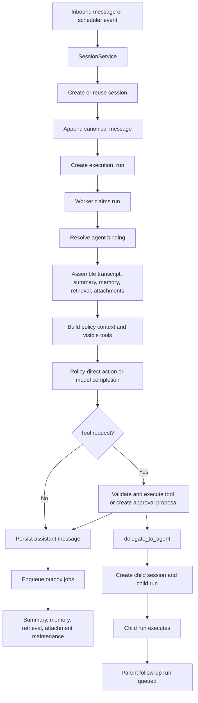

# Agents and Sub-Agents

## Scope

This document reviews the current `python-claw` implementation against the OpenClaw concepts the team asked about:

1. Agent Loop
2. Queue process
3. Multi-agent routing
4. Memory
5. Tools
6. Session management

The goal is not to restate OpenClaw. The goal is to explain what exists in this repository today, how it maps to those concepts, and where the current code intentionally differs.

## Sources Reviewed

### OpenClaw concept references

- Agent Loop: `https://docs.openclaw.ai/concepts/agent-loop`
- Queue: `https://docs.openclaw.ai/concepts/queue`
- Multi-Agent Routing: `https://docs.openclaw.ai/concepts/multi-agent`
- Memory: `https://docs.openclaw.ai/concepts/memory`
- Tools: `https://docs.openclaw.ai/concepts/session-tool`
- Session Management: `https://docs.openclaw.ai/concepts/session`

### Current `python-claw` implementation

- `docs/agents_sub_agents.md`
- `apps/gateway/deps.py`
- `scripts/worker_loop.py`
- `src/agents/bootstrap.py`
- `src/agents/service.py`
- `src/context/outbox.py`
- `src/context/service.py`
- `src/db/models.py`
- `src/delegations/service.py`
- `src/graphs/assistant_graph.py`
- `src/graphs/nodes.py`
- `src/graphs/prompts.py`
- `src/jobs/repository.py`
- `src/jobs/service.py`
- `src/memory/service.py`
- `src/providers/models.py`
- `src/retrieval/service.py`
- `src/routing/service.py`
- `src/sessions/repository.py`
- `src/sessions/service.py`
- `src/tools/delegation.py`
- `src/tools/local_safe.py`
- `src/tools/messaging.py`
- `src/tools/registry.py`
- `src/tools/remote_exec.py`

## Quick Summary

| Topic | Status in `python-claw` | Notes |
| --- | --- | --- |
| Agent Loop | Available | Implemented as a durable one-run-per-turn pipeline, not an in-memory autonomous loop. |
| Queue process | Available | Two queues exist: `execution_runs` for turns and `outbox_jobs` for after-turn work. |
| Multi-agent routing | Partial | Child-agent delegation exists, but OpenClaw-style inbound routing to different agents is not implemented. |
| Memory | Available | Implemented as summaries, extracted session memories, and lexical retrieval records. |
| Tools | Available, but different scope | Tool runtime exists for session turns; OpenClaw-style session-management tools are not present. |
| Session management | Available | Durable sessions are core to the system, but the routing/session model is simpler than OpenClaw's. |

## 1. Agent Loop

### What is implemented

`python-claw` does have an agent runtime loop, but it is a durable queue-driven turn loop rather than a continuously running in-memory agent loop.

The current path is:

1. `SessionService.process_inbound(...)` normalizes routing, creates or reuses a session, appends the user message, and creates an `execution_runs` row.
2. `RunExecutionService.process_next_run(...)` claims the next eligible run from the queue.
3. `AgentProfileService` resolves the execution binding for the run and session.
4. `AssistantGraph.invoke(...)` assembles state from transcript, summary, memory, retrieval, and attachments.
5. `graphs/nodes.py` builds policy context, binds visible tools, builds the prompt payload, and either:
   - directly executes a policy-classified action, or
   - calls the configured model adapter and interprets its tool requests.
6. Tool proposals, tool results, approval artifacts, and assistant output are persisted.
7. After the turn completes, outbox jobs are enqueued for summary generation, memory extraction, retrieval indexing, attachment extraction, and continuity repair when needed.

### How this differs from OpenClaw's concept

The closest match is the OpenClaw "agent loop" idea, but in this codebase the loop boundary is one durable execution run at a time.

Important current characteristics:

- There is no background autonomous planner that keeps looping inside one live process.
- Each inbound message, scheduler event, delegation callback, or approval continuation becomes a separate queued run.
- State continuity is persisted in the database, not held primarily in process memory.
- Child-agent work is also handled as separate queued runs, not nested live loops.

### User-facing interpretation

For users of this project, "agent loop" currently means:

- a turn enters through the session layer
- the worker executes one durable run
- tool work and approvals are persisted
- follow-up work is re-entered through new runs

That is documented in code today and is available in the current implementation.

## 2. Queue Process

### What is implemented

The queue process is clearly present and is one of the core runtime mechanisms in this repository.

There are two distinct queue-like pipelines:

### A. Execution run queue

Primary turn execution is stored in `execution_runs`.

Current run statuses in the model are:

- `queued`
- `blocked`
- `claimed`
- `running`
- `retry_wait`
- `completed`
- `failed`
- `dead_letter`
- `cancelled`

The queue mechanics are implemented in `src/jobs/repository.py` and `src/jobs/service.py`:

- `create_or_get_execution_run(...)` persists work items.
- `claim_next_eligible_run(...)` selects runnable work by `available_at`, acquires a per-session lane lease, and acquires a global concurrency slot.
- `mark_running(...)`, `complete_run(...)`, `retry_run(...)`, and `fail_run(...)` transition the run state.
- `scripts/worker_loop.py` continuously polls and processes queued runs.

Current trigger kinds used by the code include:

- `inbound_message`
- `scheduler_fire`
- `delegation_child`
- `delegation_result`
- `delegation_approval_prompt`

This means the queue is not only for user messages. It also drives scheduler turns, child-agent work, and parent follow-up work.

### B. Outbox job queue

After-turn background work is stored in `outbox_jobs`.

Current outbox job kinds include:

- `summary_generation`
- `memory_extraction`
- `retrieval_index`
- `attachment_extraction`
- `continuity_repair`

The `OutboxWorker` in `src/context/outbox.py` claims pending jobs and executes the corresponding maintenance work.

### How this differs from OpenClaw's concept

The OpenClaw queue concept maps well to this repo, but the implementation is explicitly relational and split into two durable tables:

- `execution_runs` for turn execution
- `outbox_jobs` for deferred context maintenance

This is available and well represented in the code today.

## 3. Multi-Agent Routing

### What is implemented

`python-claw` supports multiple agents in the sense that:

- agent profiles are durable in `agent_profiles`
- sessions have an `owner_agent_id`
- delegation can create child sessions owned by other agents
- child agents can run with separate model, policy, and tool bindings

This makes sub-agent orchestration real and available today.

Current delegation flow:

1. Parent agent calls `delegate_to_agent`.
2. `DelegationService.create_delegation(...)` validates policy and allowlists.
3. A child session is created with `session_kind="child"` and `owner_agent_id=<child_agent_id>`.
4. A child system message is created containing the packaged task and context.
5. A child `execution_run` is queued with `trigger_kind="delegation_child"`.
6. When the child finishes or pauses for approval, the parent session gets a follow-up message and a new queued run.

### What is not implemented

OpenClaw-style multi-agent routing of inbound traffic is not implemented in the current `python-claw` code.

What is missing compared with that concept:

- no binding table or config that maps `(channel, account, peer, group)` to different `agent_id` values
- no most-specific-match routing policy
- no per-account or per-peer inbound agent selection
- no concept of multiple inbound accounts being routed to separate agents at the gateway layer

Current inbound routing in `src/routing/service.py` only decides the session key shape:

- direct: `channel:account:direct:peer:main`
- group: `channel:account:group:group_id`

For new primary sessions, `SessionService.process_inbound(...)` resolves the bootstrap agent and assigns that agent as the session owner. After that, future turns for the same session continue to use `session.owner_agent_id`.

### Conclusion

Multi-agent delegation is available.

Multi-agent inbound routing, in the OpenClaw sense, is not available in the current codebase.

## 4. Memory

### What is implemented

Memory is available and has a concrete, durable implementation.

The current design has four main layers:

### A. Transcript and summary continuity

The canonical source remains the `messages` table.

When transcript length exceeds the runtime window, `ContextService` tries to use:

- recent transcript messages
- the latest valid `summary_snapshots` record

If continuity cannot be assembled safely, the turn is marked degraded and a `continuity_repair` outbox job is queued.

### B. Durable extracted memories

`MemoryService` writes durable memory records to `session_memories`.

Current extraction sources:

- individual messages
- summary snapshots

Current memory kinds written by the code:

- `message_fact`
- `summary_fact`

This is lightweight extraction logic, not a separate semantic memory plugin system.

### C. Retrieval index

`RetrievalService` writes chunked lookup records to `retrieval_records` for:

- messages
- summaries
- memories
- attachment extractions

Retrieval in the current repo is lexical term-overlap retrieval, not vector search.

### D. Runtime context assembly

When a turn runs, `ContextService.assemble(...)` builds a prompt context from:

- recent transcript rows
- optional summary snapshot
- retrieved memory items
- retrieved non-memory records
- extracted attachment content

`graphs/prompts.py` then passes those as additive context sections to the model prompt.

### How this differs from OpenClaw's concept

The OpenClaw memory idea is present here, but the implementation is narrower and explicitly database-driven.

Current limitations:

- no standalone memory plugin architecture
- no workspace-file memory equivalent
- no vector database retrieval layer
- no agent-specific memory store outside the session database
- memory extraction is heuristic and deterministic, not LLM-authored long-term memory curation

### Conclusion

Memory is available in the current code, and users can understand it as:

- transcript first
- summary for continuity
- extracted durable memory records
- lexical retrieval added back into future turns

## 5. Tools

### What is implemented

The project has a real tool runtime for session turns.

Tools are defined through `ToolDefinition`, bound through `ToolRegistry`, filtered by policy visibility, exposed to the provider prompt schema, and then executed through the graph runtime.

Current tool factories wired in `apps/gateway/deps.py` are:

- `echo_text`
- `send_message`
- `remote_exec`
- `delegate_to_agent`

Important runtime behavior:

- tool visibility is filtered before prompt construction
- tool calls are validated against schemas
- canonical arguments are persisted
- tool proposals and tool events are recorded
- approval-gated tools can create governance proposals instead of executing immediately

### Validate and execute tool or create approval proposal

This is the part of the runtime that decides whether a requested tool call runs now or stops and creates an approval proposal.

The decision happens inside `src/graphs/nodes.py` after the turn has already:

- assembled session context
- built policy context
- bound only the tools visible to the current agent and session
- received either a policy-directed action or a model-emitted tool request

The current flow is:

1. The runtime validates that the requested tool is actually bound and visible in the current context.
2. The request arguments are schema-validated and canonicalized.
3. The runtime checks whether the tool's typed action requires approval.
4. If approval is not required, the tool executes immediately.
5. If approval is required and there is already an exact active approval for the same typed action and canonical arguments, the tool executes immediately.
6. If approval is required and there is not an exact active approval, the runtime creates a governance proposal instead of executing the tool.

### When a proposal is created

A proposal is created in two current cases:

- the policy layer classifies the turn as an action that requires approval and routes into `_handle_awaiting_approval(...)`
- the model emits a governed tool request, the request validates successfully, but `PolicyService.has_exact_approval(...)` returns false, which routes into `_handle_governed_tool_request(...)`

In both cases the runtime calls `SessionRepository.create_governance_proposal(...)`.

That write creates or reuses a pending approval record set made up of:

- a `resource_proposals` row
- a `resource_versions` row holding the canonicalized payload
- governance transcript events such as `proposal_created` and `approval_requested`

The runtime also:

- marks the turn as `awaiting_approval`
- writes an approval-facing assistant response with the proposal id
- creates an `approval_prompt` artifact for `webchat` sessions

### Why a proposal is created

The proposal exists so the system can pause a dangerous or approval-gated action without losing the exact action the agent wanted to perform.

The current code creates a proposal when all of the following are true:

- the tool is valid and allowed to appear in the session
- the tool maps to a typed action that requires approval
- there is no exact matching active approval for that same canonical request

This matters because approval is scoped narrowly. The system does not approve a tool in the abstract. It approves a specific typed action plus a specific canonical argument payload.

For example, `remote_exec` may be visible to the runtime, but if the exact canonical request has not been approved yet, the runtime must create a proposal instead of executing it.

### What happens after the user approves

Approval is handled by `ApprovalDecisionService.decide(...)` in `src/policies/approval_actions.py`.

When the user approves a pending proposal:

1. `approve_proposal(...)` writes the durable approval record and changes the proposal state to `approved`.
2. `activate_approved_resource(...)` activates the approved action identity.
3. The prompt record, if one exists, is marked approved.
4. The system then checks whether the approved proposal belongs to a child session.

How the agent is notified depends on the session type:

- For a normal primary session, the approval becomes active and the user can reissue the request. There is no automatic continuation run for the primary session in the current implementation.
- For a child delegated session, the system automatically notifies the child agent by appending a new system message to the child session and queueing a new `execution_run`.

### How child agents are notified after approval

The automatic child-agent resume path is implemented by `_enqueue_approved_continuation(...)`.

When the approved proposal belongs to a child session:

1. The service loads the proposal's child session and parent delegation.
2. It appends a child-session system message that says approval was granted, identifies the capability, and includes the exact approved arguments.
3. It creates a new child `execution_run` with `trigger_kind="delegation_child"`.
4. It requeues the delegation to point at that new child message and child run.
5. It records a delegation event `approved_continuation_queued`.

The message explicitly tells the child agent to:

- continue the pending action now
- use the exact approved tool arguments
- not ask for another approval
- not create a new proposal for the same step

That queued continuation run is the mechanism by which the child agent is notified and resumed.

### How the parent session learns that approval was granted

The parent does not directly approve on behalf of the child in memory. Instead the child continues in its own session after approval.

Once that resumed child run completes:

- `DelegationService.handle_child_run_completed(...)` packages the child result
- a parent-side system message is written into the parent session
- a parent follow-up run is queued
- the parent agent then produces the user-visible response in the main session

If the child still needs approval again later for a different governed action, the same proposal flow repeats for that new action.

### What is not implemented

The OpenClaw "session tool" concept is not present as a feature set in this repo.

There are no current tool implementations for session-management actions such as:

- listing sessions
- inspecting arbitrary session history via a session tool
- spawning or switching sessions through a session tool surface
- sending into another session via a session tool

The codebase does have service and repository APIs for session history and session lookup, but those are backend APIs, not model-facing tools.

### Conclusion

Tooling is available in `python-claw`, but it is runtime action tooling, not OpenClaw-style session-management tooling.

## 6. Session Management

### What is implemented

Session management is a first-class part of the current architecture.

The durable session model is implemented in `sessions`, `messages`, and related tables.

Current session behavior includes:

- routing normalization from inbound transport metadata
- idempotent inbound message handling
- durable session creation and lookup by `session_key`
- durable transcript storage in `messages`
- separate `session_kind` values:
  - `primary`
  - `child`
  - `system`
- child-session parent linkage through `parent_session_id`
- collaboration state on sessions:
  - `assistant_active`
  - `human_takeover`
  - `paused`
- session ownership through `owner_agent_id`

### Current session key model

Current session keys are transport-oriented and simpler than OpenClaw's model:

- direct sessions: `channel:account:direct:peer:main`
- group sessions: `channel:account:group:group_id`
- child sessions: `child:<parent_session_id>:<delegation_id>`

### How sessions participate in runtime behavior

Sessions are not just storage. They control runtime boundaries:

- `execution_runs.lane_key` is set to the session id, which serializes work per session
- context assembly reads session transcript state
- memory and retrieval are scoped to session id
- child-agent work gets its own child session
- approvals for child work are discovered from the child session and then surfaced back to the parent session

### What is not implemented

Compared with OpenClaw session management, the current repo does not expose:

- configurable direct-message session collapsing modes such as `main`, `per-peer`, or `per-channel-peer`
- identity-linking across transports
- model-facing session tools
- a user-facing session management command surface comparable to OpenClaw's documented session tooling

### Conclusion

Session management is available and central to `python-claw`, but it is a simpler transport-plus-database session model than the one described by OpenClaw.

## Current Agent and Sub-Agent Structure in This Repo

### Agent configuration

Durable agent configuration is stored in:

- `agent_profiles`
- `model_profiles`

The runtime resolves an `AgentExecutionBinding` for each run, which includes:

- `agent_id`
- `session_kind`
- `model_profile_key`
- `policy_profile_key`
- `tool_profile_key`
- resolved model settings
- resolved policy profile
- resolved tool profile

### Sub-agent communication

Agents do not communicate through direct in-memory callbacks.

They communicate through:

- `delegations`
- child `sessions`
- child and parent `execution_runs`
- parent and child `messages`
- durable delegation events

### Parent/child lifecycle

The implemented child lifecycle is:

1. Parent tool call requests bounded delegated work.
2. Child session and child run are created.
3. Child agent executes its own turn against its own session transcript.
4. Child completion or approval wait is written back into the parent session as a system message.
5. Parent follow-up work is queued as a new run.

This is the main sub-agent mechanism available in the current codebase.

## Architecture Summary

## Final Position

For the six requested OpenClaw topics, the current `python-claw` status is:

1. Agent Loop: available
2. Queue process: available
3. Multi-agent routing: partial, because delegation exists but inbound agent routing does not
4. Memory: available
5. Tools: available, but session-management tools are not implemented
6. Session Management: available

The most important distinction for readers is this:

- `python-claw` is already a durable agent runtime with queues, sessions, tools, approvals, memory, and child delegation
- it is not yet an OpenClaw-equivalent multi-agent gateway with inbound routing rules and model-facing session tools
