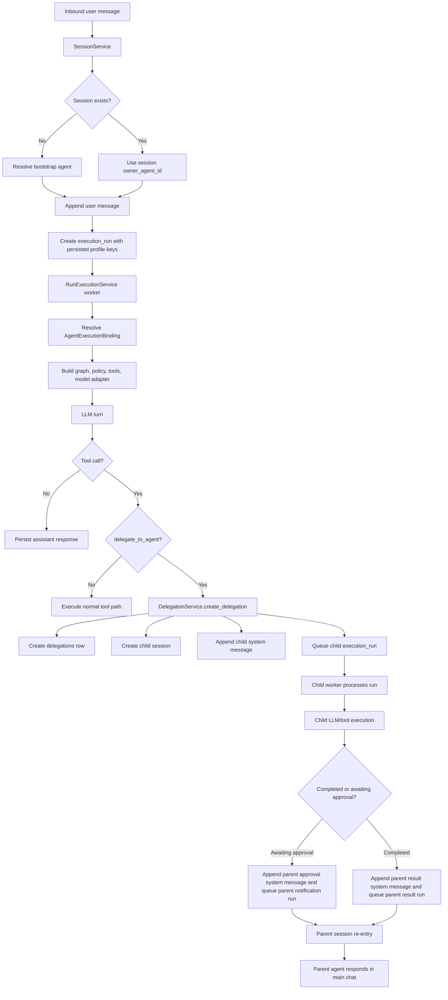
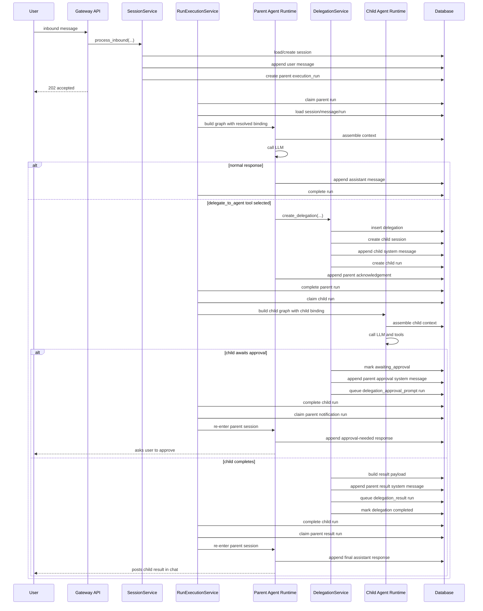

# Agents and Sub-Agents

## Scope

This document reviews Spec 014 and Spec 015 together with the current implementation in this repository. It explains how agents and sub-agents are configured, how they communicate, which database tables they depend on, and what changes are required to run them on separate models or local Ollama-compatible endpoints.

Where the specs and the current code differ, this document calls that out explicitly.

## Source Review Summary

Primary sources reviewed:

- `specs/014-agent-profiles-and-delegation-foundation/spec.md`
- `specs/015-sub-agent-delegation-and-child-session-orchestration/spec.md`
- `src/agents/service.py`
- `src/agents/bootstrap.py`
- `src/agents/repository.py`
- `src/delegations/service.py`
- `src/delegations/repository.py`
- `src/sessions/service.py`
- `src/sessions/repository.py`
- `src/jobs/service.py`
- `src/jobs/repository.py`
- `src/graphs/prompts.py`
- `src/graphs/nodes.py`
- `src/providers/models.py`
- `src/config/settings.py`
- `src/db/models.py`
- `apps/gateway/deps.py`
- `.env`
- migrations `20260328_014` and `20260329_015`

## 1. Detailed Overview of How Agents and Sub-Agents Are Configured

### Durable agent configuration

The durable agent registry is stored in the database:

- `agent_profiles`
- `model_profiles`

An agent is identified by `agent_profiles.agent_id`. Each agent profile points to:

- one default model profile through `default_model_profile_id`
- one settings-backed policy profile through `policy_profile_key`
- one settings-backed tool profile through `tool_profile_key`

This is resolved by [`src/agents/service.py`](/Users/scottcornell/src/my-projects/python-claw/src/agents/service.py).

### Settings-backed configuration

Some agent behavior is not stored in tables. It comes from environment settings parsed by [`src/config/settings.py`](/Users/scottcornell/src/my-projects/python-claw/src/config/settings.py):

- `PYTHON_CLAW_DEFAULT_AGENT_ID`
- `PYTHON_CLAW_POLICY_PROFILES`
- `PYTHON_CLAW_TOOL_PROFILES`
- `PYTHON_CLAW_HISTORICAL_AGENT_PROFILE_OVERRIDES`
- `PYTHON_CLAW_REMOTE_EXEC_AGENT_TEMPLATES`
- global LLM settings such as `PYTHON_CLAW_RUNTIME_MODE`, `PYTHON_CLAW_LLM_PROVIDER`, `PYTHON_CLAW_LLM_MODEL`, `PYTHON_CLAW_LLM_BASE_URL`

### What `.env` currently configures

The current `.env` configures:

- bootstrap/default agent: `default-agent`
- global runtime mode: `provider`
- global provider: `openai`
- global model: `gpt-4o-mini`
- default policy profile:
  - delegation enabled
  - max delegation depth `2`
  - child allowlist `deploy-agent`, `code-agent`, `notify-agent`
- default tool profile:
  - `echo_text`
  - `delegate_to_agent`
- child agent overrides:
  - `deploy-agent`
  - `code-agent`
  - `notify-agent`
- remote execution templates for those child agents

Important implementation detail:

- the environment file seeds agent-to-policy/tool relationships for historical or bootstrap agent IDs
- it does not automatically create multiple `model_profiles` beyond the default bootstrap profile

### Bootstrap flow

At app startup, [`bootstrap_agent_profiles()`](/Users/scottcornell/src/my-projects/python-claw/src/agents/bootstrap.py) does the following:

1. Creates a default `model_profiles` row if one does not already exist.
2. Finds historical or configured agent IDs from runs, sessions, overrides, and `default_agent_id`.
3. Creates missing `agent_profiles` rows for those agent IDs.
4. Assigns policy/tool profiles from `historical_agent_profile_overrides` where present.
5. Creates remote execution capability templates for configured remote-exec agents.

### Runtime binding

Before a run executes, the system resolves an `AgentExecutionBinding` containing:

- `agent_id`
- `session_kind`
- `model_profile_key`
- `policy_profile_key`
- `tool_profile_key`
- resolved model settings
- resolved policy profile
- resolved tool profile
- allowed capabilities

That binding is the core runtime contract for both parent agents and child agents.

## 2. How Agents and Sub-Agents Communicate With Each Other

Agents do not communicate through in-memory callbacks. They communicate through durable database state and queued execution runs.

### Parent to child communication

When a parent agent uses the `delegate_to_agent` tool:

1. `delegate_to_agent` validates the request in [`src/tools/delegation.py`](/Users/scottcornell/src/my-projects/python-claw/src/tools/delegation.py).
2. It calls `DelegationService.create_delegation(...)`.
3. `DelegationService` creates:
   - a `delegations` row
   - a child session with `session_kind=child`
   - a child system message containing packaged task/context
   - a child execution run with `trigger_kind="delegation_child"`

The child receives the parent request through:

- `delegations.context_payload_json`
- the child session's first `messages` row with `role="system"`

### Child to parent communication

When the child finishes:

1. `RunExecutionService` detects `trigger_kind="delegation_child"`.
2. It calls either:
   - `handle_child_run_completed(...)`, or
   - `handle_child_run_paused_for_approval(...)`
3. The delegation service appends a parent-side system message.
4. It queues a parent follow-up run.

Current parent follow-up trigger kinds used by code:

- `delegation_result`
- `delegation_approval_prompt`

This means parent/child coordination is asynchronous and durable.

### What the child actually sees

The child receives a text instruction built in [`src/delegations/service.py`](/Users/scottcornell/src/my-projects/python-claw/src/delegations/service.py) by `_build_child_instruction(...)`. It includes:

- child agent id
- parent agent id
- delegation kind
- task text
- optional expected output
- optional notes
- optional parent summary
- recent filtered parent transcript

## 3. How Agents and Sub-Agents Communicate With the LLM

### Binding to the model

Each run is bound to a model through `AgentExecutionBinding.model`, resolved from `model_profiles` and persisted run profile keys.

### Prompt assembly

The LLM input is constructed from:

- transcript context from [`src/context/service.py`](/Users/scottcornell/src/my-projects/python-claw/src/context/service.py)
- system instructions and tool definitions from [`src/graphs/prompts.py`](/Users/scottcornell/src/my-projects/python-claw/src/graphs/prompts.py)
- bound tool visibility from policy/tool profiles

The runtime converts that to a JSON prompt payload in [`src/providers/models.py`](/Users/scottcornell/src/my-projects/python-claw/src/providers/models.py).

### Parent agent to LLM

For normal parent runs:

1. `SessionService.process_inbound(...)` creates a run.
2. `RunExecutionService.process_next_run(...)` claims the run.
3. `AgentProfileService.resolve_binding_for_run(...)` resolves the run's model/policy/tool binding.
4. `build_assistant_graph(...)` constructs the graph with that binding.
5. The model adapter sends the prompt and visible tool schemas to the LLM.

### Child agent to LLM

Child runs use the same path, except:

- `session_kind` is `child`
- the initial child input is a system message generated by the delegation service
- outbound user delivery is suppressed for child sessions in `RunExecutionService`

### Current provider implementation

The only provider-backed adapter implemented today is OpenAI's Responses API client in [`src/providers/models.py`](/Users/scottcornell/src/my-projects/python-claw/src/providers/models.py).

Important limitation:

- `model_profiles.provider` is stored, but current code does not branch on provider name
- provider-backed execution always uses `OpenAIResponsesClient`

So in current code, "different LLMs" means different model names and optional different base URLs through the same OpenAI-compatible client path.

## 4. How to Set Up Agents and Sub-Agents to Use Separate LLMs

### What is supported now

Supported today:

- separate `model_profiles` per agent
- separate `model_name`
- separate `temperature`
- separate `max_output_tokens`
- separate `timeout_seconds`
- separate `tool_call_mode`
- separate `streaming_enabled`
- separate `base_url`

Not fully implemented today:

- separate provider client implementations by `provider`
- settings-backed automatic creation of multiple model profiles
- admin write APIs for creating/updating model profiles or agent profiles

### Practical setup process today

To assign separate LLMs to different agents:

1. Create additional rows in `model_profiles`.
2. Update each target `agent_profiles.default_model_profile_id` to point at the desired model profile.
3. Keep the child agent's `policy_profile_key` and `tool_profile_key` set appropriately.
4. Ensure new runs are created after the change.

Because run profile keys are persisted on `execution_runs`, existing queued runs will continue using the profile keys already stored on the run.

### Example approach

Example model profile split:

- `default-agent` -> `gpt-4o-mini`
- `code-agent` -> `gpt-4.1` or another coding-focused model
- `deploy-agent` -> a lower-cost model
- `notify-agent` -> a small fast model

### Important caveat

The bootstrap code only auto-creates the `default` model profile. Additional model profiles must currently be inserted manually through:

- a migration
- a seed script
- direct SQL
- a custom admin write path you add

## 5. What Tables in the Database the Agents and Sub-Agents Depend On

### Core required tables

These are the main tables the agent/sub-agent system depends on directly:

- `agent_profiles`
- `model_profiles`
- `sessions`
- `messages`
- `execution_runs`
- `delegations`
- `delegation_events`

### Context and runtime-support tables

These are not part of delegation identity itself, but they materially affect agent behavior:

- `summary_snapshots`
- `session_memories`
- `retrieval_records`
- `attachment_extractions`
- `message_attachments`
- `session_artifacts`
- `tool_audit_events`

### Approval and governance tables

These are especially important for child agents that call approval-gated tools such as `remote_exec`:

- `resource_proposals`
- `resource_versions`
- `resource_approvals`
- `active_resources`
- `governance_transcript_events`
- `approval_action_prompts`

### Queueing and concurrency tables

These support run execution but are not agent-specific registries:

- `session_run_leases`
- `global_run_leases`
- `inbound_dedupe`

### Remote execution related

If an agent uses remote execution:

- `resource_proposals` and related approval tables are used
- `agent_sandbox_profiles` is used for sandbox ownership and execution defaults
- `node_execution_audits` supports execution auditability for remote execution flows

## 6. What Existing Code Structures Are Used for Agents and Sub-Agents

### Agent profile resolution

- [`src/agents/repository.py`](/Users/scottcornell/src/my-projects/python-claw/src/agents/repository.py)
- [`src/agents/service.py`](/Users/scottcornell/src/my-projects/python-claw/src/agents/service.py)
- [`src/agents/bootstrap.py`](/Users/scottcornell/src/my-projects/python-claw/src/agents/bootstrap.py)

### Session and message lifecycle

- [`src/sessions/service.py`](/Users/scottcornell/src/my-projects/python-claw/src/sessions/service.py)
- [`src/sessions/repository.py`](/Users/scottcornell/src/my-projects/python-claw/src/sessions/repository.py)

### Run queue and worker execution

- [`src/jobs/repository.py`](/Users/scottcornell/src/my-projects/python-claw/src/jobs/repository.py)
- [`src/jobs/service.py`](/Users/scottcornell/src/my-projects/python-claw/src/jobs/service.py)

### Delegation and child orchestration

- [`src/tools/delegation.py`](/Users/scottcornell/src/my-projects/python-claw/src/tools/delegation.py)
- [`src/delegations/repository.py`](/Users/scottcornell/src/my-projects/python-claw/src/delegations/repository.py)
- [`src/delegations/service.py`](/Users/scottcornell/src/my-projects/python-claw/src/delegations/service.py)

### LLM runtime and tool execution

- [`apps/gateway/deps.py`](/Users/scottcornell/src/my-projects/python-claw/apps/gateway/deps.py)
- [`src/graphs/assistant_graph.py`](/Users/scottcornell/src/my-projects/python-claw/src/graphs/assistant_graph.py)
- [`src/graphs/nodes.py`](/Users/scottcornell/src/my-projects/python-claw/src/graphs/nodes.py)
- [`src/graphs/prompts.py`](/Users/scottcornell/src/my-projects/python-claw/src/graphs/prompts.py)
- [`src/providers/models.py`](/Users/scottcornell/src/my-projects/python-claw/src/providers/models.py)
- [`src/policies/service.py`](/Users/scottcornell/src/my-projects/python-claw/src/policies/service.py)

## 7. How to Set Up and Configure Agents and Sub-Agents to Use Local Ollama LLMs

### Current implementation reality

There is no Ollama-specific adapter in the current code.

However, the provider path uses the OpenAI Python client and supports `base_url` overrides. That means local Ollama can work only if you expose an OpenAI-compatible API endpoint that the OpenAI client can call successfully.

### What you can do today

You can try an OpenAI-compatible setup by:

1. Running Ollama with an OpenAI-compatible endpoint.
2. Setting either:
   - global `PYTHON_CLAW_LLM_BASE_URL`, or
   - per-model-profile `base_url`
3. Setting `runtime_mode=provider`.
4. Using a model name that your local Ollama endpoint accepts.
5. Providing an API key value if the OpenAI client path still requires one in your environment.

### Recommended configuration pattern

For a global local runtime:

- `PYTHON_CLAW_RUNTIME_MODE=provider`
- `PYTHON_CLAW_LLM_PROVIDER=openai`
- `PYTHON_CLAW_LLM_BASE_URL=http://localhost:11434/v1`
- `PYTHON_CLAW_LLM_MODEL=<ollama-model-name>`

For per-agent local routing:

- create one `model_profiles` row per agent
- set `base_url` to your Ollama-compatible endpoint for the profiles that should run locally
- update each agent to use the desired profile

### What would make Ollama first-class

If you want robust Ollama support, the clean next step is:

1. Add an `OllamaClient` or generic OpenAI-compatible client class.
2. Make provider selection branch on `model_profile.provider`.
3. Add seed/admin support for multiple model profiles.
4. Add tests for local provider routing.

## 8. How to Create and Update Context Prompts for Agents That Configure Personalities and Tasks

### What exists now

There is currently one shared global prompt builder in [`src/graphs/prompts.py`](/Users/scottcornell/src/my-projects/python-claw/src/graphs/prompts.py).

The main system instructions are hard-coded there. They are not currently customized per agent profile.

For child sessions, there is a second hard-coded delegated-task instruction builder in [`src/delegations/service.py`](/Users/scottcornell/src/my-projects/python-claw/src/delegations/service.py).

### Important limitation

These agent profile fields are stored but not currently used to shape prompts:

- `display_name`
- `role_kind`
- `description`

So today:

- agent personality is not first-class configuration
- agent task framing is partially configurable through delegation payload text
- agent-specific prompt behavior requires code changes

### How to change prompts today

To change the general assistant prompt:

- edit `build_prompt_payload()` in [`src/graphs/prompts.py`](/Users/scottcornell/src/my-projects/python-claw/src/graphs/prompts.py)

To change child-agent task framing:

- edit `_build_child_instruction()` in [`src/delegations/service.py`](/Users/scottcornell/src/my-projects/python-claw/src/delegations/service.py)

### Recommended future improvement

If you want configurable personalities and responsibilities without code edits, add fields such as:

- `system_prompt`
- `delegation_prompt_template`
- `persona`
- `task_instructions`

to either:

- `agent_profiles`
- a new `agent_prompt_profiles` table

Then update `build_prompt_payload()` and `_build_child_instruction()` to read them from the resolved binding or agent profile.

## 9. How to Create and Configure Additional Agents and Sub-Agents

### To add a new child-capable agent today

1. Create or seed an `agent_profiles` row.
2. Create or select a `model_profiles` row.
3. Assign a `policy_profile_key`.
4. Assign a `tool_profile_key`.
5. If the agent should be bootstrapped automatically, add it to `PYTHON_CLAW_HISTORICAL_AGENT_PROFILE_OVERRIDES`.
6. If it needs remote execution templates, add it to `PYTHON_CLAW_REMOTE_EXEC_AGENT_TEMPLATES`.
7. If a parent agent should be allowed to delegate to it, include the agent ID in that parent's policy profile `allowed_child_agent_ids`.
8. Make sure the parent tool profile includes `delegate_to_agent`.

### To make the new agent usable as a child agent

At minimum the parent must satisfy all of these:

- delegation tool is visible
- parent policy has `delegation_enabled=true`
- child agent id is allowlisted
- depth limit is not exceeded
- active delegation limits are not exceeded
- child agent is enabled and resolves to a valid binding

### To add another level of sub-agent

This is supported only if the child agent itself:

- has `delegate_to_agent` in its tool profile
- has `delegation_enabled=true`
- allowlists the next child agent
- stays within `max_delegation_depth`

## 10. Architecture Diagram of the Overall Agent/Sub-Agent Process

## 11. Sequence Diagram for Initiation, Communication, and Posting Results Back to the User

## Spec vs Implementation Notes

### Implemented well

- durable agent ownership on sessions
- durable child sessions
- durable delegation rows and event rows
- per-run persisted profile keys
- asynchronous parent/child orchestration
- suppression of direct child outbound delivery

### Current gaps or limitations

- per-agent prompt/personality config is not first-class
- only one provider-backed client implementation exists
- multiple model profiles are not auto-seeded from settings
- creating/updating agents and model profiles is not exposed through write APIs
- `agent_profiles.description` is metadata only right now

### One implementation extension beyond the original spec slice

The code includes an `awaiting_approval` delegation state and a `delegation_approval_prompt` parent re-entry path. That is part of the current implementation and tests, and is important for understanding actual child-agent behavior.

## Recommended Operational Guidance

- Treat `agent_profiles` plus `model_profiles` as the durable source of truth for agent identity and model selection.
- Treat settings `policy_profiles` and `tool_profiles` as the source of truth for what an agent may do.
- Use the `delegations` table to audit parent/child relationships instead of trying to infer them from transcript text alone.
- If you want separate LLMs per agent, add explicit `model_profiles` rows rather than overloading one global model setting.
- If you want configurable personalities, add prompt fields to the agent model or a dedicated prompt profile table; the current runtime does not yet support that cleanly.

## Accuracy Review

This document matches the codebase as reviewed on 2026-03-31 and is intentionally grounded in implementation rather than only spec intent.

Most important accuracy points:

- Agents and child agents are bound through `agent_profiles`, `model_profiles`, settings-backed policy/tool profiles, and persisted `execution_runs` profile keys.
- Parent/child communication is durable and asynchronous through `delegations`, `messages`, and follow-up runs.
- Child agents do not post directly to the user; parent continuation runs are responsible for final user-visible chat output.
- Separate LLMs per agent are structurally supported through model profiles, but current code requires manual creation of additional `model_profiles`.
- Local Ollama use is only practical today through the OpenAI-compatible `base_url` path, not through a dedicated Ollama adapter.
- Prompt personalities are not yet first-class agent configuration in the current implementation.