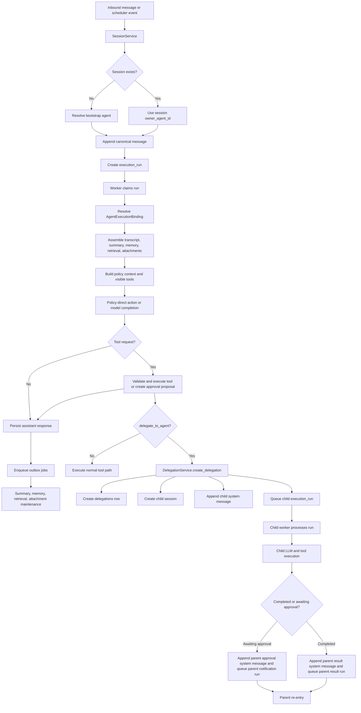
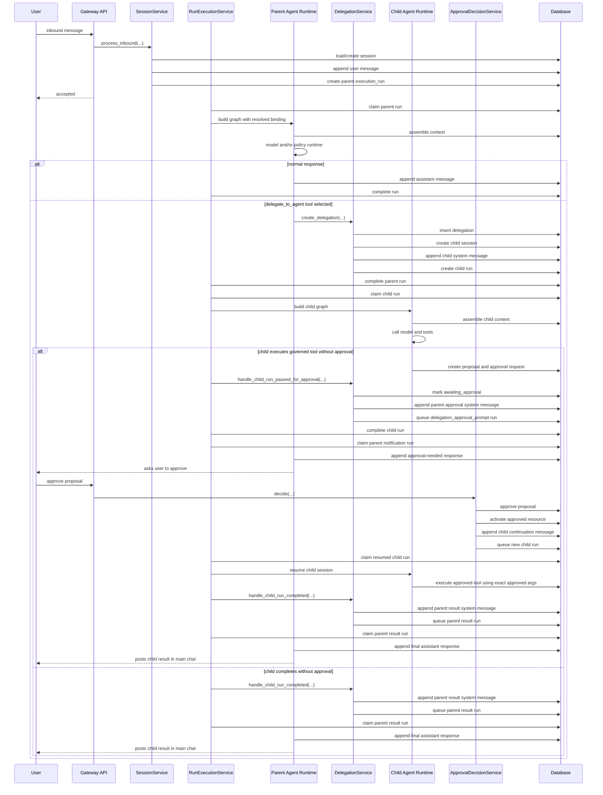

# Agents and Sub-Agents v2

## Scope

This document combines the older implementation-focused agent/sub-agent document with the newer OpenClaw concept comparison.

Its goals are:

1. explain how agents and sub-agents work in the current `python-claw` codebase
2. show how those mechanisms map to the OpenClaw concepts the team asked about
3. call out what is implemented today versus what is still missing compared with OpenClaw

This document is intentionally grounded in the current repository as reviewed on 2026-03-31.

## Sources Reviewed

### OpenClaw references

- Agent Loop: `https://docs.openclaw.ai/concepts/agent-loop`
- Queue: `https://docs.openclaw.ai/concepts/queue`
- Multi-Agent Routing: `https://docs.openclaw.ai/concepts/multi-agent`
- Memory: `https://docs.openclaw.ai/concepts/memory`
- Tools: `https://docs.openclaw.ai/concepts/session-tool`
- Session Management: `https://docs.openclaw.ai/concepts/session`

### `python-claw` sources

- `apps/gateway/deps.py`
- `scripts/worker_loop.py`
- `src/agents/bootstrap.py`
- `src/agents/repository.py`
- `src/agents/service.py`
- `src/context/outbox.py`
- `src/context/service.py`
- `src/db/models.py`
- `src/delegations/repository.py`
- `src/delegations/service.py`
- `src/graphs/assistant_graph.py`
- `src/graphs/nodes.py`
- `src/graphs/prompts.py`
- `src/jobs/repository.py`
- `src/jobs/service.py`
- `src/memory/service.py`
- `src/policies/approval_actions.py`
- `src/policies/service.py`
- `src/providers/models.py`
- `src/retrieval/service.py`
- `src/routing/service.py`
- `src/sessions/repository.py`
- `src/sessions/service.py`
- `src/tools/delegation.py`
- `src/tools/local_safe.py`
- `src/tools/messaging.py`
- `src/tools/registry.py`
- `src/tools/remote_exec.py`

## Quick Summary

| Topic | Status in `python-claw` | Notes |
| --- | --- | --- |
| Agent loop | Available | Implemented as a durable run-per-turn worker pipeline, not a continuously looping in-memory autonomous runtime. |
| Queue process | Available | Implemented through `execution_runs` and `outbox_jobs`. |
| Multi-agent routing | Partial | Child-agent delegation exists. OpenClaw-style inbound agent routing does not. |
| Memory | Available | Transcript, summaries, extracted memories, retrieval index, and attachment extraction are implemented. |
| Tools | Available, but narrower | Runtime tools exist, but OpenClaw-style session-management tools are not implemented. |
| Session management | Available | Durable sessions are central, but the routing/session model is simpler than OpenClaw's. |
| Separate LLMs per agent | Partially available | Multiple model profiles are supported, but provider branching is limited. |
| Local Ollama setup | Partially available | Possible through an OpenAI-compatible `base_url`, but not first-class. |
| Prompt/persona customization | Partial | Prompts are code-defined, not first-class per-agent configuration. |

## 1. How Agents and Sub-Agents Are Configured

### Durable agent configuration

The durable agent registry is stored in:

- `agent_profiles`
- `model_profiles`

An agent is identified by `agent_profiles.agent_id`. Each agent profile points to:

- one default model profile through `default_model_profile_id`
- one settings-backed policy profile through `policy_profile_key`
- one settings-backed tool profile through `tool_profile_key`

The runtime resolves these through `src/agents/service.py`.

### Settings-backed configuration

Some important behavior is not stored in tables. It comes from application settings parsed by `src/config/settings.py`.

Relevant settings include:

- `PYTHON_CLAW_DEFAULT_AGENT_ID`
- `PYTHON_CLAW_POLICY_PROFILES`
- `PYTHON_CLAW_TOOL_PROFILES`
- `PYTHON_CLAW_HISTORICAL_AGENT_PROFILE_OVERRIDES`
- `PYTHON_CLAW_REMOTE_EXEC_AGENT_TEMPLATES`
- global LLM settings such as runtime mode, provider, model, and base URL

### Bootstrap behavior

At startup, `bootstrap_agent_profiles()`:

1. creates the default `model_profiles` row if missing
2. finds known agent ids from settings and historical records
3. creates missing `agent_profiles`
4. assigns policy/tool profile keys from configured overrides
5. seeds remote-execution capability templates for configured agents

### Runtime binding

Before a run executes, the system resolves an `AgentExecutionBinding` that includes:

- `agent_id`
- `session_kind`
- `model_profile_key`
- `policy_profile_key`
- `tool_profile_key`
- resolved model settings
- resolved policy profile
- resolved tool profile
- allowed capabilities

This binding is the main runtime contract for both parent and child agents.

## 2. How Agents and Sub-Agents Communicate

Agents and sub-agents do not communicate through direct in-memory callbacks. They communicate through durable database records and queued runs.

### Parent to child

When a parent agent uses `delegate_to_agent`:

1. the tool validates the request in `src/tools/delegation.py`
2. it calls `DelegationService.create_delegation(...)`
3. the service creates:
   - a `delegations` row
   - a child session with `session_kind="child"`
   - a child system message containing the delegated task package
   - a child execution run with `trigger_kind="delegation_child"`

The child receives the parent request through:

- `delegations.context_payload_json`
- the first child `messages` row with `role="system"`

### Child to parent

When the child finishes, `RunExecutionService` detects `trigger_kind="delegation_child"` and calls either:

- `handle_child_run_completed(...)`
- `handle_child_run_paused_for_approval(...)`

The delegation service then:

- appends a parent-side system message
- queues a parent follow-up run

Current parent follow-up trigger kinds include:

- `delegation_result`
- `delegation_approval_prompt`

### What the child actually sees

The child sees a generated instruction assembled in `src/delegations/service.py` that includes:

- child agent id
- parent agent id
- delegation kind
- task text
- optional expected output
- optional notes
- optional parent summary
- recent filtered parent transcript

## 3. How Agents and Sub-Agents Communicate With the LLM

### Binding to the model

Each run is bound to a model through `AgentExecutionBinding.model`, resolved from `model_profiles` and the persisted run profile keys.

### Prompt assembly

The prompt uses:

- transcript context from `src/context/service.py`
- system instructions and tool definitions from `src/graphs/prompts.py`
- bound tool visibility from policy/tool profiles

The prompt is serialized into the provider payload in `src/providers/models.py`.

### Parent and child runs

Parent runs and child runs use the same graph/runtime path. The important differences for child runs are:

- `session_kind="child"`
- the first child message is a system message built by the delegation service
- outbound user delivery is suppressed for child sessions

### Current provider implementation

The only provider-backed adapter currently implemented is OpenAI Responses API support in `src/providers/models.py`.

Important limitation:

- `model_profiles.provider` is stored
- current execution does not branch to different provider client implementations by provider name
- provider-backed execution always uses the OpenAI-compatible path

So today, different LLMs primarily means different model names and optional different base URLs through the same OpenAI-compatible client shape.

## 4. Agent Loop

### What is implemented

`python-claw` does have an agent runtime loop, but it is a durable queue-driven turn loop rather than a continuously running in-memory agent loop.

The current path is:

1. `SessionService.process_inbound(...)` normalizes routing, creates or reuses a session, appends the user message, and creates an `execution_runs` row.
2. `RunExecutionService.process_next_run(...)` claims the next eligible run from the queue.
3. `AgentProfileService` resolves the execution binding for the run and session.
4. `AssistantGraph.invoke(...)` assembles state from transcript, summary, memory, retrieval, and attachments.
5. `graphs/nodes.py` builds policy context, binds visible tools, builds the prompt payload, and either:
   - directly executes a policy-classified action
   - or calls the configured model adapter and interprets its tool requests
6. tool proposals, tool results, approval artifacts, and assistant output are persisted
7. after the turn completes, outbox jobs are queued for summary generation, memory extraction, retrieval indexing, attachment extraction, and continuity repair when needed

### How this differs from OpenClaw

The loop boundary is one durable execution run at a time.

That means:

- there is no continuously looping in-memory planner
- each inbound message, scheduler event, delegation callback, or approval continuation becomes a separate queued run
- state continuity is primarily database-backed
- child-agent work is also handled as separate queued runs

## 5. Queue Process

### Execution run queue

Primary turn execution is stored in `execution_runs`.

Current statuses include:

- `queued`
- `blocked`
- `claimed`
- `running`
- `retry_wait`
- `completed`
- `failed`
- `dead_letter`
- `cancelled`

The main mechanics live in `src/jobs/repository.py` and `src/jobs/service.py`:

- `create_or_get_execution_run(...)`
- `claim_next_eligible_run(...)`
- `mark_running(...)`
- `complete_run(...)`
- `retry_run(...)`
- `fail_run(...)`

`claim_next_eligible_run(...)` also uses:

- per-session lane leasing
- global concurrency slots

### Trigger kinds currently used

Current trigger kinds include:

- `inbound_message`
- `scheduler_fire`
- `delegation_child`
- `delegation_result`
- `delegation_approval_prompt`

### Outbox queue

After-turn background work is stored in `outbox_jobs`.

Current outbox job kinds include:

- `summary_generation`
- `memory_extraction`
- `retrieval_index`
- `attachment_extraction`
- `continuity_repair`

The `OutboxWorker` in `src/context/outbox.py` processes that queue.

### How this differs from OpenClaw

The queue concept maps well, but the implementation here is explicitly relational and split into:

- `execution_runs` for turn execution
- `outbox_jobs` for deferred maintenance work

## 6. Multi-Agent Routing

### What is implemented

`python-claw` supports multiple agents in the sense that:

- agent profiles are durable in `agent_profiles`
- sessions have an `owner_agent_id`
- child delegation creates child sessions owned by other agents
- child agents can run with separate model, policy, and tool bindings

This makes multi-agent delegation real and available today.

### What is not implemented

OpenClaw-style inbound multi-agent routing is not implemented.

Missing pieces compared with OpenClaw include:

- no binding table or routing config that maps `(channel, account, peer, group)` to different agents
- no most-specific-match inbound routing
- no per-account or per-peer inbound agent selection
- no gateway-level multi-agent account routing

Current inbound routing in `src/routing/service.py` only decides session key shape:

- direct: `channel:account:direct:peer:main`
- group: `channel:account:group:group_id`

For a new primary session, the system uses the bootstrap agent. Later turns use `session.owner_agent_id`.

### Bottom line

- child-agent delegation: available
- inbound multi-agent routing in the OpenClaw sense: not available

## 7. Memory

### What is implemented

Memory is available and has a durable implementation with four layers.

### A. Transcript and summary continuity

The canonical source is the `messages` table.

When transcript length exceeds the runtime window, `ContextService` tries to combine:

- recent transcript messages
- a valid `summary_snapshots` record

If continuity cannot be assembled safely, the turn is marked degraded and a `continuity_repair` job is queued.

### B. Durable extracted memories

`MemoryService` writes durable memory records to `session_memories`.

Current extraction sources:

- individual messages
- summary snapshots

Current memory kinds:

- `message_fact`
- `summary_fact`

### C. Retrieval index

`RetrievalService` writes lookup chunks to `retrieval_records` for:

- messages
- summaries
- memories
- attachment extractions

Retrieval in the current repo is lexical term-overlap retrieval, not vector search.

### D. Runtime context assembly

When a turn runs, `ContextService.assemble(...)` builds prompt context from:

- recent transcript
- optional summary
- retrieved memory items
- retrieved non-memory items
- extracted attachment content

`graphs/prompts.py` injects those as additive context sections.

### How this differs from OpenClaw

The memory concept is present, but the implementation is narrower:

- no standalone memory plugin architecture
- no workspace-file memory equivalent
- no vector retrieval layer
- no separate agent memory store outside the session database
- extraction is heuristic and deterministic rather than long-term semantic curation by a dedicated memory runtime

## 8. Tools

### What is implemented

The project has a real runtime tool system for session turns.

Tools are defined through `ToolDefinition`, bound through `ToolRegistry`, filtered by policy visibility, exposed to the provider prompt schema, and executed through the graph runtime.

Current tool factories wired in `apps/gateway/deps.py` are:

- `echo_text`
- `send_message`
- `remote_exec`
- `delegate_to_agent`

Important runtime behavior:

- tool visibility is filtered before prompt construction
- tool calls are validated against schemas
- canonical arguments are persisted
- tool proposals and tool events are recorded
- approval-gated tools can create governance proposals instead of executing immediately

### Validate and execute tool or create approval proposal

This is the runtime path that decides whether a requested tool call runs immediately or stops and creates an approval proposal.

The decision happens in `src/graphs/nodes.py` after the turn has:

- assembled session context
- built policy context
- bound only the visible tools
- received either a policy-directed action or a model-emitted tool request

The current flow is:

1. validate that the requested tool is actually bound and visible
2. schema-validate and canonicalize arguments
3. determine whether the typed action requires approval
4. if approval is not required, execute immediately
5. if approval is required and there is an exact active approval for the same canonical request, execute immediately
6. if approval is required and there is no exact active approval, create a governance proposal instead of executing

### When a proposal is created

A proposal is created in two current cases:

- the policy layer classifies the turn as an action requiring approval and routes into `_handle_awaiting_approval(...)`
- the model emits a governed tool request, validation succeeds, but `PolicyService.has_exact_approval(...)` returns false, which routes into `_handle_governed_tool_request(...)`

Both paths call `SessionRepository.create_governance_proposal(...)`.

That creates or reuses:

- a `resource_proposals` row
- a `resource_versions` row with the canonicalized payload
- governance transcript events such as `proposal_created` and `approval_requested`

The runtime also:

- marks the turn as `awaiting_approval`
- writes an approval-facing assistant response with the proposal id
- creates an `approval_prompt` artifact for `webchat` sessions

### Why a proposal is created

The proposal exists so the system can pause a dangerous or approval-gated action without losing the exact request the agent intended to perform.

The runtime creates a proposal when all of the following are true:

- the tool is valid and visible
- the tool maps to a typed action that requires approval
- there is no exact matching active approval for the same canonical request

Approval is narrow. The system does not approve a tool in the abstract. It approves a specific typed action plus a specific canonical argument payload.

### What happens after approval

Approval is handled by `ApprovalDecisionService.decide(...)` in `src/policies/approval_actions.py`.

When a user approves a proposal:

1. `approve_proposal(...)` writes the durable approval record and changes proposal state to `approved`
2. `activate_approved_resource(...)` activates the approved action identity
3. the prompt record, if present, is marked approved
4. the system checks whether the proposal belongs to a child session

How the agent is notified depends on session type:

- primary session: the approval becomes active and the user can reissue the request; there is no automatic primary-session continuation run today
- child session: the system automatically resumes the child agent

### How child agents are notified after approval

The automatic child resume path is implemented by `_enqueue_approved_continuation(...)`.

When the approved proposal belongs to a child session:

1. the service loads the child session and its parent delegation
2. it appends a child-session system message explaining that approval was granted
3. it includes the exact approved arguments
4. it creates a new child `execution_run` with `trigger_kind="delegation_child"`
5. it requeues the delegation to reference the new message and run
6. it records `approved_continuation_queued`

The child instruction explicitly tells the child agent to:

- continue the pending action now
- use the exact approved arguments
- not request another approval
- not create a new proposal for that same step

That queued continuation run is how the child agent is notified and resumed.

### How the parent learns that the child resumed and finished

The parent does not directly resume in memory. The child continues in its own session.

Once the resumed child run completes:

- `DelegationService.handle_child_run_completed(...)` packages the result
- a parent-side system message is written into the parent session
- a parent follow-up run is queued
- the parent agent then produces the main user-visible response

### What is missing compared with OpenClaw tools

The OpenClaw session-tool concept is not present as a feature set here.

Current gaps include no model-facing tools for:

- listing sessions
- inspecting arbitrary session history
- spawning or switching sessions
- sending into another session through a session-management tool

The repo has service/repository APIs for session history and lookup, but those are backend APIs, not model-facing tools.

## 9. Session Management

### What is implemented

Session management is first-class in the current architecture.

The durable session model is implemented in `sessions`, `messages`, and related records.

Current session behavior includes:

- routing normalization from inbound transport metadata
- idempotent inbound message handling
- durable session creation and lookup by `session_key`
- durable transcript storage in `messages`
- `session_kind` values:
  - `primary`
  - `child`
  - `system`
- child linkage through `parent_session_id`
- collaboration state on sessions:
  - `assistant_active`
  - `human_takeover`
  - `paused`
- ownership through `owner_agent_id`

### Current session key model

Current session keys are transport-oriented:

- direct: `channel:account:direct:peer:main`
- group: `channel:account:group:group_id`
- child: `child:<parent_session_id>:<delegation_id>`

### How sessions participate in runtime behavior

Sessions define runtime boundaries:

- `execution_runs.lane_key` is set to the session id
- context assembly reads session transcript state
- memory and retrieval are scoped by session id
- child agents get their own child sessions
- child approvals are discovered in the child session and later surfaced back to the parent session

### What is missing compared with OpenClaw

Compared with OpenClaw session management, the current repo does not expose:

- configurable DM collapsing modes such as `main`, `per-peer`, or `per-channel-peer`
- identity-linking across transports
- model-facing session tools
- a user-facing session-management command surface comparable to OpenClaw's documented session tooling

## 10. How to Set Up Agents and Sub-Agents to Use Separate LLMs

### Supported today

Supported now:

- separate `model_profiles` per agent
- separate `model_name`
- separate `temperature`
- separate `max_output_tokens`
- separate `timeout_seconds`
- separate `tool_call_mode`
- separate `streaming_enabled`
- separate `base_url`

Not fully implemented:

- separate provider client implementations by `provider`
- settings-backed automatic creation of multiple model profiles
- admin write APIs for creating or updating model profiles and agent profiles

### Practical setup process

To assign different LLMs to different agents:

1. create additional rows in `model_profiles`
2. update `agent_profiles.default_model_profile_id` for each target agent
3. keep the agent's `policy_profile_key` and `tool_profile_key` aligned
4. ensure new runs are created after the change

Because run profile keys are persisted on `execution_runs`, already queued runs will continue using the profile keys already stored on the run.

### Example split

Example model profile split:

- `default-agent` -> `gpt-4o-mini`
- `code-agent` -> `gpt-4.1`
- `deploy-agent` -> lower-cost model
- `notify-agent` -> smaller faster model

### Important caveat

Bootstrap currently auto-creates only the default model profile. Additional model profiles must currently be added manually through:

- a migration
- a seed script
- direct SQL
- a custom admin write path

## 11. Local Ollama and OpenAI-Compatible Endpoints

### Current implementation reality

There is no Ollama-specific adapter in the current code.

However, the provider path uses the OpenAI Python client and supports `base_url` overrides. That means local Ollama can work only if it exposes an OpenAI-compatible endpoint that the OpenAI client can call successfully.

### What you can do today

You can try an OpenAI-compatible local setup by:

1. running Ollama behind an OpenAI-compatible endpoint
2. setting either:
   - global `PYTHON_CLAW_LLM_BASE_URL`
   - or per-model-profile `base_url`
3. setting `runtime_mode=provider`
4. using a model name accepted by the local endpoint
5. providing an API key value if required by the client path in your environment

### What would make Ollama first-class

To make Ollama a first-class provider, the clean next step would be:

1. add an `OllamaClient` or generic provider abstraction
2. branch client selection on `model_profile.provider`
3. add seed/admin support for multiple model profiles
4. add tests for local provider routing

## 12. Prompt and Persona Configuration

### What exists today

There is currently:

- one shared assistant prompt builder in `src/graphs/prompts.py`
- one child delegation instruction builder in `src/delegations/service.py`

The main system instructions are hard-coded and are not currently customized per agent profile.

### Current limitation

These stored agent profile fields are not currently used to shape prompts:

- `display_name`
- `role_kind`
- `description`

So today:

- agent personality is not first-class configuration
- child task framing is partially configurable through delegation payload text
- agent-specific prompt behavior requires code changes

### How to change prompts today

To change the general assistant prompt:

- edit `build_prompt_payload()` in `src/graphs/prompts.py`

To change child-agent framing:

- edit `_build_child_instruction()` in `src/delegations/service.py`

### Recommended future improvement

If you want configurable personalities and responsibilities without code edits, add fields such as:

- `system_prompt`
- `delegation_prompt_template`
- `persona`
- `task_instructions`

either to:

- `agent_profiles`
- or a new prompt profile table

## 13. How to Create and Configure Additional Agents and Sub-Agents

### To add a new child-capable agent

1. create or seed an `agent_profiles` row
2. create or select a `model_profiles` row
3. assign a `policy_profile_key`
4. assign a `tool_profile_key`
5. if the agent should be bootstrapped automatically, add it to the historical/configured overrides
6. if it needs remote execution templates, add it to the remote-exec template configuration
7. if a parent should delegate to it, include the child agent id in that parent's allowed child list
8. ensure the parent tool profile includes `delegate_to_agent`

### To make the new agent usable as a child

At minimum the parent must satisfy:

- delegation tool is visible
- delegation is enabled in policy
- child agent id is allowlisted
- depth limit is not exceeded
- active delegation limits are not exceeded
- child agent is enabled and resolves to a valid binding

### To add another sub-agent layer

Nested delegation is supported only if the child agent itself:

- has `delegate_to_agent` in its tool profile
- has delegation enabled
- allowlists the next child agent
- stays within `max_delegation_depth`

## 14. Database Tables Used by Agents and Sub-Agents

### Core required tables

- `agent_profiles`
- `model_profiles`
- `sessions`
- `messages`
- `execution_runs`
- `delegations`
- `delegation_events`

### Context and runtime support

- `summary_snapshots`
- `session_memories`
- `retrieval_records`
- `attachment_extractions`
- `message_attachments`
- `session_artifacts`
- `tool_audit_events`

### Approval and governance

- `resource_proposals`
- `resource_versions`
- `resource_approvals`
- `active_resources`
- `governance_transcript_events`
- `approval_action_prompts`

### Queueing and concurrency

- `session_run_leases`
- `global_run_leases`
- `inbound_dedupe`
- `outbox_jobs`

### Remote execution related

- `agent_sandbox_profiles`
- `node_execution_audits`

## 15. Main Code Structures Used by Agents and Sub-Agents

### Agent profile resolution

- `src/agents/repository.py`
- `src/agents/service.py`
- `src/agents/bootstrap.py`

### Session and message lifecycle

- `src/sessions/service.py`
- `src/sessions/repository.py`
- `src/routing/service.py`

### Run queue and worker execution

- `src/jobs/repository.py`
- `src/jobs/service.py`
- `scripts/worker_loop.py`

### Delegation and child orchestration

- `src/tools/delegation.py`
- `src/delegations/repository.py`
- `src/delegations/service.py`

### LLM runtime and tool execution

- `apps/gateway/deps.py`
- `src/graphs/assistant_graph.py`
- `src/graphs/nodes.py`
- `src/graphs/prompts.py`
- `src/providers/models.py`
- `src/tools/registry.py`
- `src/policies/service.py`
- `src/policies/approval_actions.py`

### Context, memory, and retrieval

- `src/context/service.py`
- `src/context/outbox.py`
- `src/memory/service.py`
- `src/retrieval/service.py`

## 16. Architecture Diagram

## 17. Sequence Diagram

## 18. What Is Missing Compared With OpenClaw

The most important gaps are:

- no inbound multi-agent routing configuration comparable to OpenClaw bindings
- no OpenClaw-style session-management tools exposed to the model
- no configurable session identity/collapse policies beyond the current fixed key shapes
- no identity-linking across transports
- no first-class multi-provider client abstraction beyond the current OpenAI-compatible path
- no first-class Ollama adapter
- no first-class agent-specific prompt/persona configuration in durable data

## 19. Spec and Implementation Notes

### Implemented well

- durable agent ownership on sessions
- durable child sessions
- durable delegation rows and event rows
- per-run persisted profile keys
- asynchronous parent/child orchestration
- suppression of direct child outbound delivery
- approval-aware delegated continuation for child sessions

### Current limitations

- per-agent prompt/personality config is not first-class
- only one provider-backed client implementation exists
- multiple model profiles are not auto-seeded from settings
- creating/updating agents and model profiles is not exposed through write APIs
- `agent_profiles.description` is currently metadata only
- primary sessions do not auto-resume after approval; child sessions do

## 20. Operational Guidance

- treat `agent_profiles` and `model_profiles` as the durable source of truth for agent identity and model selection
- treat settings-backed policy and tool profiles as the source of truth for what each agent may do
- use `delegations` and `delegation_events` to audit parent/child relationships
- if you want separate LLMs per agent, add explicit `model_profiles` rows rather than overloading one global model setting
- if you want configurable personas, add prompt fields to an agent-level durable model rather than relying on hard-coded prompt builders forever
- if you want OpenClaw-like multi-agent routing, that needs a new inbound routing layer rather than only more delegation rules

## Final Position

`python-claw` already has a serious durable runtime for agents and sub-agents:

- sessions
- queues
- model bindings
- tools
- approval-gated actions
- memory and retrieval
- delegated child sessions

What it does not yet have is the full OpenClaw-style gateway model around those primitives, especially:

- inbound routing bindings across multiple agents
- session-management tools exposed to the model
- richer session identity policies
- first-class provider and prompt-pluggability

For users trying to understand the current system, the right mental model is:

- `python-claw` is a durable agent runtime with delegated child sessions
- OpenClaw is a broader reference point for features around routing, session tooling, and session identity that `python-claw` only partially implements today
