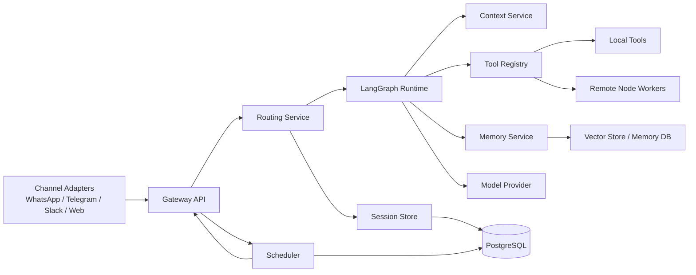
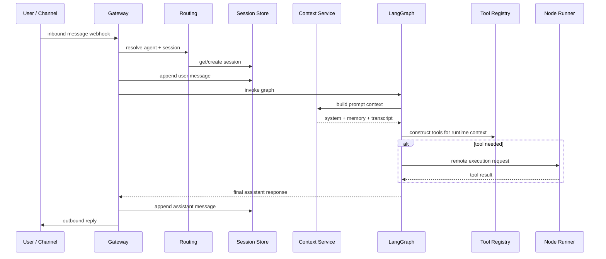
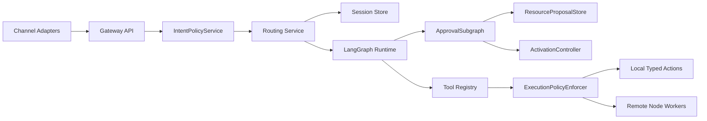

# Building an OpenClaw-Style Alternative in Python with LangChain and LangGraph

## Purpose

This document reviews the current OpenClaw architecture and translates its major design ideas into a Python-first implementation using **LangChain** and **LangGraph**. The goal is not to clone OpenClaw feature-for-feature. The goal is to build an alternative that preserves the important system properties:

- a single gateway that owns inbound/outbound chat integration
- durable per-user and per-channel sessions
- tool-using agents with strong routing and orchestration
- controllable context assembly and compaction
- long-term memory that is persisted outside the model
- schedulable automation
- optional remote execution on worker/node hosts
- operational and security guardrails

The resulting architecture is suitable for a self-hosted, multi-channel AI assistant that can serve as a personal or team automation layer.

---

## 1. What OpenClaw’s architecture is doing

OpenClaw is built around a **single long-lived Gateway** that owns the messaging surfaces and acts as the source of truth for routing and session management. That gateway is the process that receives inbound messages, runs the model, and dispatches tool calls. Nodes can connect to it over WebSocket to provide remote execution capability. Control-plane clients also connect to the gateway over WebSocket rather than talking directly to the model runtime.

Conceptually, the system breaks down into these architectural concerns:

### 1.1 Messaging gateway

The gateway is the front door. It owns channel integrations, receives messages, determines which agent/session should handle them, and manages the run lifecycle.

### 1.2 Session management

OpenClaw treats sessions as first-class persistent objects. Direct messages can collapse into one long-lived “main” session for continuity, or be isolated per peer/channel depending on policy. Transcripts are persisted independently of the model provider.

### 1.3 Context engine

Instead of treating prompt construction as ad hoc glue code, OpenClaw makes context assembly explicit. The context engine is responsible for:

- ingesting new messages
- assembling what the model should see
- compacting older history when token limits are reached
- doing after-turn persistence or index maintenance

### 1.4 Memory as durable external state

OpenClaw’s memory model is notable because the source of truth is not hidden vector state inside the model runtime. Memory is persisted outside the prompt and can be indexed/searchable by a memory plugin.

### 1.5 Tool and plugin capability layer

OpenClaw exposes typed tools and a plugin architecture that registers capabilities such as inference providers, speech, web search, channels, and memory/context components. The practical architectural point is that the runtime depends on **stable capability contracts**, not one-off tool wiring.

### 1.6 Scheduled automation

Cron lives in the gateway. Jobs persist and can either re-enter the main session, run in a dedicated isolated session, or target the current session.

### 1.7 Remote execution via nodes

The gateway can forward selected exec/tool actions to a remote node host, while approvals and allowlists are enforced on the execution host rather than only on the gateway.

### 1.8 Workspace-centric operation

The workspace is the agent’s home for instructions and durable files. Sessions and operational state live separately from the workspace.

---

## 2. What to preserve in a Python alternative

If you are reimplementing this with LangChain and LangGraph, the most important thing to preserve is not the exact file layout or UI. It is the separation of responsibilities.

You want these boundaries:

1. **Gateway service**: receives messages and owns routing.
2. **Session store**: durable conversation and metadata storage.
3. **Graph runtime**: executes the agent workflow.
4. **Context service**: assembles prompt input and compacts history.
5. **Memory service**: extracts, stores, and retrieves durable memory.
6. **Tool registry**: exposes typed capabilities to the graph.
7. **Scheduler**: triggers work without bypassing the gateway.
8. **Node/worker execution layer**: runs privileged or remote actions.
9. **Policy/security layer**: applies channel, tool, and execution rules.

That separation is what keeps the system maintainable when you add more channels, more tools, and more agents.

---

## 3. Recommended Python architecture

A solid Python implementation can use the following stack:

- **FastAPI** for the gateway HTTP/WebSocket service
- **LangGraph** for deterministic agent orchestration
- **LangChain** for model adapters, tools, retrievers, and structured output
- **PostgreSQL** for session metadata, transcripts, jobs, approvals, and routing state
- **Redis** for short-lived locks, dedupe, rate limiting, and ephemeral caches
- **pgvector** or **Chroma** for semantic memory/retrieval indexes
- **APScheduler** or **Arq/Dramatiq/Celery** for scheduled and async work
- **Pydantic** for contracts and tool payload schemas
- **SQLAlchemy** for persistence

### 3.1 Service topology



### 3.2 Core design decision

Do **not** let each channel adapter invoke LangGraph directly. All requests should enter through the gateway so that:

- routing rules are consistent
- idempotency is centralized
- session lifecycle is uniform
- approvals and audit logging are enforceable
- scheduled jobs and user messages share one execution path

---

## 4. Mapping OpenClaw concepts to LangGraph concepts

| OpenClaw concept | Python/LangGraph equivalent |
|---|---|
| Gateway | FastAPI service with adapter webhooks/WebSockets |
| Session routing | Routing service + SQL session tables |
| Agent runtime | LangGraph compiled graph |
| Context engine | Prompt assembly/compaction service invoked before model node |
| Memory plugin | Memory extraction + retrieval service |
| Typed tools | LangChain tools / structured tool wrappers |
| Cron | Scheduler service creating gateway events |
| Node host | Remote worker service with signed task execution |
| Workspace files | Mounted/project workspace + durable instruction bundle |
| Approvals | Policy engine + human approval queue |

This mapping matters because it avoids building a “giant agent function” that mixes transport, memory, orchestration, and execution policy into one object.

---

## 5. Recommended project structure

```text
openassistant/
├── apps/
│   ├── gateway/
│   │   ├── main.py
│   │   ├── api/
│   │   │   ├── inbound.py
│   │   │   ├── health.py
│   │   │   └── admin.py
│   │   ├── websocket/
│   │   │   └── control.py
│   │   ├── channels/
│   │   │   ├── base.py
│   │   │   ├── telegram.py
│   │   │   ├── slack.py
│   │   │   └── webchat.py
│   │   └── deps.py
│   ├── worker/
│   │   ├── jobs.py
│   │   └── scheduler.py
│   └── node_runner/
│       ├── main.py
│       └── executor.py
├── src/
│   ├── config/
│   │   └── settings.py
│   ├── db/
│   │   ├── base.py
│   │   ├── session.py
│   │   └── models.py
│   ├── domain/
│   │   ├── events.py
│   │   └── schemas.py
│   ├── routing/
│   │   ├── service.py
│   │   └── policies.py
│   ├── sessions/
│   │   ├── repository.py
│   │   └── service.py
│   ├── memory/
│   │   ├── service.py
│   │   ├── extraction.py
│   │   └── retriever.py
│   ├── context/
│   │   └── service.py
│   ├── tools/
│   │   ├── registry.py
│   │   ├── messaging.py
│   │   ├── calendar.py
│   │   └── remote_exec.py
│   ├── policies/
│   │   └── service.py
│   ├── graphs/
│   │   ├── state.py
│   │   ├── nodes.py
│   │   ├── assistant_graph.py
│   │   └── prompts.py
│   ├── providers/
│   │   └── models.py
│   └── observability/
│       └── tracing.py
├── migrations/
├── tests/
├── docs/
└── pyproject.toml
```

This keeps operational services separate from reusable domain and graph code.

---

## 6. Data model

At minimum, create these durable tables/collections.

### 6.1 Sessions

- `sessions`
  - `session_id`
  - `agent_id`
  - `session_key`
  - `channel_type`
  - `channel_account_id`
  - `peer_id`
  - `group_id`
  - `scope` (`main`, `per_peer`, `per_channel_peer`, `group`)
  - `status`
  - `created_at`
  - `updated_at`

### 6.2 Transcript events

- `messages`
  - `message_id`
  - `session_id`
  - `role`
  - `content_json`
  - `attachments_json`
  - `tool_calls_json`
  - `tool_results_json`
  - `token_count`
  - `created_at`

Store transcript events as append-only records. Resist the temptation to mutate prior assistant messages.

### 6.3 Memory records

- `memory_items`
  - `memory_id`
  - `agent_id`
  - `scope` (`global`, `session`, `user`, `channel`, `entity`)
  - `kind` (`fact`, `preference`, `task`, `summary`, `entity`, `episodic`)
  - `content`
  - `source_session_id`
  - `confidence`
  - `last_seen_at`
  - `embedding`

### 6.4 Jobs

- `scheduled_jobs`
- `job_runs`

### 6.5 Approvals and policies

- `approval_requests`
- `tool_policies`
- `channel_policies`
- `exec_allowlists`

### 6.6 Routing bindings

- `channel_bindings`
  - maps channel account/group/user patterns to an `agent_id`

---

## 7. Concrete code scaffolding

The rest of this document turns the architecture into starter code. The code is intentionally scaffold-level: it is meant to be valid, structurally sound, and easy to extend, rather than pretending to be a finished product.

---

## 8. `pyproject.toml`

```toml
[project]
name = "openassistant"
version = "0.1.0"
description = "OpenClaw-style self-hosted gateway built with LangChain and LangGraph"
requires-python = ">=3.11"
dependencies = [
  "fastapi>=0.116.0",
  "uvicorn[standard]>=0.35.0",
  "pydantic>=2.11.0",
  "pydantic-settings>=2.10.0",
  "sqlalchemy>=2.0.43",
  "psycopg[binary]>=3.2.9",
  "alembic>=1.16.0",
  "redis>=6.4.0",
  "httpx>=0.28.1",
  "langchain>=1.0.0",
  "langgraph>=0.6.0",
  "langchain-openai>=0.3.0",
  "langchain-community>=0.3.0",
  "langchain-chroma>=0.2.0",
  "chromadb>=1.0.0",
  "apscheduler>=3.11.0",
  "structlog>=25.4.0",
  "tenacity>=9.1.2",
]

[tool.pytest.ini_options]
pythonpath = ["."]
addopts = "-q"
```

---

## 9. Configuration

### `src/config/settings.py`

```python
from functools import lru_cache
from pydantic import Field
from pydantic_settings import BaseSettings, SettingsConfigDict


class Settings(BaseSettings):
    model_config = SettingsConfigDict(env_file=".env", env_file_encoding="utf-8", extra="ignore")

    app_name: str = "openassistant-gateway"
    environment: str = Field(default="dev")
    database_url: str
    redis_url: str = "redis://localhost:6379/0"

    default_model: str = "gpt-4.1-mini"
    openai_api_key: str | None = None

    chroma_persist_dir: str = ".chroma"
    scheduler_timezone: str = "UTC"
    signing_secret: str = "change-me"


@lru_cache(maxsize=1)
def get_settings() -> Settings:
    return Settings()
```

---

## 10. Domain contracts

### `src/domain/schemas.py`

```python
from __future__ import annotations

from datetime import datetime
from enum import Enum
from typing import Any
from uuid import UUID

from pydantic import BaseModel, Field


class ChannelType(str, Enum):
    telegram = "telegram"
    slack = "slack"
    webchat = "webchat"
    scheduler = "scheduler"


class SessionScope(str, Enum):
    main = "main"
    per_peer = "per_peer"
    per_channel_peer = "per_channel_peer"
    group = "group"


class MessageRole(str, Enum):
    user = "user"
    assistant = "assistant"
    tool = "tool"
    system = "system"


class InboundMessage(BaseModel):
    external_message_id: str
    channel_type: ChannelType
    channel_account_id: str
    peer_id: str
    group_id: str | None = None
    text: str
    attachments: list[dict[str, Any]] = Field(default_factory=list)
    metadata: dict[str, Any] = Field(default_factory=dict)
    received_at: datetime = Field(default_factory=datetime.utcnow)


class RouteDecision(BaseModel):
    agent_id: str
    session_key: str
    scope: SessionScope


class GatewayResponse(BaseModel):
    session_id: UUID
    response_text: str
    tool_events: list[dict[str, Any]] = Field(default_factory=list)
```

---

## 11. SQLAlchemy models

### `src/db/base.py`

```python
from sqlalchemy.orm import DeclarativeBase


class Base(DeclarativeBase):
    pass
```

### `src/db/models.py`

```python
from __future__ import annotations

import uuid
from datetime import datetime

from sqlalchemy import DateTime, Float, ForeignKey, String, Text, JSON, func
from sqlalchemy.dialects.postgresql import UUID
from sqlalchemy.orm import Mapped, mapped_column, relationship

from src.db.base import Base


class SessionModel(Base):
    __tablename__ = "sessions"

    session_id: Mapped[uuid.UUID] = mapped_column(UUID(as_uuid=True), primary_key=True, default=uuid.uuid4)
    agent_id: Mapped[str] = mapped_column(String(100), index=True)
    session_key: Mapped[str] = mapped_column(String(255), unique=True, index=True)
    channel_type: Mapped[str] = mapped_column(String(50), index=True)
    channel_account_id: Mapped[str] = mapped_column(String(255), index=True)
    peer_id: Mapped[str] = mapped_column(String(255), index=True)
    group_id: Mapped[str | None] = mapped_column(String(255), nullable=True)
    scope: Mapped[str] = mapped_column(String(50))
    status: Mapped[str] = mapped_column(String(50), default="active")
    created_at: Mapped[datetime] = mapped_column(DateTime(timezone=True), server_default=func.now())
    updated_at: Mapped[datetime] = mapped_column(DateTime(timezone=True), server_default=func.now(), onupdate=func.now())

    messages: Mapped[list["MessageModel"]] = relationship(back_populates="session", cascade="all, delete-orphan")


class MessageModel(Base):
    __tablename__ = "messages"

    message_id: Mapped[uuid.UUID] = mapped_column(UUID(as_uuid=True), primary_key=True, default=uuid.uuid4)
    session_id: Mapped[uuid.UUID] = mapped_column(ForeignKey("sessions.session_id", ondelete="CASCADE"), index=True)
    role: Mapped[str] = mapped_column(String(50), index=True)
    content_json: Mapped[dict] = mapped_column(JSON, default=dict)
    attachments_json: Mapped[list] = mapped_column(JSON, default=list)
    tool_calls_json: Mapped[list] = mapped_column(JSON, default=list)
    tool_results_json: Mapped[list] = mapped_column(JSON, default=list)
    token_count: Mapped[int | None] = mapped_column(nullable=True)
    created_at: Mapped[datetime] = mapped_column(DateTime(timezone=True), server_default=func.now(), index=True)

    session: Mapped[SessionModel] = relationship(back_populates="messages")


class MemoryItemModel(Base):
    __tablename__ = "memory_items"

    memory_id: Mapped[uuid.UUID] = mapped_column(UUID(as_uuid=True), primary_key=True, default=uuid.uuid4)
    agent_id: Mapped[str] = mapped_column(String(100), index=True)
    scope: Mapped[str] = mapped_column(String(50), index=True)
    kind: Mapped[str] = mapped_column(String(50), index=True)
    content: Mapped[str] = mapped_column(Text)
    source_session_id: Mapped[uuid.UUID | None] = mapped_column(UUID(as_uuid=True), nullable=True)
    confidence: Mapped[float] = mapped_column(Float, default=0.5)
    last_seen_at: Mapped[datetime] = mapped_column(DateTime(timezone=True), server_default=func.now())
```

### `src/db/session.py`

```python
from sqlalchemy import create_engine
from sqlalchemy.orm import sessionmaker

from src.config.settings import get_settings

settings = get_settings()
engine = create_engine(settings.database_url, future=True, pool_pre_ping=True)
SessionLocal = sessionmaker(bind=engine, autoflush=False, autocommit=False, expire_on_commit=False)


def get_db():
    db = SessionLocal()
    try:
        yield db
    finally:
        db.close()
```

---

## 12. Session repository and service

### `src/sessions/repository.py`

```python
from __future__ import annotations

from sqlalchemy import select
from sqlalchemy.orm import Session

from src.db.models import MessageModel, SessionModel
from src.domain.schemas import InboundMessage, MessageRole, RouteDecision


class SessionRepository:
    def __init__(self, db: Session):
        self.db = db

    def get_by_session_key(self, session_key: str) -> SessionModel | None:
        stmt = select(SessionModel).where(SessionModel.session_key == session_key)
        return self.db.scalar(stmt)

    def create_session(self, inbound: InboundMessage, route: RouteDecision) -> SessionModel:
        model = SessionModel(
            agent_id=route.agent_id,
            session_key=route.session_key,
            channel_type=inbound.channel_type.value,
            channel_account_id=inbound.channel_account_id,
            peer_id=inbound.peer_id,
            group_id=inbound.group_id,
            scope=route.scope.value,
            status="active",
        )
        self.db.add(model)
        self.db.flush()
        return model

    def append_message(
        self,
        session_id,
        role: MessageRole,
        content: dict,
        attachments: list | None = None,
        tool_calls: list | None = None,
        tool_results: list | None = None,
        token_count: int | None = None,
    ) -> MessageModel:
        message = MessageModel(
            session_id=session_id,
            role=role.value,
            content_json=content,
            attachments_json=attachments or [],
            tool_calls_json=tool_calls or [],
            tool_results_json=tool_results or [],
            token_count=token_count,
        )
        self.db.add(message)
        self.db.flush()
        return message

    def list_recent_messages(self, session_id, limit: int = 25) -> list[MessageModel]:
        stmt = (
            select(MessageModel)
            .where(MessageModel.session_id == session_id)
            .order_by(MessageModel.created_at.desc())
            .limit(limit)
        )
        rows = list(self.db.scalars(stmt))
        rows.reverse()
        return rows
```

### `src/sessions/service.py`

```python
from __future__ import annotations

from sqlalchemy.orm import Session

from src.domain.schemas import InboundMessage, RouteDecision
from src.sessions.repository import SessionRepository


class SessionService:
    def __init__(self, db: Session):
        self.repo = SessionRepository(db)
        self.db = db

    def get_or_create_session(self, inbound: InboundMessage, route: RouteDecision):
        session = self.repo.get_by_session_key(route.session_key)
        if session:
            return session
        session = self.repo.create_session(inbound, route)
        self.db.commit()
        self.db.refresh(session)
        return session
```

---

## 13. Routing service

The routing layer should decide **which agent** and **which session namespace** an inbound message belongs to.

### `src/routing/service.py`

```python
from src.domain.schemas import InboundMessage, RouteDecision, SessionScope


class RoutingService:
    def route(self, inbound: InboundMessage) -> RouteDecision:
        # Replace this with DB-backed channel bindings and policy rules.
        if inbound.group_id:
            scope = SessionScope.group
            session_key = f"{inbound.channel_type.value}:{inbound.channel_account_id}:{inbound.group_id}:{inbound.peer_id}"
        else:
            scope = SessionScope.per_channel_peer
            session_key = f"{inbound.channel_type.value}:{inbound.channel_account_id}:{inbound.peer_id}"

        return RouteDecision(
            agent_id="default-assistant",
            session_key=session_key,
            scope=scope,
        )
```

---

## 14. Context service

This is the Python equivalent of OpenClaw’s explicit context engine.

### `src/context/service.py`

```python
from __future__ import annotations

from langchain_core.messages import AIMessage, HumanMessage, SystemMessage, ToolMessage

from src.db.models import MessageModel


class ContextService:
    def build_messages(
        self,
        system_prompt: str,
        transcript: list[MessageModel],
        memory_snippets: list[str],
        new_user_text: str,
        summary_snapshot=None,
    ):
        messages = [SystemMessage(content=system_prompt)]

        if summary_snapshot:
            messages.append(SystemMessage(content=f"Session summary:\n{summary_snapshot.summary_text}"))

        if memory_snippets:
            memory_block = "\n".join(f"- {item}" for item in memory_snippets)
            messages.append(SystemMessage(content=f"Relevant memory:\n{memory_block}"))

        for item in transcript:
            text = item.content_json.get("text", "")
            if item.role == "user":
                messages.append(HumanMessage(content=text))
            elif item.role == "assistant":
                messages.append(AIMessage(content=text))
            elif item.role == "tool":
                messages.append(ToolMessage(content=text, tool_call_id=item.content_json.get("tool_call_id", "unknown")))

        messages.append(HumanMessage(content=new_user_text))
        return messages
```

---

## 15. Memory service

Keep memory persistence outside the prompt runtime.

### `src/memory/service.py`

```python
from __future__ import annotations

from sqlalchemy.orm import Session

from src.db.models import MemoryItemModel


class MemoryService:
    def __init__(self, db: Session):
        self.db = db

    def retrieve_relevant_memory(self, agent_id: str, query: str, limit: int = 5) -> list[str]:
        # This is a placeholder. Replace with vector retrieval or hybrid search.
        rows = (
            self.db.query(MemoryItemModel)
            .filter(MemoryItemModel.agent_id == agent_id)
            .order_by(MemoryItemModel.last_seen_at.desc())
            .limit(limit)
            .all()
        )
        return [r.content for r in rows]

    def save_fact(self, agent_id: str, content: str, source_session_id=None, confidence: float = 0.7):
        row = MemoryItemModel(
            agent_id=agent_id,
            scope="user",
            kind="fact",
            content=content,
            source_session_id=source_session_id,
            confidence=confidence,
        )
        self.db.add(row)
        self.db.commit()
        return row
```

A stronger production version would:

- extract candidate facts/preferences/tasks after each turn
- deduplicate via semantic similarity plus entity keys
- store embeddings in pgvector or Chroma
- support scope filters such as `user`, `session`, and `channel`
- treat memory rows as **derived state** that can be regenerated from transcript history
- verify that newly written memory is retrievable before marking extraction successful
- keep extraction idempotent with a stable `dedupe_key` per turn

### 15.1 Recommended retrieval fallback order

To reduce continuity failures, do not rely on a single retrieval path. Rebuild the
model context from progressively less-processed sources:

1. recent transcript events from the canonical message store
2. latest valid summary snapshot for the session
3. semantic memory rows and entity facts
4. optional vector retrieval over older transcript chunks

If semantic memory is empty or stale, the system should still be able to reconstruct a
useful prompt from transcript + summary snapshot alone.

---

## 16. Tool registry

OpenClaw uses capability contracts rather than ad hoc wiring. In Python, mirror that with a registry that owns tool construction, policy checks, and exposure rules.

### 16.1 Tool runtime context

### `src/tools/registry.py`

```python
from __future__ import annotations

from dataclasses import dataclass
from typing import Callable
from uuid import UUID

from langchain.tools import tool


@dataclass(slots=True)
class ToolRuntimeContext:
    session_id: UUID
    agent_id: str
    channel_type: str
    requester_id: str


class ToolRegistry:
    def __init__(self):
        self._factories: dict[str, Callable[[ToolRuntimeContext], object]] = {}

    def register(self, name: str, factory: Callable[[ToolRuntimeContext], object]) -> None:
        self._factories[name] = factory

    def build_tools(self, ctx: ToolRuntimeContext) -> list[object]:
        return [factory(ctx) for factory in self._factories.values()]


registry = ToolRegistry()
```

### 16.2 Messaging tool

### `src/tools/messaging.py`

```python
from __future__ import annotations

from langchain.tools import tool

from src.tools.registry import ToolRuntimeContext, registry


class MessageDispatcher:
    def send_message(self, session_id, text: str) -> str:
        # Replace with channel-specific delivery adapters.
        return f"queued outbound message for session {session_id}: {text}"


def make_message_tool(ctx: ToolRuntimeContext):
    dispatcher = MessageDispatcher()

    @tool("message")
    def message(text: str) -> str:
        """Send a message back to the active chat session."""
        return dispatcher.send_message(ctx.session_id, text)

    return message


registry.register("message", make_message_tool)
```

### 16.3 Remote execution tool

### `src/tools/remote_exec.py`

```python
from __future__ import annotations

import httpx
from langchain.tools import tool

from src.tools.registry import ToolRuntimeContext, registry


class RemoteExecClient:
    def __init__(self, base_url: str = "http://localhost:8090"):
        self.base_url = base_url

    def run(self, command: str) -> str:
        response = httpx.post(f"{self.base_url}/execute", json={"command": command}, timeout=30.0)
        response.raise_for_status()
        return response.json()["output"]


def make_remote_exec_tool(ctx: ToolRuntimeContext):
    client = RemoteExecClient()

    @tool("system_run")
    def system_run(command: str) -> str:
        """Run an approved command on a remote node host."""
        return client.run(command)

    return system_run


registry.register("system_run", make_remote_exec_tool)
```

### 16.4 Calendar or business API tool

```python
from langchain.tools import tool

from src.tools.registry import ToolRuntimeContext, registry


def make_calendar_lookup_tool(ctx: ToolRuntimeContext):
    @tool("calendar_lookup")
    def calendar_lookup(date: str) -> str:
        """Look up events for a given ISO date."""
        return f"No calendar provider attached yet for {date}."

    return calendar_lookup


registry.register("calendar_lookup", make_calendar_lookup_tool)
```

### 16.5 Why this registry matters

This design gives you the same strategic benefits OpenClaw gets from a plugin/capability layer:

- tools are constructed from stable contracts
- runtime context is injected centrally
- tool exposure can vary by session/channel/policy
- approvals can be enforced before a factory returns a sensitive tool
- tests can instantiate tools without booting the whole gateway

---

## 17. LangGraph state

Your graph state should include transport metadata, transcript metadata, and scratch state for tool planning.

### `src/graphs/state.py`

```python
from __future__ import annotations

from typing import Any, TypedDict
from uuid import UUID

from langchain_core.messages import BaseMessage


class AssistantState(TypedDict, total=False):
    session_id: UUID
    agent_id: str
    channel_type: str
    user_text: str
    messages: list[BaseMessage]
    response_text: str
    tool_events: list[dict[str, Any]]
    memory_snippets: list[str]
    needs_tools: bool
```

---

## 18. LangGraph nodes

### `src/graphs/prompts.py`

```python
SYSTEM_PROMPT = """
You are a durable multi-channel assistant.

Rules:
- respond clearly and concisely
- use tools when needed
- prefer the shared message tool for channel replies
- do not invent successful tool outcomes
- if a privileged operation is blocked, explain the constraint
""".strip()
```

### `src/providers/models.py`

```python
from langchain_openai import ChatOpenAI

from src.config.settings import get_settings


def build_chat_model():
    settings = get_settings()
    return ChatOpenAI(model=settings.default_model, api_key=settings.openai_api_key, temperature=0)
```

### `src/graphs/nodes.py`

```python
from __future__ import annotations

from typing import Any

from langchain_core.messages import AIMessage
from langgraph.prebuilt import ToolNode

from src.context.service import ContextService
from src.domain.schemas import MessageRole
from src.graphs.prompts import SYSTEM_PROMPT
from src.graphs.state import AssistantState
from src.memory.service import MemoryService
from src.providers.models import build_chat_model
from src.sessions.repository import SessionRepository
from src.tools.registry import ToolRuntimeContext, registry


class GraphDependencies:
    def __init__(self, db):
        self.db = db
        self.sessions = SessionRepository(db)
        self.context = ContextService()
        self.memory = MemoryService(db)


def load_context_node(state: AssistantState, deps: GraphDependencies) -> AssistantState:
    transcript = deps.sessions.list_recent_messages(state["session_id"], limit=20)
    summary_snapshot = deps.sessions.get_latest_summary_snapshot(state["session_id"])
    memory = deps.memory.retrieve_relevant_memory(agent_id=state["agent_id"], query=state["user_text"], limit=5)
    messages = deps.context.build_messages(
        system_prompt=SYSTEM_PROMPT,
        transcript=transcript,
        memory_snippets=memory,
        new_user_text=state["user_text"],
        summary_snapshot=summary_snapshot,
    )
    return {
        "messages": messages,
        "memory_snippets": memory,
        "summary_snapshot_id": getattr(summary_snapshot, "id", None),
    }


def think_node(state: AssistantState, deps: GraphDependencies) -> AssistantState:
    tool_ctx = ToolRuntimeContext(
        session_id=state["session_id"],
        agent_id=state["agent_id"],
        channel_type=state["channel_type"],
        requester_id="active-user",
    )
    tools = registry.build_tools(tool_ctx)
    model = build_chat_model().bind_tools(tools)

    result = model.invoke(state["messages"])
    needs_tools = bool(getattr(result, "tool_calls", None))
    return {
        "messages": state["messages"] + [result],
        "needs_tools": needs_tools,
    }


def persist_response_node(state: AssistantState, deps: GraphDependencies) -> AssistantState:
    final_message = state["messages"][-1]
    text = getattr(final_message, "content", "")

    deps.sessions.append_message(
        session_id=state["session_id"],
        role=MessageRole.assistant,
        content={"text": text},
    )
    deps.db.commit()

    return {
        "response_text": text,
        "tool_events": [],
    }


def route_after_think(state: AssistantState) -> str:
    return "tools" if state.get("needs_tools") else "persist"
```

Notes:

- `ToolNode` is useful when you want a standard tool-execution node.
- You can also build your own tool executor if you need richer approval, retry, or audit behavior.

---

## 19. Graph assembly

### `src/graphs/assistant_graph.py`

```python
from __future__ import annotations

from functools import partial

from langgraph.graph import END, START, StateGraph
from langgraph.prebuilt import ToolNode

from src.graphs.nodes import (
    GraphDependencies,
    load_context_node,
    persist_response_node,
    route_after_think,
    think_node,
)
from src.graphs.state import AssistantState
from src.tools.registry import ToolRuntimeContext, registry


class GraphFactory:
    def __init__(self, db):
        self.deps = GraphDependencies(db)

    def compile(self, *, session_id, agent_id: str, channel_type: str):
        tool_ctx = ToolRuntimeContext(
            session_id=session_id,
            agent_id=agent_id,
            channel_type=channel_type,
            requester_id="active-user",
        )
        tool_node = ToolNode(registry.build_tools(tool_ctx))

        graph = StateGraph(AssistantState)
        graph.add_node("load_context", partial(load_context_node, deps=self.deps))
        graph.add_node("think", partial(think_node, deps=self.deps))
        graph.add_node("tools", tool_node)
        graph.add_node("persist", partial(persist_response_node, deps=self.deps))

        graph.add_edge(START, "load_context")
        graph.add_edge("load_context", "think")
        graph.add_conditional_edges("think", route_after_think, {"tools": "tools", "persist": "persist"})
        graph.add_edge("tools", "think")
        graph.add_edge("persist", END)

        return graph.compile()
```

This is the direct Python analogue to OpenClaw’s embedded agent-session runtime: the gateway creates or resumes a session, prepares the tool surface for that session, and invokes a compiled graph for the turn.

---

## 20. Gateway scaffolding

### `apps/gateway/deps.py`

```python
from fastapi import Depends
from sqlalchemy.orm import Session

from src.db.session import get_db
from src.routing.service import RoutingService
from src.sessions.service import SessionService


def get_routing_service() -> RoutingService:
    return RoutingService()


def get_session_service(db: Session = Depends(get_db)) -> SessionService:
    return SessionService(db)
```

### `apps/gateway/api/inbound.py`

```python
from fastapi import APIRouter, Depends
from sqlalchemy.orm import Session

from apps.gateway.deps import get_routing_service, get_session_service
from src.db.session import get_db
from src.domain.schemas import GatewayResponse, InboundMessage, MessageRole
from src.graphs.assistant_graph import GraphFactory
from src.sessions.repository import SessionRepository

router = APIRouter(prefix="/inbound", tags=["inbound"])


@router.post("/message", response_model=GatewayResponse)
def receive_message(
    inbound: InboundMessage,
    db: Session = Depends(get_db),
    routing=Depends(get_routing_service),
    session_service=Depends(get_session_service),
):
    route = routing.route(inbound)
    session = session_service.get_or_create_session(inbound, route)

    repo = SessionRepository(db)
    repo.append_message(
        session_id=session.session_id,
        role=MessageRole.user,
        content={"text": inbound.text},
        attachments=inbound.attachments,
    )
    db.commit()

    graph = GraphFactory(db).compile(
        session_id=session.session_id,
        agent_id=session.agent_id,
        channel_type=session.channel_type,
    )
    result = graph.invoke(
        {
            "session_id": session.session_id,
            "agent_id": session.agent_id,
            "channel_type": session.channel_type,
            "user_text": inbound.text,
            "tool_events": [],
        }
    )

    return GatewayResponse(
        session_id=session.session_id,
        response_text=result.get("response_text", ""),
        tool_events=result.get("tool_events", []),
    )
```

### `apps/gateway/api/health.py`

```python
from fastapi import APIRouter

router = APIRouter(tags=["health"])


@router.get("/healthz")
def healthz():
    return {"ok": True}
```

### `apps/gateway/main.py`

```python
from fastapi import FastAPI

from apps.gateway.api.health import router as health_router
from apps.gateway.api.inbound import router as inbound_router
from src.config.settings import get_settings

settings = get_settings()
app = FastAPI(title=settings.app_name)
app.include_router(health_router)
app.include_router(inbound_router)
```

Run it with:

```bash
uvicorn apps.gateway.main:app --reload --port 8000
```

---

## 21. Scheduler scaffolding

The scheduler should create a **gateway event**, not run the graph in isolation. That preserves the same entry semantics as a real user message.

### `apps/worker/scheduler.py`

```python
from __future__ import annotations

from apscheduler.schedulers.blocking import BlockingScheduler
import httpx


scheduler = BlockingScheduler(timezone="UTC")


@scheduler.scheduled_job("interval", minutes=30, id="follow-up-check")
def follow_up_job():
    payload = {
        "external_message_id": "sched-follow-up-check",
        "channel_type": "scheduler",
        "channel_account_id": "internal",
        "peer_id": "system",
        "text": "Run the scheduled follow-up check and summarize anything important.",
        "attachments": [],
        "metadata": {"job_id": "follow-up-check"},
    }
    httpx.post("http://localhost:8000/inbound/message", json=payload, timeout=60.0)


if __name__ == "__main__":
    scheduler.start()
```

---

## 22. Node runner scaffolding

OpenClaw’s node concept is one of its strongest architectural ideas. In Python, keep the same boundary: the gateway owns orchestration, while node hosts own privileged execution.

### `apps/node_runner/main.py`

```python
from fastapi import FastAPI, HTTPException
from pydantic import BaseModel

app = FastAPI(title="node-runner")


class ExecuteRequest(BaseModel):
    command: str


@app.post("/execute")
def execute(req: ExecuteRequest):
    allowed_prefixes = ["ls", "pwd", "echo", "python --version"]
    if not any(req.command.startswith(prefix) for prefix in allowed_prefixes):
        raise HTTPException(status_code=403, detail="command not approved")

    # Stub only. Replace with subprocess runner, sandboxing, and audit logging.
    return {"output": f"stub execution accepted: {req.command}"}
```

In production, add:

- signed requests from the gateway
- per-node allowlists
- human approval queue for sensitive tools
- process isolation or containerized execution
- OS-level audit and rate limiting

---

## 23. Outbound channel adapters

OpenClaw centralizes a shared `message` tool while letting channel plugins own the channel-specific execution details. Mirror that in Python:

```python
from abc import ABC, abstractmethod


class BaseChannelAdapter(ABC):
    @abstractmethod
    def send_text(self, peer_id: str, text: str) -> None:
        raise NotImplementedError


class TelegramAdapter(BaseChannelAdapter):
    def send_text(self, peer_id: str, text: str) -> None:
        # POST to Telegram API
        pass


class SlackAdapter(BaseChannelAdapter):
    def send_text(self, peer_id: str, text: str) -> None:
        # POST to Slack API
        pass
```

The shared messaging tool should target a `MessageDispatcher` that selects the correct adapter based on `channel_type` and route metadata.

---

## 24. Recommended execution flow



---

## 25. What to add next

The scaffolding above is enough to create a working baseline, but a serious OpenClaw-class system should add these next:

### 25.1 Checkpointing and graph persistence

Use LangGraph persistence/checkpointing so the graph can survive retries and be inspected during failures.

### 25.2 Better tool audit logging

Every tool call should be logged with:

- tool name
- arguments
- approval decision
- execution target
- duration
- outcome
- sanitized result preview

### 25.3 Real memory extraction

Add a post-turn memory extractor that produces structured outputs such as:

- user preference
- stable fact
- ongoing task
- project/entity relationship

### 25.4 Policy gating

Before exposing tools to the model, run a policy filter such as:

- deny shell tools in public group chats
- allow calendar tools only for authenticated users
- expose file tools only for selected agents/workspaces

### 25.5 Multi-agent routing

Instead of one `default-assistant`, let the router bind channels or patterns to:

- `coding-assistant`
- `ops-assistant`
- `personal-assistant`
- `team-bot`

### 25.6 Subgraphs

LangGraph subgraphs are a strong fit for:

- research subflows
- approval subflows
- memory extraction subflows
- specialized agent teams

---

## 26. Why this architecture is a good OpenClaw alternative

This Python design preserves the main strengths of OpenClaw without copying its implementation language or internals:

- **Gateway-first architecture** keeps sessions, routing, and channel state coherent.
- **Explicit context service** prevents prompt construction from turning into hidden glue code.
- **Typed tool registry** mirrors a plugin/capability system instead of ad hoc function injection.
- **Durable memory outside the model** keeps continuity inspectable and portable.
- **Scheduler re-enters the gateway** so automations behave like first-class conversations.
- **Remote node runners** separate orchestration from privileged execution.
- **LangGraph orchestration** gives deterministic control over loops, tools, branching, and future multi-agent extensions.

That is the architectural shape that matters.

---

## 27. Implementation advice

If you actually build this, do it in four phases.

### Phase 1: Core gateway

Build only:

- FastAPI inbound endpoint
- PostgreSQL sessions/messages
- one model provider
- one outbound message channel
- one simple LangGraph graph

### Phase 2: Tools and policies

Add:

- message tool
- one business/API tool
- one remote-exec tool
- policy-based tool exposure
- audit logging

### Phase 3: Memory and scheduling

Add:

- memory extraction
- memory retrieval
- APScheduler or queue workers
- scheduled jobs that re-enter the gateway

### Phase 4: Multi-channel and node hosts

Add:

- more channel adapters
- node-runner authentication
- approval workflows
- subgraphs for specialist agents

That incremental path will get you to a production-grade design without trying to build every advanced feature at once.

---

## 28. Source alignment notes

This blueprint is intentionally aligned to the documented OpenClaw architecture ideas rather than its Node.js implementation details:

- one gateway as source of truth
- shared message tool plus channel-owned execution boundary
- explicit session lifecycle
- explicit context engine and memory plugin slots
- persistent cron/jobs in the gateway
- remote nodes as separate execution hosts

LangGraph is a good fit for the execution core because it natively models stateful nodes, edges, loops, and subgraphs, while LangChain provides the model/tool abstractions needed to expose a clean capability layer.

---

## 29. Context Engine Lifecycle

OpenClaw formalises context management as a four-phase plugin contract. Each phase runs at a specific point in the turn lifecycle. The existing document's `ContextService` covers assembly but omits the other three phases. Mirror all four in Python.

### Four lifecycle phases

| Phase | When it runs | What it does |
|---|---|---|
| **Ingest** | When a new message arrives | Store or index the message in an auxiliary data store |
| **Assemble** | Before each model call | Return the ordered message list that fits the token budget |
| **Compact** | When context is full or `/compact` is requested | Summarise older history to free space |
| **After turn** | After the run completes | Persist state, trigger background compaction, update indexes |

### `src/context/engine.py`

```python
from __future__ import annotations

from abc import ABC, abstractmethod
from dataclasses import dataclass, field
from typing import Any

from langchain_core.messages import BaseMessage


@dataclass
class AssembleResult:
    messages: list[BaseMessage]
    estimated_tokens: int
    system_prompt_addition: str | None = None


@dataclass
class IngestParams:
    session_id: str
    message: dict[str, Any]
    is_heartbeat: bool = False


@dataclass
class AssembleParams:
    session_id: str
    messages: list[BaseMessage]
    token_budget: int


@dataclass
class CompactParams:
    session_id: str
    force: bool = False


class ContextEngine(ABC):
    """Abstract base for pluggable context engines."""

    @abstractmethod
    async def ingest(self, params: IngestParams) -> dict[str, Any]:
        """Store/index an incoming message. Returns ingest metadata."""

    @abstractmethod
    async def assemble(self, params: AssembleParams) -> AssembleResult:
        """Build the context that goes to the model."""

    @abstractmethod
    async def compact(self, params: CompactParams) -> dict[str, Any]:
        """Reduce context when token limit is approaching."""

    async def after_turn(self, session_id: str, result: dict[str, Any]) -> None:
        """Post-run hook: persist state, background work, index updates."""

    async def bootstrap(self, session_id: str) -> None:
        """Initialise engine state for a new session."""

    async def dispose(self) -> None:
        """Release resources on gateway shutdown."""
```

### `src/context/legacy_engine.py`

The legacy engine mirrors OpenClaw's built-in behaviour — a token-budget-aware
pass-through that compacts by calling the LLM to summarise older history.

```python
from __future__ import annotations

import tiktoken
from langchain_core.messages import BaseMessage, SystemMessage

from src.context.engine import AssembleParams, AssembleResult, CompactParams, ContextEngine, IngestParams


def _count_tokens(messages: list[BaseMessage], model: str = "gpt-4o") -> int:
    enc = tiktoken.encoding_for_model(model)
    total = 0
    for m in messages:
        total += len(enc.encode(m.content if isinstance(m.content, str) else str(m.content)))
    return total


class LegacyContextEngine(ContextEngine):
    """Pass-through engine: trim oldest messages when over budget."""

    async def ingest(self, params: IngestParams) -> dict:
        return {"ingested": True}

    async def assemble(self, params: AssembleParams) -> AssembleResult:
        messages = params.messages
        budget = params.token_budget
        while messages and _count_tokens(messages) > budget:
            # Remove the oldest non-system message
            for i, m in enumerate(messages):
                if not isinstance(m, SystemMessage):
                    messages = messages[:i] + messages[i + 1:]
                    break
        return AssembleResult(
            messages=messages,
            estimated_tokens=_count_tokens(messages),
        )

    async def compact(self, params: CompactParams) -> dict:
        # In production: call LLM to summarise and replace oldest N messages
        # with a single SummaryMessage.
        return {"ok": True, "compacted": False, "reason": "stub"}
```

Add `tiktoken` to `pyproject.toml` dependencies and wire the engine into
`ContextService` so every turn calls `ingest → assemble → (compact if needed) → after_turn`.

### 29.1 Context continuity and memory-loss prevention

If you are building this system specifically to avoid the class of failures where the
assistant "forgets" durable context, this needs to be an explicit architecture goal,
not an implied side effect of using a memory store.

#### Design rules

1. **Transcript is canonical.** The append-only transcript store is the source of truth for every turn.
2. **Memory and summaries are derived.** Vector memory, extracted facts, and summaries must be disposable and rebuildable.
3. **Turn completion is transactional.** If transcript commit fails, the turn failed. Do not run after-turn memory jobs.
4. **Compaction is versioned, not destructive.** Write a new snapshot row; never overwrite the only copy of history.
5. **Recovery can replay.** On restart, replay transcript events and regenerate summaries/memory.

#### Required data-model additions

Add two durable tables beyond the base transcript schema:

- `summary_snapshots` for versioned compaction artifacts
- `outbox_jobs` for idempotent post-commit work such as memory extraction and reindexing

```python
# src/db/models_continuity.py
from __future__ import annotations

import uuid
from datetime import datetime

from sqlalchemy import DateTime, ForeignKey, Integer, JSON, String, Text, UniqueConstraint, func
from sqlalchemy.dialects.postgresql import UUID
from sqlalchemy.orm import Mapped, mapped_column

from src.db.base import Base


class SummarySnapshotModel(Base):
    __tablename__ = "summary_snapshots"

    id: Mapped[uuid.UUID] = mapped_column(UUID(as_uuid=True), primary_key=True, default=uuid.uuid4)
    session_id: Mapped[uuid.UUID] = mapped_column(UUID(as_uuid=True), ForeignKey("sessions.id"), index=True)
    version: Mapped[int] = mapped_column(Integer, nullable=False)
    base_message_id: Mapped[uuid.UUID | None] = mapped_column(UUID(as_uuid=True), nullable=True)
    through_message_id: Mapped[uuid.UUID | None] = mapped_column(UUID(as_uuid=True), nullable=True)
    summary_text: Mapped[str] = mapped_column(Text, nullable=False)
    metadata_json: Mapped[dict] = mapped_column(JSON, default=dict, nullable=False)
    created_at: Mapped[datetime] = mapped_column(DateTime(timezone=True), server_default=func.now(), nullable=False)

    __table_args__ = (
        UniqueConstraint("session_id", "version", name="uq_summary_snapshot_version"),
    )


class OutboxJobModel(Base):
    __tablename__ = "outbox_jobs"

    id: Mapped[uuid.UUID] = mapped_column(UUID(as_uuid=True), primary_key=True, default=uuid.uuid4)
    job_type: Mapped[str] = mapped_column(String(64), nullable=False, index=True)
    dedupe_key: Mapped[str] = mapped_column(String(255), nullable=False, unique=True)
    payload_json: Mapped[dict] = mapped_column(JSON, default=dict, nullable=False)
    status: Mapped[str] = mapped_column(String(32), default="pending", nullable=False, index=True)
    created_at: Mapped[datetime] = mapped_column(DateTime(timezone=True), server_default=func.now(), nullable=False)
```

#### Versioned compaction flow

```python
# src/context/compaction.py
from __future__ import annotations

from sqlalchemy import func, select
from sqlalchemy.orm import Session

from src.db.models_continuity import SummarySnapshotModel


class SummaryStore:
    def __init__(self, db: Session):
        self.db = db

    def write_snapshot(self, session_id: str, summary_text: str, metadata: dict) -> SummarySnapshotModel:
        current_version = self.db.scalar(
            select(func.coalesce(func.max(SummarySnapshotModel.version), 0)).where(
                SummarySnapshotModel.session_id == session_id
            )
        )
        row = SummarySnapshotModel(
            session_id=session_id,
            version=int(current_version or 0) + 1,
            summary_text=summary_text,
            metadata_json=metadata,
        )
        self.db.add(row)
        self.db.commit()
        self.db.refresh(row)
        return row
```

#### Recovery and repair jobs

Implement a periodic repair loop that can:

- detect sessions where transcript length is high but summary/memory is missing
- regenerate latest summaries from transcript ranges
- re-run memory extraction for turns whose outbox jobs failed
- verify that semantic retrieval returns at least one durable result for active sessions

#### Continuity observability

Add metrics and alerts for:

- transcript commit failures
- outbox job retry count
- sessions with no summary snapshot after N turns
- memory retrieval returning zero results for long-running sessions
- summary snapshot write failures
- replay duration for recovery jobs

#### Failure-mode testing

Your test plan should include:

- gateway crash after transcript commit but before memory extraction
- crash during summary compaction
- vector index unavailable while transcript DB is healthy
- duplicate outbox delivery
- two concurrent inbound messages to the same session
- replay from transcript after deleting derived memory rows

A design like this directly addresses memory-loss incidents because it assumes
that memory indexes and summaries will sometimes fail, lag, or corrupt — and still
keeps enough durable information to reconstruct continuity.

---

## 30. Streaming Response Architecture

OpenClaw ships a dedicated block chunker that splits model output into reply
blocks and parses reply directives embedded in the streaming text. The Python
alternative should handle this as a post-processing step before outbound
dispatch rather than treating the raw response string as the final output.

### Reply directives

OpenClaw embeds structured directives in model output, for example:

```
[[media:https://example.com/image.png]]
[[voice]]
[[reply:msg-id-123]]
```

Implement a parser that strips these from the displayed text and routes them
to the correct outbound action:

```python
# src/domain/reply_directives.py
from __future__ import annotations

import re
from dataclasses import dataclass, field


_MEDIA_RE = re.compile(r"\[\[media:([^\]]+)\]\]")
_VOICE_RE = re.compile(r"\[\[voice\]\]")
_REPLY_RE = re.compile(r"\[\[reply:([^\]]+)\]\]")


@dataclass
class ParsedReply:
    text: str
    media_urls: list[str] = field(default_factory=list)
    audio_as_voice: bool = False
    reply_to_id: str | None = None


def parse_reply_directives(raw: str) -> ParsedReply:
    media_urls = _MEDIA_RE.findall(raw)
    audio_as_voice = bool(_VOICE_RE.search(raw))
    reply_match = _REPLY_RE.search(raw)
    reply_to_id = reply_match.group(1) if reply_match else None

    clean = _MEDIA_RE.sub("", raw)
    clean = _VOICE_RE.sub("", clean)
    clean = _REPLY_RE.sub("", clean)
    return ParsedReply(
        text=clean.strip(),
        media_urls=media_urls,
        audio_as_voice=audio_as_voice,
        reply_to_id=reply_to_id,
    )
```

### Block chunking

For long responses, break output into chunks before sending so channel
adapters can deliver multi-message replies that feel natural:

```python
# src/domain/block_chunker.py
from __future__ import annotations

import re
from dataclasses import dataclass


@dataclass
class ChunkConfig:
    max_chars: int = 1500
    split_on_paragraphs: bool = True


def chunk_text(text: str, cfg: ChunkConfig) -> list[str]:
    if len(text) <= cfg.max_chars:
        return [text]

    if cfg.split_on_paragraphs:
        paragraphs = re.split(r"\n{2,}", text)
        chunks: list[str] = []
        current = ""
        for para in paragraphs:
            if len(current) + len(para) + 2 > cfg.max_chars and current:
                chunks.append(current.strip())
                current = para
            else:
                current = current + "\n\n" + para if current else para
        if current:
            chunks.append(current.strip())
        return chunks

    # Fallback: hard split at max_chars
    return [text[i:i + cfg.max_chars] for i in range(0, len(text), cfg.max_chars)]
```

Wire `parse_reply_directives` and `chunk_text` into the outbound dispatch path
so every assistant reply is processed before delivery.

---

## 31. Error Classification and Retry Policy

OpenClaw classifies errors at the model/agent level before deciding whether to
retry, compact, failover, or surface the error to the user. Add an equivalent
classifier to the Python gateway so node failures are handled deliberately.

### `src/domain/errors.py`

```python
from __future__ import annotations

from enum import Enum


class FailureKind(str, Enum):
    context_overflow = "context_overflow"
    compaction_failure = "compaction_failure"
    auth_failure = "auth_failure"
    rate_limit = "rate_limit"
    quota_exceeded = "quota_exceeded"
    timeout = "timeout"
    provider_error = "provider_error"
    unknown = "unknown"


_CONTEXT_PATTERNS = [
    "context_length_exceeded",
    "maximum context length",
    "too many tokens",
    "context window",
]
_RATE_LIMIT_PATTERNS = ["rate limit", "rate_limit", "too many requests", "429"]
_AUTH_PATTERNS = ["invalid api key", "unauthorized", "authentication", "401"]
_QUOTA_PATTERNS = ["quota", "billing", "insufficient_quota"]


def classify_failure(error_text: str) -> FailureKind:
    t = error_text.lower()
    if any(p in t for p in _CONTEXT_PATTERNS):
        return FailureKind.context_overflow
    if any(p in t for p in _RATE_LIMIT_PATTERNS):
        return FailureKind.rate_limit
    if any(p in t for p in _AUTH_PATTERNS):
        return FailureKind.auth_failure
    if any(p in t for p in _QUOTA_PATTERNS):
        return FailureKind.quota_exceeded
    return FailureKind.unknown
```

### Retry policy in the graph

Add an error-handling node that reads `FailureKind` and routes accordingly:

```python
# In src/graphs/nodes.py

from src.domain.errors import FailureKind, classify_failure


def handle_error_node(state: AssistantState, deps: GraphDependencies) -> AssistantState:
    error_text = state.get("last_error", "")
    kind = classify_failure(error_text)

    if kind == FailureKind.context_overflow:
        # Trigger compaction then retry
        return {**state, "needs_compact": True}
    if kind == FailureKind.rate_limit:
        # Surface to user; upstream retry with backoff
        return {**state, "response_text": "Rate limited. Please retry in a moment."}
    if kind == FailureKind.auth_failure:
        # Rotate auth profile if multi-profile is configured
        return {**state, "needs_auth_rotation": True}
    return {**state, "response_text": f"An error occurred ({kind}). Please try again."}
```

Add `last_error`, `needs_compact`, and `needs_auth_rotation` to `AssistantState` and
wire `handle_error_node` into the graph with conditional edges from `think_node`.

---

## 32. Multi-Auth Profile Rotation and Failover

OpenClaw maintains a per-agent auth profile store with cooldown tracking and
automatic rotation when a profile fails. In a Python system serving multiple
users or high-volume workloads, a single API key becomes a single point of
failure. Build equivalent multi-profile support.

### Data model addition

```sql
-- Add to migrations
CREATE TABLE auth_profiles (
    profile_id  UUID PRIMARY KEY DEFAULT gen_random_uuid(),
    agent_id    TEXT NOT NULL,
    provider    TEXT NOT NULL,
    api_key     TEXT NOT NULL,
    priority    INTEGER DEFAULT 0,
    status      TEXT DEFAULT 'active',  -- active | cooldown | disabled
    cooldown_until TIMESTAMPTZ,
    failure_count INTEGER DEFAULT 0,
    created_at  TIMESTAMPTZ DEFAULT now()
);
```

### `src/providers/auth_profiles.py`

```python
from __future__ import annotations

from datetime import datetime, timedelta, timezone

from sqlalchemy import select
from sqlalchemy.orm import Session


class AuthProfileStore:
    def __init__(self, db: Session, agent_id: str, provider: str):
        self.db = db
        self.agent_id = agent_id
        self.provider = provider

    def get_active_key(self) -> str | None:
        """Return the highest-priority API key that is not on cooldown."""
        now = datetime.now(timezone.utc)
        stmt = (
            select(AuthProfileModel)
            .where(
                AuthProfileModel.agent_id == self.agent_id,
                AuthProfileModel.provider == self.provider,
                AuthProfileModel.status == "active",
            )
            .where(
                (AuthProfileModel.cooldown_until == None)  # noqa: E711
                | (AuthProfileModel.cooldown_until < now)
            )
            .order_by(AuthProfileModel.priority.desc())
            .limit(1)
        )
        row = self.db.scalar(stmt)
        return row.api_key if row else None

    def mark_failure(self, api_key: str, cooldown_minutes: int = 10) -> None:
        stmt = select(AuthProfileModel).where(
            AuthProfileModel.agent_id == self.agent_id,
            AuthProfileModel.api_key == api_key,
        )
        row = self.db.scalar(stmt)
        if row:
            row.failure_count += 1
            row.cooldown_until = datetime.now(timezone.utc) + timedelta(minutes=cooldown_minutes)
            self.db.commit()
```

Wire `AuthProfileStore` into `build_chat_model()` so the graph picks an active
key before each invocation. On `auth_failure`, call `mark_failure` and rotate.

---

## 33. Command Queue and Concurrency Lane Model

OpenClaw distinguishes session-scoped lanes (one run at a time per session) from
global lanes (system-wide concurrency limits). Without this, a busy session can
starve others or a slow tool can block the event loop.

### Two-lane design

- **Session lane**: only one graph run per `session_id` at a time. An incoming
  message while a run is active is either queued or rejected with a "busy" reply.
- **Global lane**: cap the total number of concurrent graph runs across all sessions.

### `src/sessions/concurrency.py`

```python
from __future__ import annotations

import asyncio
from collections import defaultdict
from contextlib import asynccontextmanager
from uuid import UUID


class SessionLaneManager:
    """Ensures at most one active run per session."""

    def __init__(self):
        self._locks: dict[UUID, asyncio.Lock] = defaultdict(asyncio.Lock)
        self._global_sem: asyncio.Semaphore | None = None

    def configure_global_limit(self, max_concurrent: int) -> None:
        self._global_sem = asyncio.Semaphore(max_concurrent)

    @asynccontextmanager
    async def acquire(self, session_id: UUID):
        lock = self._locks[session_id]
        if lock.locked():
            raise RuntimeError("session_busy")
        async with lock:
            if self._global_sem:
                async with self._global_sem:
                    yield
            else:
                yield


lane_manager = SessionLaneManager()
```

Update the inbound endpoint to use `lane_manager.acquire(session.session_id)`.
When `session_busy` is raised, either queue the message or return a "busy" reply
to the channel depending on channel policy.

Also note that the existing `inbound.py` runs the graph synchronously within a
FastAPI request handler. For any non-trivial graph run, move graph execution into
a `BackgroundTask` or Celery/Dramatiq worker and return an immediate `accepted`
acknowledgment to the channel, then deliver the final reply via the outbound
channel adapter when the graph completes.

---

## 34. Presence and Agent Status

OpenClaw broadcasts a presence snapshot to control-plane clients: which agents
are active, which sessions are running, health metrics, and uptime. This is
valuable for the dashboard UI and for operator health checks.

### `src/domain/presence.py`

```python
from __future__ import annotations

from dataclasses import dataclass, field
from datetime import datetime, timezone
from uuid import UUID


@dataclass
class AgentPresence:
    agent_id: str
    status: str  # idle | running | error
    active_session_ids: list[UUID] = field(default_factory=list)
    last_run_at: datetime | None = None
    uptime_seconds: float = 0.0


@dataclass
class GatewayPresence:
    started_at: datetime
    agents: list[AgentPresence] = field(default_factory=list)

    @property
    def uptime_seconds(self) -> float:
        return (datetime.now(timezone.utc) - self.started_at).total_seconds()
```

Expose a `/presence` endpoint and push snapshots over the WebSocket control
channel whenever agent status changes. The control UI consumes these events to
show which agents are busy.

```python
# In apps/gateway/api/health.py
from src.domain.presence import GatewayPresence
import datetime

_started_at = datetime.datetime.now(datetime.timezone.utc)

@router.get("/presence")
def presence():
    p = GatewayPresence(started_at=_started_at)
    return p
```

---

## 35. Advanced Routing Rules and Identity Links

The existing routing service uses a simple `session_key` pattern. OpenClaw's
actual routing applies precedence tiers with most-specific-wins semantics and
supports identity links that collapse multiple peer addresses into one session.

### Routing precedence (most specific first)

1. Exact peer match (DM or group ID)
2. Parent-peer match (thread inheritance)
3. Account-scoped channel match
4. Channel-wide fallback
5. Default agent

### Identity links

An identity link tells the router that two peer addresses (for example a user's
WhatsApp number and Telegram ID) map to the same session namespace. This is
important when you want conversation history to carry across channels.

```python
# src/routing/service.py (extended)
from __future__ import annotations

from dataclasses import dataclass
from src.domain.schemas import InboundMessage, RouteDecision, SessionScope


@dataclass
class BindingRule:
    agent_id: str
    channel: str | None = None
    account_id: str | None = None
    peer_id: str | None = None
    peer_kind: str | None = None  # direct | group
    priority: int = 0  # higher wins


@dataclass
class IdentityLink:
    """Two peer addresses that share the same session namespace."""
    canonical_peer_id: str
    linked_peer_ids: list[str]


class RoutingService:
    def __init__(
        self,
        bindings: list[BindingRule] | None = None,
        identity_links: list[IdentityLink] | None = None,
    ):
        self._bindings = sorted(bindings or [], key=lambda b: b.priority, reverse=True)
        self._identity_links = identity_links or []

    def _resolve_canonical_peer(self, peer_id: str) -> str:
        for link in self._identity_links:
            if peer_id in link.linked_peer_ids:
                return link.canonical_peer_id
        return peer_id

    def route(self, inbound: InboundMessage) -> RouteDecision:
        canonical_peer = self._resolve_canonical_peer(inbound.peer_id)

        # Walk the binding list in priority order
        for rule in self._bindings:
            if rule.channel and rule.channel != inbound.channel_type.value:
                continue
            if rule.account_id and rule.account_id != inbound.channel_account_id:
                continue
            if rule.peer_id and rule.peer_id != canonical_peer:
                continue
            # Match found
            scope = SessionScope.group if inbound.group_id else SessionScope.per_channel_peer
            key = f"{inbound.channel_type.value}:{rule.agent_id}:{canonical_peer}"
            return RouteDecision(agent_id=rule.agent_id, session_key=key, scope=scope)

        # Default fallback
        scope = SessionScope.group if inbound.group_id else SessionScope.per_channel_peer
        key = f"{inbound.channel_type.value}:default:{canonical_peer}"
        return RouteDecision(agent_id="default-assistant", session_key=key, scope=scope)
```

Load bindings from the `channel_bindings` database table at startup and reload
on configuration changes.

---

## 36. Per-Agent Sandbox Isolation

The existing node-runner stub handles a single allowlist. OpenClaw supports
per-agent sandbox configuration with Docker-backed process isolation.
The Python equivalent should support at least three execution modes.

### Three sandbox modes

| Mode | Behaviour |
|---|---|
| `off` | Tools run directly on the host. Suitable for trusted personal agents. |
| `shared` | All agents share one container. Reduces overhead but weakens isolation. |
| `agent` | Each agent gets its own container. Maximum isolation. |

### `src/sandbox/service.py`

```python
from __future__ import annotations

import subprocess
import shlex
from dataclasses import dataclass
from enum import Enum


class SandboxMode(str, Enum):
    off = "off"
    shared = "shared"
    agent = "agent"


@dataclass
class SandboxConfig:
    mode: SandboxMode = SandboxMode.off
    docker_image: str = "python:3.12-slim"
    setup_command: str | None = None
    allowed_commands: list[str] | None = None


class SandboxExecutor:
    def __init__(self, agent_id: str, cfg: SandboxConfig):
        self.agent_id = agent_id
        self.cfg = cfg

    def run(self, command: str) -> str:
        if self.cfg.mode == SandboxMode.off:
            return self._run_host(command)
        return self._run_container(command)

    def _run_host(self, command: str) -> str:
        if self.cfg.allowed_commands:
            if not any(command.startswith(p) for p in self.cfg.allowed_commands):
                raise PermissionError(f"command not in allowlist: {command}")
        result = subprocess.run(
            shlex.split(command),
            capture_output=True,
            text=True,
            timeout=30,
        )
        if result.returncode != 0:
            raise RuntimeError(result.stderr)
        return result.stdout

    def _run_container(self, command: str) -> str:
        container_name = (
            f"openassistant-sandbox"
            if self.cfg.mode == SandboxMode.shared
            else f"openassistant-{self.agent_id}"
        )
        docker_cmd = ["docker", "exec", container_name, "sh", "-c", command]
        result = subprocess.run(docker_cmd, capture_output=True, text=True, timeout=30)
        if result.returncode != 0:
            raise RuntimeError(result.stderr)
        return result.stdout
```

Expose per-agent sandbox config in the `Settings` model or a dedicated
`agents.json` workspace file, and inject the correct `SandboxExecutor` into the
`system_run` tool factory at runtime.

---

## 37. Observability and LangSmith Tracing

The existing document includes a `tracing.py` stub but no concrete guidance.
LangChain natively integrates with LangSmith, which gives you turn-level traces,
tool call inspection, latency histograms, and feedback collection without
additional instrumentation code.

### Enabling LangSmith

```python
# src/config/settings.py (additions)
langsmith_api_key: str | None = None
langsmith_project: str = "openassistant"
langsmith_tracing: bool = False
```

```python
# apps/gateway/main.py (startup hook)
import os
from src.config.settings import get_settings

def configure_tracing():
    settings = get_settings()
    if settings.langsmith_tracing and settings.langsmith_api_key:
        os.environ["LANGCHAIN_TRACING_V2"] = "true"
        os.environ["LANGCHAIN_API_KEY"] = settings.langsmith_api_key
        os.environ["LANGCHAIN_PROJECT"] = settings.langsmith_project
```

Call `configure_tracing()` before building the app. Every LangGraph run will
then emit a trace automatically.

### Structured logging with `structlog`

Tag every log record with `session_id`, `agent_id`, `channel_type`, and
`run_id` so traces correlate across services:

```python
# src/observability/tracing.py
import structlog

def get_logger(session_id=None, agent_id=None, channel_type=None):
    return structlog.get_logger().bind(
        session_id=str(session_id) if session_id else None,
        agent_id=agent_id,
        channel_type=channel_type,
    )
```

Add `langsmith` to `pyproject.toml`:

```toml
"langsmith>=0.2.0",
```

---

## 38. Async Gateway Patterns

The existing `inbound.py` runs the graph synchronously inside a FastAPI request
handler. For any graph run that takes more than a few hundred milliseconds, this
blocks the Uvicorn worker and prevents the gateway from accepting new inbound
messages. Adopt the two-stage response pattern OpenClaw uses.

### Two-stage response

1. **Accept immediately**: the gateway persists the inbound message, queues the
   run, and returns `{"status": "accepted", "run_id": "..."}` to the channel adapter.
2. **Deliver later**: when the graph completes, the gateway pushes the outbound
   reply via the channel adapter.

### Updated `apps/gateway/api/inbound.py`

```python
from fastapi import APIRouter, BackgroundTasks, Depends
from sqlalchemy.orm import Session
import uuid

from apps.gateway.deps import get_routing_service, get_session_service
from src.db.session import get_db
from src.domain.schemas import InboundMessage, MessageRole
from src.graphs.assistant_graph import GraphFactory
from src.sessions.repository import SessionRepository

router = APIRouter(prefix="/inbound", tags=["inbound"])


async def _run_graph(db_url: str, session_id, agent_id: str, channel_type: str, user_text: str):
    """Background task: run the graph and dispatch the outbound reply."""
    from src.db.session import SessionLocal
    from src.channels.dispatch import dispatch_reply
    db = SessionLocal()
    try:
        graph = GraphFactory(db).compile(
            session_id=session_id,
            agent_id=agent_id,
            channel_type=channel_type,
        )
        result = graph.invoke(
            {
                "session_id": session_id,
                "agent_id": agent_id,
                "channel_type": channel_type,
                "user_text": user_text,
                "tool_events": [],
            }
        )
        await dispatch_reply(session_id=session_id, text=result.get("response_text", ""))
    finally:
        db.close()


@router.post("/message")
async def receive_message(
    inbound: InboundMessage,
    background_tasks: BackgroundTasks,
    db: Session = Depends(get_db),
    routing=Depends(get_routing_service),
    session_service=Depends(get_session_service),
):
    route = routing.route(inbound)
    session = session_service.get_or_create_session(inbound, route)

    repo = SessionRepository(db)
    repo.append_message(
        session_id=session.session_id,
        role=MessageRole.user,
        content={"text": inbound.text},
        attachments=inbound.attachments,
    )
    db.commit()

    run_id = str(uuid.uuid4())
    background_tasks.add_task(
        _run_graph,
        db_url=None,  # inject via settings
        session_id=session.session_id,
        agent_id=session.agent_id,
        channel_type=session.channel_type,
        user_text=inbound.text,
    )

    return {"status": "accepted", "run_id": run_id, "session_id": str(session.session_id)}
```

For high-throughput deployments, replace `BackgroundTasks` with Celery or Arq
so runs survive gateway restarts and can be distributed across worker processes.

---

## 39. Security Threat Model

OpenClaw maintains a formal threat model (MITRE ATLAS taxonomy) and TLA+ security
models covering specific invariants. Your Python gateway should address the same
threat categories even without the formal verification tooling.

### High-risk invariants to enforce

| Invariant | Implementation |
|---|---|
| Binding beyond loopback without auth is dangerous | Enforce `gateway.auth.token` when `bind != loopback` |
| Remote exec requires allowlist + live approval | Approval queue before `SandboxExecutor.run()` |
| DMs from distinct peers must not collapse into same session | Test with the routing isolation cases from Section 35 |
| Inbound message deduplication | Redis-based idempotency key on `external_message_id` |
| Ingress trace correlation across fan-out | Propagate `trace_id` through all internal message records |

### Idempotency guard

```python
# src/gateway/idempotency.py
import redis.asyncio as aioredis

async def is_duplicate(redis_client, external_message_id: str, ttl_seconds: int = 300) -> bool:
    key = f"msg:dedup:{external_message_id}"
    result = await redis_client.set(key, "1", nx=True, ex=ttl_seconds)
    return result is None  # None means key already existed
```

Call `is_duplicate` at the top of the inbound handler and drop duplicates
before they reach the session store.

### Auth token enforcement

```python
# apps/gateway/api/inbound.py (middleware)
from fastapi import Header, HTTPException
from src.config.settings import get_settings

async def verify_gateway_token(x_gateway_token: str = Header(None)):
    settings = get_settings()
    if settings.signing_secret and x_gateway_token != settings.signing_secret:
        raise HTTPException(status_code=401, detail="unauthorized")
```

Require `X-Gateway-Token` on all inbound webhook endpoints that are not bound
to loopback.

---

## 39A. User-Controlled Capability Governance

The existing approval queue, tool policy, channel policy, execution allowlist,
and sandbox guidance provide a strong baseline, but they are not sufficient on
their own to guarantee that the user remains in control of tool creation,
resource activation, and script execution. To harden this design, add an
explicit capability-governance layer that separates **proposal**, **approval**,
**activation**, and **execution**.

The core rule is simple:

> Agents may propose capabilities and artifacts, but they may not directly
> activate them, register them into the runtime, or execute privileged code
> without an approval record tied to the exact artifact version and action
> parameters.

This section adds that control-plane structure without changing the rest of the
runtime model.

### Why this needs to exist

The default tool and remote-exec patterns in earlier sections are useful, but a
system that allows a model to generate arbitrary shell commands, self-register
new tools, or persist executable resources without an explicit approval
lifecycle can drift out of user control. The architecture should distinguish
between these different classes of behavior:

- generating code or configuration as draft content
- creating a persisted resource such as a tool, job, workflow, or integration
- activating a previously created resource
- executing a command, script, or remote action
- executing a privileged or potentially destructive action

Each class should have a different policy and approval requirement.

### Required control-plane components

Add the following services to the policy/security layer shown in Section 2:

1. **IntentPolicyService**
   - Classifies each inbound request before graph planning.
   - Assigns one of: `answer_only`, `draft_only`, `create_resource`,
     `modify_resource`, `execute_action`, `privileged_execute_action`.
   - Determines which tool families are eligible to be bound for the turn.

2. **RiskScoringService**
   - Evaluates proposed actions and artifacts.
   - Scores for file-system writes, network use, subprocess execution,
     persistence, secret access, privilege escalation, destructive potential,
     and scope of impact.

3. **ApprovalSubgraph**
   - Produces a human-readable approval packet.
   - Blocks the main graph at the approval boundary.
   - Resumes only when the user or authorized reviewer approves or rejects.

4. **ResourceProposalStore**
   - Persists proposed tools, jobs, prompt bundles, workflows, and integrations
     before they are activated.
   - Stores immutable content hashes, diffs, proposer identity, and approval
     state.

5. **ActivationController**
   - The only component allowed to move a resource into the active runtime.
   - Verifies approval status, artifact hash, policy compatibility, and owner
     scope before activation.

6. **ExecutionPolicyEnforcer**
   - Sits between the graph runtime and any execution substrate.
   - Rejects actions that are not represented as approved typed capabilities.
   - Treats raw shell execution as a privileged exception rather than a default
     primitive.

### Architecture insertion point

Extend the topology from Section 3.1 as follows:



The important constraint is that the graph runtime may prepare a proposal, but
it may not bypass `ApprovalSubgraph`, `ActivationController`, or
`ExecutionPolicyEnforcer`.

### Capability lifecycle

Every agent-created executable or persistent resource should move through a
strict lifecycle:

- `proposed`
- `review_ready`
- `approved`
- `active`
- `revoked`

Rules:

- Agents may create `proposed` resources only.
- Agents may move a proposal to `review_ready` only after policy validation and
  risk scoring complete.
- Only a user or authorized human reviewer may move a proposal to `approved`.
- Only the `ActivationController` may move an approved artifact to `active`.
- Any change to artifact content creates a new version and invalidates previous
  approvals unless policy explicitly allows inherited approval.
- `revoked` resources are never callable by the graph even if still present in
  storage.

This lifecycle should apply to:

- tool definitions
- scheduled jobs
- workflows / graph fragments
- prompt bundles and instruction packs
- automations and integrations
- executable scripts

### Data model additions

Extend Section 6 with the following durable tables.

#### `resource_proposals`

- `proposal_id`
- `resource_type` (`tool`, `job`, `workflow`, `prompt_bundle`, `integration`, `script`)
- `owner_user_id`
- `owner_scope`
- `proposer_agent_id`
- `content_json`
- `content_hash`
- `risk_level`
- `status` (`proposed`, `review_ready`, `approved`, `active`, `revoked`)
- `created_at`
- `updated_at`

#### `resource_versions`

- `version_id`
- `proposal_id`
- `version_number`
- `content_json`
- `content_hash`
- `diff_from_previous`
- `created_at`

#### `resource_approvals`

- `approval_id`
- `proposal_id`
- `version_id`
- `approved_by`
- `approval_scope`
- `approved_action`
- `approved_parameters_json`
- `decision` (`approved`, `rejected`, `expired`, `revoked`)
- `expires_at`
- `created_at`

#### `active_resources`

- `active_resource_id`
- `proposal_id`
- `version_id`
- `activated_by`
- `activated_at`
- `runtime_scope`
- `runtime_binding`

These structures are intentionally separate from `approval_requests` because the
system needs artifact-level governance, not only turn-level approval prompts.

### Request classification before tool binding

Do not expose the full tool registry to the model before intent classification.
Instead, bind tools by request class.

| Request class | Default tool exposure |
|---|---|
| `answer_only` | retrieval, search, read-only business tools |
| `draft_only` | read-only tools + artifact drafting helpers |
| `create_resource` | proposal-writing tools only; no activation or exec |
| `modify_resource` | proposal update tools only; no activation or exec |
| `execute_action` | pre-approved typed actions allowed by policy |
| `privileged_execute_action` | no direct tool access until live approval succeeds |

This prevents the model from planning around tools the user has not actually
approved for that turn.

### Replace raw shell with typed actions

The `system_run(command: str)` shape described earlier should not be the normal
execution primitive in production. Replace it with typed capabilities such as:

- `read_file(path)`
- `write_file(path, content)`
- `list_directory(path)`
- `run_python_module(module_name, args)`
- `execute_approved_script(script_id, input_json)`
- `create_job_proposal(job_spec)`
- `create_tool_proposal(tool_spec)`

Raw shell should be represented as a separate privileged capability with all of
these constraints:

- disabled by default
- never exposed in standard turns
- requires live approval for each invocation
- approval bound to the exact command, arguments, workspace, and sandbox mode
- runs only in the most restrictive sandbox compatible with the task
- emits a full audit record including stdout/stderr and exit status

### Approval subgraph contract

Model the human-control boundary explicitly in LangGraph.

```python
# src/policies/approval_models.py
from __future__ import annotations

from datetime import datetime
from enum import Enum
from typing import Any

from pydantic import BaseModel, Field


class RequestClass(str, Enum):
    answer_only = "answer_only"
    draft_only = "draft_only"
    create_resource = "create_resource"
    modify_resource = "modify_resource"
    execute_action = "execute_action"
    privileged_execute_action = "privileged_execute_action"


class ApprovalDecision(str, Enum):
    approved = "approved"
    rejected = "rejected"
    expired = "expired"


class ApprovalPacket(BaseModel):
    request_class: RequestClass
    summary: str
    risk_reasons: list[str] = Field(default_factory=list)
    proposed_artifact_type: str | None = None
    proposed_artifact_hash: str | None = None
    diff_summary: str | None = None
    requested_action: str | None = None
    requested_parameters: dict[str, Any] = Field(default_factory=dict)
    sandbox_mode: str | None = None
    expires_at: datetime | None = None


class ApprovalResult(BaseModel):
    decision: ApprovalDecision
    approved_artifact_hash: str | None = None
    approved_action: str | None = None
    approved_parameters: dict[str, Any] = Field(default_factory=dict)
    reviewer_id: str | None = None
```

```python
# src/graphs/nodes_approval.py
from __future__ import annotations

from src.policies.approval_models import ApprovalPacket


def build_approval_packet(state) -> dict:
    packet = ApprovalPacket(
        request_class=state["request_class"],
        summary=state["approval_summary"],
        risk_reasons=state.get("risk_reasons", []),
        proposed_artifact_type=state.get("proposed_artifact_type"),
        proposed_artifact_hash=state.get("proposed_artifact_hash"),
        diff_summary=state.get("diff_summary"),
        requested_action=state.get("requested_action"),
        requested_parameters=state.get("requested_parameters", {}),
        sandbox_mode=state.get("sandbox_mode"),
    )
    return {"approval_packet": packet.model_dump()}


def wait_for_human_decision(state) -> dict:
    # Replace with queue / webhook / UI callback integration.
    decision = state.get("approval_result")
    if not decision:
        return {"halt_for_approval": True}
    return {"halt_for_approval": False}
```

The graph should not continue into resource activation or privileged execution
until a valid `ApprovalResult` is attached to the run state.

### Tool registry restrictions

The tool registry in Section 16 should be tightened with these rules:

- Agents may not call runtime registration methods directly.
- `registry.register(...)` is a control-plane operation, not a model-exposed
  capability.
- Agent-facing tools may only create resource proposals.
- Activation must happen out-of-band through `ActivationController` after
  approval verification.
- Tool exposure is computed from request class, channel policy, user policy,
  agent policy, and approval status.

A safe split looks like this:

- **Model-facing tools**: read-only tools, proposal tools, approved typed actions
- **Control-plane tools**: registry mutation, activation, revocation, policy
  administration

### Script safety policy

Before saving or executing any generated script, run mandatory policy checks.
Reject or force escalation when the script attempts any of the following:

- writes outside the approved workspace root
- network access not allowed by policy
- subprocess spawning not represented by typed execution contracts
- reading secrets, tokens, SSH keys, or credential stores
- persistence mechanisms such as cron entries, systemd services, startup hooks,
  launch agents, or registry autoruns
- destructive operations such as recursive delete, mass overwrite, encryption,
  permission changes, or service shutdown
- obfuscation, self-modification, or encoded payload unpacking
- privilege escalation or container escape techniques

Even when the user approves a script, the approval should apply to the exact
artifact hash and approved parameters. A materially changed script must require
re-review.

### Approval UX requirements

When the system asks the user for approval, present a compact but exact packet:

- what the agent wants to create, modify, or run
- why the agent believes it is needed
- what files, systems, or external services are affected
- the risk level and reasons
- the exact artifact diff or command parameters
- the sandbox/runtime where it will execute
- what will happen if the user rejects it

Approval should be explicit and non-ambient. Do not treat prior general consent
as blanket approval for future privileged actions.

### Audit and provenance rules

For every proposed or approved capability, store:

- proposer agent identity
- requesting user/session/channel
- artifact hash and version
- full approval decision chain
- activation event
- every invocation record
- resulting files/resources created or modified

This makes rollback, forensics, and user trust materially stronger.

### Non-negotiable invariants

Add the following invariants to the threat model from Section 39:

| Invariant | Implementation |
|---|---|
| Agents may propose but may not activate | ActivationController is the sole activator |
| No privileged execution without exact approval | Approval record must match artifact hash + parameters |
| Raw shell is off by default | Only typed actions are bound in standard turns |
| Resource mutation is versioned and immutable | New content creates a new version row |
| Revoked artifacts cannot be invoked | ExecutionPolicyEnforcer rejects revoked bindings |
| User consent is scoped, not ambient | Approval packet tied to exact action and target |

### Minimal implementation advice

If you want the shortest path to adopt this without redesigning the whole
system, make these concrete changes first:

1. add `RequestClass` classification before graph compilation
2. split tool exposure into read-only, proposal, approved-action, and
   privileged-action categories
3. replace general shell execution with typed actions
4. add resource proposal/version/approval tables
5. require approval packets for every new tool, job, workflow, or script
6. reserve runtime activation and registry mutation for the control plane only

Those changes are enough to make the user, not the model, the final authority
for dangerous capabilities.

---

## 40. Agent-to-Agent Messaging

OpenClaw supports cross-agent messaging via an explicit `tools.agentToAgent`
allowlist. This is useful when you want a personal assistant to delegate tasks
to a coding agent or an ops agent.

Mirror this with an explicit opt-in at the tool layer, not at the model layer:

```python
# src/tools/agent_to_agent.py
from langchain.tools import tool
from src.tools.registry import ToolRuntimeContext, registry


ALLOWED_AGENT_PAIRS: set[tuple[str, str]] = set()  # (from_agent, to_agent)


def allow_agent_pair(from_agent: str, to_agent: str) -> None:
    ALLOWED_AGENT_PAIRS.add((from_agent, to_agent))


def make_send_to_agent_tool(ctx: ToolRuntimeContext):
    import httpx

    @tool("send_to_agent")
    def send_to_agent(target_agent_id: str, message: str) -> str:
        """Send a message to another agent and return its response."""
        if (ctx.agent_id, target_agent_id) not in ALLOWED_AGENT_PAIRS:
            return f"Cross-agent messaging to '{target_agent_id}' is not allowed."
        payload = {
            "external_message_id": f"a2a-{ctx.session_id}-{target_agent_id}",
            "channel_type": "agent",
            "channel_account_id": ctx.agent_id,
            "peer_id": ctx.requester_id,
            "text": message,
            "metadata": {"source_agent": ctx.agent_id},
        }
        response = httpx.post(
            "http://localhost:8000/inbound/message",
            json=payload,
            timeout=60.0,
        )
        return response.json().get("response_text", "No response")

    return send_to_agent
```

Register `send_to_agent` in the `ToolRegistry` only for agents that have
explicit pairs configured. Never register it globally.

---

## 41. Media and Attachment Pipeline

OpenClaw supports images, audio, and documents as first-class inbound and
outbound objects. Add an attachment processing stage between the channel adapter
and the graph so the context service can include media in the prompt.

### Inbound processing

```python
# src/media/processor.py
from __future__ import annotations

import base64
import httpx
from dataclasses import dataclass
from enum import Enum


class MediaKind(str, Enum):
    image = "image"
    audio = "audio"
    document = "document"


@dataclass
class ProcessedAttachment:
    kind: MediaKind
    mime_type: str
    url: str | None = None
    base64_data: str | None = None
    transcript: str | None = None  # for audio, after transcription


class MediaProcessor:
    async def process(self, attachment: dict) -> ProcessedAttachment:
        url = attachment.get("url")
        mime = attachment.get("mime_type", "application/octet-stream")
        kind = self._classify(mime)

        if kind == MediaKind.image:
            data = await self._fetch_b64(url)
            return ProcessedAttachment(kind=kind, mime_type=mime, url=url, base64_data=data)
        if kind == MediaKind.audio:
            transcript = await self._transcribe(url)
            return ProcessedAttachment(kind=kind, mime_type=mime, url=url, transcript=transcript)
        return ProcessedAttachment(kind=kind, mime_type=mime, url=url)

    def _classify(self, mime: str) -> MediaKind:
        if mime.startswith("image/"):
            return MediaKind.image
        if mime.startswith("audio/"):
            return MediaKind.audio
        return MediaKind.document

    async def _fetch_b64(self, url: str) -> str:
        async with httpx.AsyncClient() as client:
            r = await client.get(url)
            return base64.b64encode(r.content).decode()

    async def _transcribe(self, url: str) -> str:
        # Stub. Replace with Whisper or another STT provider.
        return f"[audio transcription not configured for {url}]"
```

Pass `ProcessedAttachment` objects into `ContextService.build_messages()` so
images are injected as vision-compatible message parts and audio transcripts
appear as user message text prefixes.

---

## 42. Hot Reload and Configuration Watching

OpenClaw watches its config file and applies changes without restarting the
gateway. In Python, implement a config watcher as a background thread or
`asyncio` task that detects file changes and reloads the relevant runtime state.

```python
# src/config/watcher.py
from __future__ import annotations

import asyncio
import hashlib
import json
import logging
from pathlib import Path

log = logging.getLogger(__name__)


class ConfigWatcher:
    def __init__(self, config_path: str, on_reload):
        self._path = Path(config_path)
        self._on_reload = on_reload
        self._last_hash: str | None = None

    async def watch(self, interval_seconds: float = 5.0) -> None:
        while True:
            await asyncio.sleep(interval_seconds)
            try:
                content = self._path.read_bytes()
                current_hash = hashlib.sha256(content).hexdigest()
                if current_hash != self._last_hash:
                    self._last_hash = current_hash
                    new_config = json.loads(content)
                    await self._on_reload(new_config)
                    log.info("config reloaded", path=str(self._path))
            except Exception as exc:
                log.warning("config reload failed", error=str(exc))
```

Start the watcher in `apps/gateway/main.py` via `asyncio.create_task` inside a
FastAPI `lifespan` context manager. Hot-safe changes (routing bindings, tool
policies, model selection) can be applied in-process; restart-required changes
(database URL, port) should be flagged and handled by the supervisor.

---

## 43. Gaps vs the Existing Document: Summary

The following table maps OpenClaw architectural concepts to the sections where
they are now addressed in this document.

| OpenClaw concept | Previously documented | Added/expanded |
|---|---|---|
| Context engine lifecycle (ingest/assemble/compact/after-turn) | Partial (assembly only) | Section 29 |
| Streaming / block chunking / reply directives | Not covered | Section 30 |
| Error classification and retry policy | Not covered | Section 31 |
| Multi-auth profile rotation and failover | Not covered | Section 32 |
| Command queue / concurrency lane model | Not covered | Section 33 |
| Presence and agent status | Not covered | Section 34 |
| Advanced routing rules and identity links | Partial (simple key) | Section 35 |
| Per-agent sandbox isolation (Docker modes) | Stub only | Section 36 |
| LangSmith tracing and structured logging | Stub only | Section 37 |
| Async gateway pattern (two-stage response) | Synchronous only | Section 38 |
| Security threat model and idempotency | High-level only | Section 39 |
| User-controlled capability governance | Partial (approvals and allowlists only) | Section 39A |
| Agent-to-agent messaging | Not covered | Section 40 |
| Media and attachment pipeline | Mentioned, not built | Section 41 |
| Hot reload / config watching | Not covered | Section 42 |

Sections 1–28 from the original document remain valid as the foundational
scaffold. Sections 29–42, plus Section 39A, extend that scaffold to cover the architectural
concepts found in OpenClaw's documentation that were not previously captured and
harden the approval/execution model so the user remains in control of dangerous
capabilities.

---

## 44. Required Revisions: Context Continuity and Memory-Loss Hardening

The current document correctly identifies the architectural risk that long-running
agent sessions can lose continuity when the context window is exceeded and older
history must be compacted or summarized. It also introduces the right design
principles: transcript-first durability, derived memory, versioned summaries,
and replayable recovery. Those are the correct foundations.

However, several of the most important protections are still scaffold-level or
only partially wired into the runtime. The following revisions are therefore
**required** if this document is to fully claim that it mitigates context-window
loss and continuity failures in a production-capable way.

### 44.1 Required revision goals

The architecture must guarantee the following properties:

1. **No durable context is lost when compaction occurs.** Compaction must reduce
   prompt size without destroying the ability to reconstruct the conversation.
2. **Transcript remains the canonical source of truth.** Any derived summary,
   memory item, or vector artifact must be replaceable from transcript history.
3. **Continuity survives partial failures.** The system must remain recoverable
   if memory extraction, summary generation, vector indexing, or post-turn work
   fails.
4. **Context assembly is deterministic and inspectable.** It must be possible to
   explain exactly why a given message, summary, or memory row was included in a
   prompt.
5. **The runtime must degrade gracefully.** If semantic retrieval or summary
   generation fails, the assistant must still function from transcript-first
   fallback paths.

### 44.2 Required code and schema revisions

#### Revision 1: Complete the four-phase context lifecycle wiring

The document defines `ingest`, `assemble`, `compact`, and `after_turn`, but the
main gateway and graph scaffolding do not yet show those phases being executed as
an end-to-end lifecycle. That gap must be closed.

**Required change:**

- Wire the context engine so every inbound turn executes:
  - `ingest` after the user message is durably appended
  - `assemble` before each model invocation
  - `compact` when token budget thresholds are crossed or when explicitly forced
  - `after_turn` only after the assistant response is committed successfully

**Required implementation expectation:**

- `apps/gateway/api/inbound.py` and the LangGraph nodes must stop treating
  context assembly as an isolated helper call and instead treat the context
  engine as a first-class runtime dependency.
- `after_turn` work must not run before transcript persistence succeeds.

#### Revision 2: Replace stub compaction with versioned snapshot compaction

The current `LegacyContextEngine.compact()` is explicitly a stub, and the sample
assembly flow still permits direct trimming of older messages. That is not
sufficient for production continuity protection.

**Required change:**

- Implement real compaction that writes a new `summary_snapshots` row instead of
  deleting or silently dropping old transcript messages.
- Ensure compaction records the covered transcript range using
  `base_message_id` and `through_message_id`.
- Preserve transcript rows unchanged in the canonical message store.

**Required implementation expectation:**

- Compaction must be additive and versioned.
- The runtime must be able to reconstruct context from:
  - recent transcript
  - latest valid summary snapshot
  - durable memory rows
  - optional retrieval over older transcript chunks

#### Revision 3: Add the missing repository and service methods for summary access

The graph code references session-level summary access, but the repository
scaffolding in the document does not yet include those methods.

**Required change:**

Add repository methods for at least the following operations:

- `get_latest_summary_snapshot(session_id)`
- `list_summary_snapshots(session_id, limit=...)`
- `create_summary_snapshot(...)`
- `get_transcript_range(session_id, after_message_id=None, before_message_id=None)`

**Required implementation expectation:**

- `load_context_node()` must retrieve the latest valid snapshot through the
  repository rather than through an implied or undefined dependency.
- The data-access layer must be sufficient to support replay, repair, and
  inspection workflows.

#### Revision 4: Make post-turn memory extraction outbox-driven and idempotent

The document correctly states that memory and summaries are derived state, but it
must go further and require idempotent post-commit execution.

**Required change:**

- Treat memory extraction, embedding generation, reindexing, and secondary
  durability work as outbox jobs created only after transcript commit.
- Use a stable `dedupe_key` per turn so retries do not duplicate memory rows or
  background work.
- Do not mark extraction successful unless the derived artifact is retrievable or
  verifiably persisted.

**Required implementation expectation:**

- Background workers must consume `outbox_jobs` and update job status
  transactionally.
- Reprocessing the same turn must be safe.

#### Revision 5: Define an explicit continuity reconstruction algorithm

The document describes fallback order conceptually, but the runtime should define
it as a required algorithm rather than a suggestion.

**Required change:**

For each model invocation, context reconstruction must follow this order:

1. system prompt and current runtime instructions
2. recent transcript events from the canonical message store
3. latest valid summary snapshot
4. relevant durable memory rows
5. optional retrieval over older transcript chunks if budget permits

**Required implementation expectation:**

- The document should explicitly state how budget is allocated across these
  sources.
- Retrieval failure in any lower-priority source must not prevent the model call
  if higher-priority transcript data is available.

#### Revision 6: Add recovery and repair execution paths as first-class services

The current document describes replay and repair, but those paths should be
required components rather than future enhancements.

**Required change:**

Add explicit services or jobs that can:

- regenerate missing summary snapshots from transcript history
- rebuild memory rows for a session or transcript range
- verify retrieval health for active sessions
- re-run failed outbox jobs safely
- reconstruct session continuity after deletion of derived memory artifacts

**Required implementation expectation:**

- Recovery jobs must be able to run without needing the original live request
  context.
- Recovery inputs must come from durable session and transcript data only.

#### Revision 7: Add failure-mode tests for continuity guarantees

The document lists the right failure modes, but those need to become required
acceptance tests.

**Required change:**

Create automated tests for at least these scenarios:

- gateway crash after transcript commit but before outbox enqueue
- crash after outbox enqueue but before worker completion
- crash during summary snapshot creation
- semantic retrieval unavailable while transcript storage remains healthy
- duplicate outbox delivery for the same turn
- concurrent inbound messages to the same session
- replay after deleting all derived memory rows
- context overflow leading to compaction and retry

**Required implementation expectation:**

- The build should not be considered production-ready until these tests pass.
- At least one integration-style test should validate transcript-only recovery.

### 44.3 Required structural updates to the sample code

The following files or sections must be updated to reflect the above revisions:

- `src/context/service.py`
  - stop acting only as a message formatter
  - delegate to the full context engine lifecycle
- `src/context/legacy_engine.py`
  - replace trim-only behavior with real versioned compaction support
- `src/sessions/repository.py`
  - add summary snapshot and transcript-range accessors
- `src/graphs/nodes.py`
  - load summary snapshots through concrete repository methods
  - support compaction/retry state transitions
- `apps/gateway/api/inbound.py`
  - ensure transcript persistence occurs before derived-state jobs
  - enqueue outbox work only after commit
- `src/db/models.py` and/or continuity model modules
  - ensure the continuity tables match the actual primary key names used by the
    `sessions` table and related foreign keys
- `tests/`
  - add continuity, recovery, and concurrency failure-mode coverage

### 44.4 Minimum acceptance criteria for this architecture claim

This document may claim to mitigate context-window continuity loss only if the
implementation satisfies all of the following:

- summary compaction is non-destructive and versioned
- transcript replay can rebuild continuity after derived-state loss
- context assembly has a documented fallback order
- background memory work is idempotent and post-commit only
- the graph/runtime can recover from context overflow by compacting and retrying
- repository interfaces exist for reading and writing summary snapshots
- failure-mode tests prove continuity survives partial subsystem failure

### 44.5 Conclusion

The existing document already contains the correct architectural direction for
handling limited context windows and continuity loss. The required revisions in
this section do not replace that direction; they complete it. Once these
revisions are implemented, the architecture will move from “aware of the
problem” to “structurally hardened against it.”


---

## 45. Required Revisions: Spec-Kit Multi-Spec Delivery Structure

The document is now strong enough architecturally to guide an implementation, but it is **not yet shaped for reliable spec-kit execution across multiple feature specs**. The current content is still too monolithic for a constitution → specify → plan → tasks → implement workflow. The build should be decomposed into a small number of specs with crisp boundaries, explicit dependencies, and acceptance criteria that map directly to the architecture in this document.

This is especially important because spec-kit works best when each spec has:

- a narrowly scoped vertical slice
- concrete acceptance criteria
- explicit non-goals
- clear upstream dependencies
- enough implementation detail to avoid re-architecting during `plan` and `tasks`

OpenClaw-style systems are cross-cutting by nature. If the entire system is attempted as one giant spec, the result will be unstable planning, sprawling task graphs, and a high chance that an agent will generate placeholder glue instead of a durable runtime design. The correct structure is a **multi-spec program**.

### 45.1 Required spec decomposition

Use these specs, in this order.

#### Spec 1: Gateway, routing, sessions, and transcript foundation

**Purpose:** Establish the canonical runtime entry path and durable session model.

**Must include:**

- FastAPI gateway service
- inbound event contract
- routing service and session-key strategy
- `sessions` and `messages` persistence
- append-only transcript storage
- idempotent inbound handling using `external_message_id`
- minimal health and admin surfaces

**Must not include yet:**

- memory extraction
- remote execution
- media pipeline
- multi-agent delegation

**Acceptance criteria:**

- all inbound events enter through the gateway
- sessions are created or resumed deterministically
- transcript rows are append-only
- duplicate inbound deliveries do not duplicate stored user turns
- basic session history retrieval works

#### Spec 2: LangGraph runtime and typed tool registry

**Purpose:** Add the graph runtime without collapsing orchestration into the gateway layer.

**Must include:**

- `AssistantState`
- graph assembly and invocation
- tool registry with runtime context injection
- policy-aware tool exposure
- at least one safe local tool and one outbound message tool
- explicit separation between graph runtime and transport layer

**Acceptance criteria:**

- graph execution is independent of channel adapters
- tools are constructed from registry contracts, not ad hoc imports
- tool exposure can differ by channel/session/agent policy
- tool executions are logged with arguments and outcomes

#### Spec 3: User-controlled capability governance and safe resource creation

**Purpose:** Ensure the system cannot create tools, scripts, or resources without explicit user approval.

**Must include:**

- capability proposal model
- approval queue and approval state machine
- typed action catalog replacing raw shell for normal operations
- policy for blocked script generation and execution
- provenance and audit logging for approved resources
- approval subgraph or equivalent gated flow

**Acceptance criteria:**

- unapproved tools/resources cannot become active
- the runtime distinguishes proposal from activation
- raw shell is blocked by default for creation flows
- every approved capability has provenance, versioning, and approver metadata

#### Spec 4: Context engine lifecycle, continuity, compaction, and recovery

**Purpose:** Turn continuity from an idea into a verifiable subsystem.

**Must include:**

- four-phase context engine lifecycle
- summary snapshot storage and retrieval
- outbox-driven derived-state jobs
- continuity reconstruction algorithm
- recovery and repair jobs
- compaction/retry flow for context overflow

**Acceptance criteria:**

- transcript remains canonical
- summaries are versioned and non-destructive
- memory extraction is post-commit and idempotent
- transcript-only recovery is demonstrated by automated tests
- the graph can compact and retry after context overflow

#### Spec 5: Async execution, scheduler, queueing, and concurrency lanes

**Purpose:** Move from request-bound scaffolding to production-safe execution semantics.

**Must include:**

- accepted/queued inbound response pattern
- background execution for graph runs
- session-lane concurrency control
- global concurrency cap
- scheduler that re-enters through the gateway
- retry policy integration

**Acceptance criteria:**

- long graph runs do not block inbound HTTP workers
- at most one active run per session lane
- scheduled jobs use the same gateway path as user messages
- duplicate work is prevented or safely ignored

#### Spec 6: Remote node runner and per-agent sandboxing

**Purpose:** Separate orchestration from privileged execution.

**Must include:**

- node-runner service
- signed gateway-to-node requests
- per-agent sandbox mode
- command allowlists
- execution audit logging
- explicit approval requirement for privileged actions

**Acceptance criteria:**

- node execution requests are authenticated
- blocked commands fail closed
- agent sandbox mode is enforced per runtime policy
- execution audit trails are queryable

#### Spec 7: Channels, streaming/chunking, media, and attachment pipeline

**Purpose:** Make delivery behavior channel-realistic rather than text-only.

**Must include:**

- outbound dispatcher abstraction
- block chunking
- reply directive parsing
- inbound attachment normalization
- media-safe storage path
- per-channel adapter boundaries

**Acceptance criteria:**

- large responses are chunked before delivery
- directives are parsed before outbound send
- attachments enter a normalized processing pipeline
- channel adapters remain transport-specific, not orchestration-specific

#### Spec 8: Presence, observability, auth failover, and operational hardening

**Purpose:** Add the operational features needed for a credible OpenClaw-class deployment.

**Must include:**

- presence endpoint and/or WebSocket snapshots
- structured tracing and logs
- multi-auth profile rotation
- recovery metrics and alerts
- admin/read-only diagnostics for sessions and jobs

**Acceptance criteria:**

- agent and session status can be observed externally
- auth profile failures can rotate to another profile where configured
- continuity failures emit visible telemetry
- operators can inspect stuck jobs and active sessions

### 45.2 Required dependency order between specs

The specs should be implemented in this dependency graph:

1. **Spec 1** → required by all others
2. **Spec 2** → depends on Spec 1
3. **Spec 3** → depends on Specs 1 and 2
4. **Spec 4** → depends on Specs 1 and 2
5. **Spec 5** → depends on Specs 1, 2, and 4
6. **Spec 6** → depends on Specs 2, 3, and 5
7. **Spec 7** → depends on Specs 1, 2, and 5
8. **Spec 8** → depends on all prior specs

This dependency order matters because it prevents spec-kit from trying to design later operational layers before the canonical transcript, routing, graph, and policy contracts exist.

### 45.3 Required repository layout for spec-kit execution

To make the implementation tractable for spec-kit, the repository should expose architecture boundaries that align with the specs above.

**Required change:**

- keep the runtime code modular exactly as the document proposes
- add a `specs/` program structure that groups related specs by delivery order
- add a project constitution that freezes the non-negotiable architecture constraints

Recommended structure:

```text
.specify/
├── memory/
│   └── constitution.md
├── templates/
└── scripts/

specs/
├── 001-gateway-sessions/
│   ├── spec.md
│   ├── plan.md
│   └── tasks.md
├── 002-runtime-tools/
│   ├── spec.md
│   ├── plan.md
│   └── tasks.md
├── 003-capability-governance/
│   ├── spec.md
│   ├── plan.md
│   └── tasks.md
├── 004-context-continuity/
│   ├── spec.md
│   ├── plan.md
│   └── tasks.md
├── 005-async-queueing/
│   ├── spec.md
│   ├── plan.md
│   └── tasks.md
├── 006-node-sandbox/
│   ├── spec.md
│   ├── plan.md
│   └── tasks.md
├── 007-channels-media/
│   ├── spec.md
│   ├── plan.md
│   └── tasks.md
└── 008-observability-hardening/
    ├── spec.md
    ├── plan.md
    └── tasks.md
```

### 45.4 Required constitution rules for this project

For spec-kit to preserve the architecture instead of accidentally simplifying it away, the constitution should include these non-negotiable rules.

**Required constitution principles:**

1. **Gateway-first execution:** no channel adapter may invoke the graph directly.
2. **Transcript is canonical:** all continuity features are derived from durable transcript state.
3. **User approval before activation:** no new tool, script, or resource becomes active without explicit approval.
4. **Typed actions over raw shell:** normal automation must use typed tools; shell remains exceptional and gated.
5. **Versioned compaction:** summaries never replace or destroy transcript history.
6. **Asynchronous durability:** derived-state work runs post-commit and idempotently.
7. **Observable operations:** all critical flows emit structured logs, metrics, and traceable audit events.
8. **Spec boundaries are binding:** later specs may extend earlier contracts but may not silently collapse service boundaries.

These rules should be written into `.specify/memory/constitution.md` so `specify`, `plan`, and `implement` inherit the architecture constraints automatically. Spec-kit’s constitution is specifically meant to carry project-wide rules into later specification and implementation phases. citeturn310138view3turn310138view4

### 45.5 Required spec authoring guidance

Each spec should follow these authoring rules.

**Required change:**

Every `spec.md` should include:

- purpose and non-goals
- upstream dependencies
- data-model changes
- API or event contracts
- runtime invariants
- security constraints
- acceptance criteria
- operational considerations
- explicit test expectations

Every `plan.md` should include:

- target files/modules to change
- migration order
- risk areas
- rollback strategy where appropriate
- test strategy by unit/integration level

Every `tasks.md` should include:

- prerequisite checks
- migrations before runtime code where needed
- tests before implementation for the highest-risk invariants
- explicit dependency markers between tasks
- no “miscellaneous cleanup” placeholder tasks

### 45.6 Required spec-kit prompts by phase

The architecture document should include concrete prompts so a spec-kit workflow can be run with less ambiguity.

#### Constitution prompt

```text
Create a constitution for a Python implementation of an OpenClaw-style gateway using FastAPI, LangGraph, PostgreSQL, Redis, and optional remote node runners.

The constitution must enforce these non-negotiable rules:
- gateway-first execution; no channel adapter may invoke the graph directly
- transcript is canonical and append-only
- memory, summaries, embeddings, and indexes are derived and rebuildable
- no tool, script, or resource can become active without explicit user approval
- typed actions are preferred over raw shell execution
- shell and remote execution are gated by policy, approval, and audit
- context compaction must be versioned and non-destructive
- derived-state jobs must be post-commit and idempotent
- the system must be observable with structured logging, traces, and audit records
- specs must preserve service boundaries between gateway, graph runtime, context, memory, tools, scheduler, and node execution
```

#### Spec 1 specify prompt

```text
Create a feature spec for the gateway/session/transcript foundation of an OpenClaw-style Python system.

Scope:
- FastAPI gateway as the only entrypoint
- inbound message contract
- routing service
- deterministic session-key strategy
- durable sessions and append-only transcript storage in PostgreSQL
- idempotent inbound handling using external message ids
- basic history retrieval

Non-goals:
- memory extraction
- remote execution
- media pipeline
- multi-agent delegation

Acceptance criteria must prove that duplicate deliveries do not duplicate transcript turns and that sessions are resumed deterministically.
```

#### Spec 2 specify prompt

```text
Create a feature spec for the LangGraph runtime and typed tool registry.

Scope:
- AssistantState
- graph assembly and invocation
- runtime context injection for tools
- policy-aware tool exposure
- outbound message tool
- safe local example tool
- tool audit logging

The spec must preserve separation between transport, orchestration, and tool execution.
```

#### Spec 3 specify prompt

```text
Create a feature spec for user-controlled capability governance.

Scope:
- proposal/approval/activation lifecycle for tools and resources
- approval queue and approval states
- typed action catalog for normal operations
- blocked-by-default policy for raw shell/resource creation
- provenance, versioning, and audit requirements
- approval subgraph or equivalent gated runtime flow

The spec must make it impossible for unapproved tools or scripts to become active.
```

#### Spec 4 specify prompt

```text
Create a feature spec for context continuity, compaction, and recovery.

Scope:
- four-phase context engine lifecycle
- summary_snapshots and outbox_jobs
- post-commit idempotent memory extraction
- continuity reconstruction order
- recovery and repair jobs
- compaction and retry on context overflow
- failure-mode tests proving transcript-only recovery

The spec must treat transcript storage as canonical and all other continuity artifacts as derived state.
```

#### Spec 5 specify prompt

```text
Create a feature spec for async execution, scheduler integration, and concurrency lanes.

Scope:
- accept/queue/execute response pattern
- session-lane locking
- global concurrency cap
- background graph execution
- scheduler events that re-enter through the gateway
- duplicate-work prevention and retry policy integration

The spec must prevent long graph runs from blocking inbound workers.
```

#### Spec 6 specify prompt

```text
Create a feature spec for remote node execution and per-agent sandbox isolation.

Scope:
- node-runner service
- signed gateway-to-node requests
- per-agent sandbox modes
- allowlists and denial behavior
- execution audit logging
- approval requirements for privileged actions

The spec must fail closed for unauthorized or unapproved commands.
```

#### Spec 7 specify prompt

```text
Create a feature spec for channels, streaming, chunking, and media handling.

Scope:
- outbound dispatcher
- block chunking
- reply directive parsing
- inbound attachment normalization
- media-safe storage path
- transport-specific channel adapter boundaries

The spec must keep channels transport-specific and must not move orchestration logic into adapters.
```

#### Spec 8 specify prompt

```text
Create a feature spec for observability, auth failover, presence, and operational hardening.

Scope:
- structured logs and traces
- presence endpoint and/or websocket events
- multi-auth profile rotation
- recovery metrics and alerts
- admin diagnostics for sessions, jobs, and stuck runs

The spec must make operator-visible failures diagnosable without requiring direct database inspection.
```

### 45.7 Required implementation expectations for spec-kit compatibility

The document should explicitly state the following so that spec-kit-generated plans remain grounded:

- each spec must be implementable and testable independently
- no spec may introduce hidden prerequisites from a later spec
- cross-cutting migrations must be declared in the earliest dependent spec
- acceptance criteria must be executable, not aspirational
- placeholder scaffolds must be marked clearly as stub, demo-only, or production-required
- when code examples reference methods that do not yet exist, the owning spec must be identified

### 45.8 Required accuracy corrections surfaced by this review

The following corrections should be reflected in the document because they affect implementation accuracy:

1. **Foreign key mismatch in continuity schema:** the continuity sample uses `ForeignKey("sessions.id")`, but the earlier SQLAlchemy model defines the session primary key as `session_id`. That must be changed to `ForeignKey("sessions.session_id")` or the base session model must be renamed consistently. fileciteturn2file2
2. **Repository contract mismatch:** `src/graphs/nodes.py` calls `get_latest_summary_snapshot(...)`, but the earlier repository scaffold does not define that method. The later revisions correctly call this out, but the document should mark the earlier graph sample as incomplete until that repository method exists. fileciteturn2file2
3. **Synchronous inbound execution remains sample-only:** the early gateway scaffold invokes the graph inline inside the request handler, while the later async section correctly moves toward accepted/queued execution. The document should explicitly mark the early synchronous handler as baseline scaffolding only, not production guidance. fileciteturn2file2
4. **OpenClaw session semantics should be described more concretely:** OpenClaw documents a literal `main` direct-chat bucket and named session tools/history APIs, so the Python alternative should preserve that idea in its session naming and admin/history surfaces rather than treating session identity as purely free-form. citeturn310138view2turn310138view0
5. **Plugin-slot language is accurate and should be preserved:** OpenClaw’s docs explicitly describe pluggable memory and context-engine slots, which supports the document’s recommendation to keep those as separable capability contracts in Python. citeturn310138view1

### 45.9 Conclusion

This document is directionally accurate and already captures many of the most important OpenClaw ideas: gateway-first routing, explicit context handling, durable memory outside the prompt, scheduler re-entry, remote execution, continuity hardening, and governance. The main remaining revision is structural rather than conceptual: **turn the monolithic architecture into a sequence of bounded specs that spec-kit can execute reliably**.

Once the spec decomposition above is added, this document becomes suitable not only as an architecture review but also as the backbone for a spec-kit-driven build program that can generate the solution incrementally, with strong guardrails and lower risk of architecture drift.
