# Message Flow

This document explains, step by step, how a user request moves through `python-claw` from inbound message to AI execution and then back to the user.

It is written for a junior developer, so it focuses on three things at each step:

1. what happens
2. which code modules own that step
3. which durable database tables are read or written

This document reflects the codebase after Specs `001` through `017`.

## 1. Big Picture

At a high level, the runtime works like this:

1. A user sends a message through a channel such as webchat, Slack, Telegram, or the generic inbound API.
2. The gateway validates the request, resolves the canonical session, stores the user message, and creates an `execution_run`.
3. A worker claims that run and prepares the request for execution.
4. The context engine builds the AI input from the transcript plus summaries, memories, retrieval rows, and attachment understanding.
5. The graph runtime builds the prompt, binds the allowed tools, and calls the model.
6. If the model asks for tools, the backend validates and executes them, or creates approval records instead of executing.
7. The final assistant result is persisted.
8. The dispatcher sends the result back to the channel and records delivery state.
9. After-turn jobs generate summaries, memory, retrieval entries, and attachment enrichment for future turns.

### End-to-End Architecture

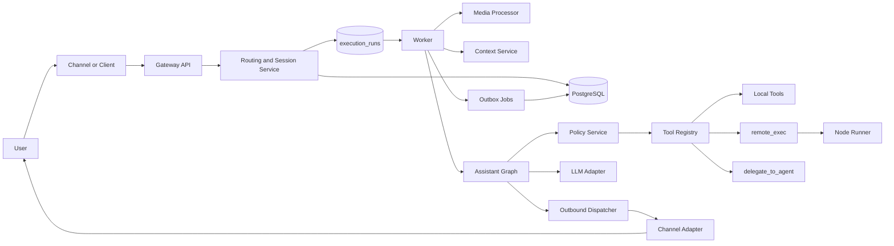

### Main Runtime Sequence

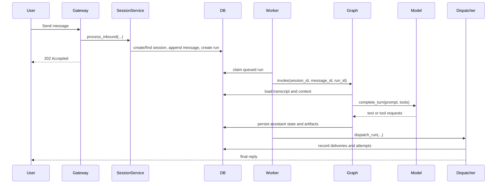

## 2. Runtime Layers You Should Know

Before walking the steps, it helps to know the main ownership boundaries.

| Layer | Main modules | Responsibility |
| --- | --- | --- |
| API entrypoints | `apps/gateway/api/*` | Accept inbound requests and provider callbacks |
| Dependency wiring | `apps/gateway/deps.py` | Construct services, graph dependencies, adapters, and runtime objects |
| Session intake | `src/sessions/service.py`, `src/routing/service.py`, `src/gateway/idempotency.py` | Canonical session resolution, dedupe, transcript persistence, run creation |
| Queue and worker | `src/jobs/service.py`, `src/jobs/repository.py`, `apps/worker/*` | Claim, run, retry, and complete execution jobs |
| AI orchestration | `src/graphs/assistant_graph.py`, `src/graphs/nodes.py`, `src/graphs/prompts.py`, `src/providers/models.py` | Assemble context, build prompt, call model, handle tool loops |
| Tools and policy | `src/tools/*`, `src/policies/service.py`, `src/policies/approval_actions.py` | Validate tool calls, enforce approvals, execute tools, continue after approval |
| Delivery | `src/channels/dispatch.py`, `src/channels/adapters/*` | Send outbound replies, media, and streams |
| Derived context | `src/context/service.py`, `src/context/outbox.py`, `src/memory/service.py`, `src/retrieval/service.py`, `src/media/extraction.py` | Build and enrich future-turn context |
| Persistence | `src/sessions/repository.py`, `src/db/models.py`, `docs/Database.md` | Durable source of truth |

## 3. Step 1: Message Enters the Gateway

### What happens

The message enters through one of the gateway API routes:

- Generic inbound API: `apps/gateway/api/inbound.py`
- Webchat: `apps/gateway/api/webchat.py`
- Slack webhook: `apps/gateway/api/slack.py`
- Telegram webhook: `apps/gateway/api/telegram.py`

Provider-specific endpoints first verify provider credentials or tokens, then translate the provider payload into the shared canonical inbound shape. After that, all roads lead into `SessionService.process_inbound(...)`.

### Code structures used

| Type | Module | Why it matters |
| --- | --- | --- |
| FastAPI router | `apps/gateway/api/inbound.py` | Generic `POST /inbound/message` |
| FastAPI router | `apps/gateway/api/webchat.py` | Webchat send, poll, stream, approvals |
| FastAPI router | `apps/gateway/api/slack.py` | Slack signature validation and translation |
| FastAPI router | `apps/gateway/api/telegram.py` | Telegram secret validation and translation |
| Service wiring | `apps/gateway/deps.py` | Injects `SessionService`, `QuotaService`, settings, DB |
| DTOs | `src/domain/schemas.py` | Request/response shapes |
| Quota service | `src/policies/quota.py` | Optional rate-limit checks |

### Tables used

| Table | Usage in this step |
| --- | --- |
| `rate_limit_counters` | Incremented if rate limiting is enabled |

### Architecture Diagram

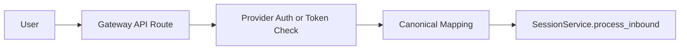

### Sequence Diagram

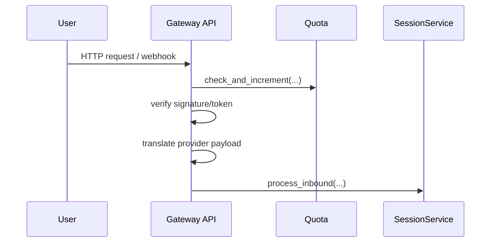

## 4. Step 2: Resolve the Canonical Session and Persist the User Turn

### What happens

`SessionService.process_inbound(...)` is the canonical entrypoint for inbound message acceptance.

It does the following:

1. Normalizes routing input with `src/routing/service.py`
2. Claims idempotency with `src/gateway/idempotency.py`
3. Finds or creates the durable session
4. Appends the user message to the transcript
5. Stores inbound attachment metadata, if present
6. Creates or reuses an `execution_run`
7. Finalizes the dedupe record

This is where the message stops being “just an HTTP request” and becomes durable runtime state.

### Code structures used

| Type | Module | Responsibility |
| --- | --- | --- |
| Routing DTO | `src/routing/service.py` | Builds the canonical `session_key` |
| Session service | `src/sessions/service.py` | Orchestrates the full intake write path |
| Session repository | `src/sessions/repository.py` | Writes sessions, messages, attachments |
| Jobs repository | `src/jobs/repository.py` | Creates queued execution runs |
| Idempotency service | `src/gateway/idempotency.py` | Prevents duplicate user turns |
| Agent binding service | `src/agents/service.py` | Resolves owner agent and profile binding |

### Tables used

| Table | Usage in this step |
| --- | --- |
| `inbound_dedupe` | Claims and finalizes dedupe identity |
| `sessions` | Finds or creates the canonical conversation |
| `messages` | Stores the user transcript row |
| `inbound_message_attachments` | Stores raw inbound attachment metadata |
| `execution_runs` | Queues the worker-owned run |

### Architecture Diagram

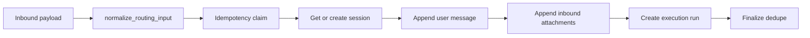

### Sequence Diagram

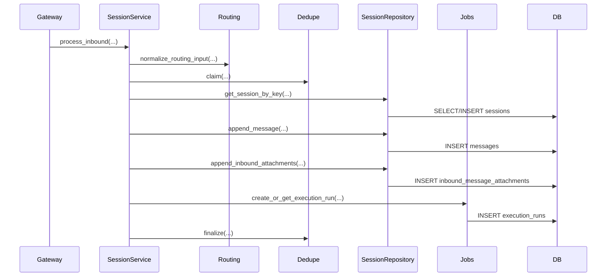

## 5. Step 3: The Worker Claims the Run

### What happens

The gateway returns `202 Accepted` quickly. It does not execute the AI request in the HTTP request thread.

Later, the worker loop calls `RunExecutionService.process_next_run(...)`, which:

1. Claims the next eligible queued run
2. Marks it running
3. Acquires lane/global concurrency leases
4. Loads the message and session
5. Resolves the exact execution binding for that run

This step is the boundary between intake and execution.

### Code structures used

| Type | Module | Responsibility |
| --- | --- | --- |
| Worker entrypoint | `apps/worker/jobs.py` | Calls the run execution service |
| Run execution service | `src/jobs/service.py` | Main worker orchestration |
| Jobs repository | `src/jobs/repository.py` | Claims and updates run rows |
| Concurrency service | `src/sessions/concurrency.py` | Per-session lane and global concurrency control |
| Agent binding service | `src/agents/service.py` | Resolves per-run model/policy/tool profiles |

### Tables used

| Table | Usage in this step |
| --- | --- |
| `execution_runs` | Claimed, marked running, retried, completed, or failed |
| `session_run_leases` | Per-session lane lease |
| `global_run_leases` | Global worker concurrency lease |
| `sessions` | Read to validate ownership and state |
| `messages` | Read to load the triggering user turn |

### Architecture Diagram

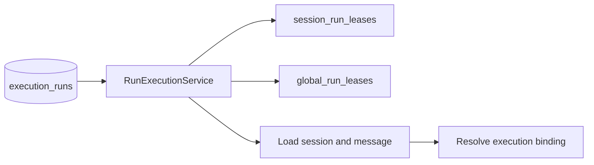

### Sequence Diagram

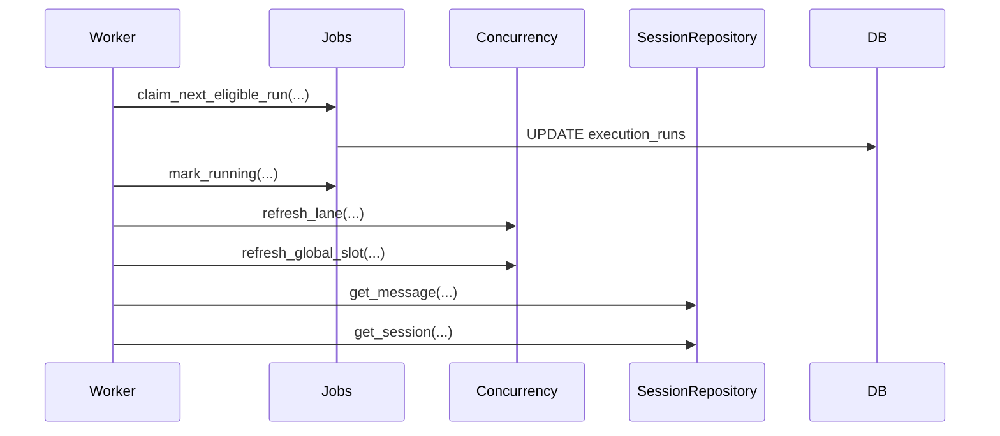

## 6. Step 4: Normalize Attachments and Prepare the Turn

### What happens

If the run was triggered by an inbound user message, the worker does attachment prep before asking the model to respond.

The main work is:

1. Read raw inbound attachment rows
2. Download or validate each attachment
3. Store normalized media to durable storage
4. Create normalized attachment rows
5. Optionally run same-turn extraction for attachment text understanding

This is why later prompt assembly can include extracted PDF/text content instead of only raw URLs.

### Code structures used

| Type | Module | Responsibility |
| --- | --- | --- |
| Media processor | `src/media/processor.py` | Normalizes raw attachments into stored media |
| Media extraction service | `src/media/extraction.py` | Extracts text or metadata from stored media |
| Run execution service | `src/jobs/service.py` | Calls same-turn media prep |
| Session repository | `src/sessions/repository.py` | Reads and writes attachment records |

### Tables used

| Table | Usage in this step |
| --- | --- |
| `inbound_message_attachments` | Read as the raw inbound attachment source |
| `message_attachments` | Stores normalized attachment records |
| `attachment_extractions` | Stores text extraction results |

### Architecture Diagram

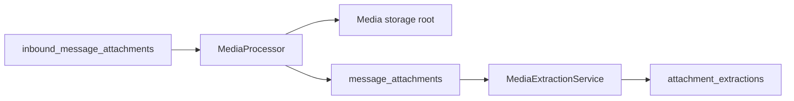

### Sequence Diagram

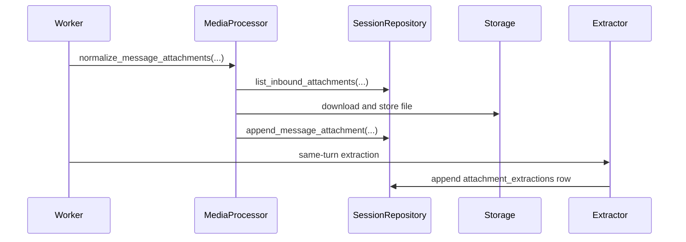

## 7. Step 5: Assemble Runtime Context

### What happens

`ContextService.assemble(...)` builds the exact state the model will use for this turn.

It reads:

1. Recent transcript messages
2. The latest usable summary snapshot
3. Session memories
4. Retrieval records
5. Attachment extraction results

Then it creates:

- an in-memory `AssistantState`
- a structured `context_manifest`
- a `degraded` flag if the system cannot safely assemble enough context

Important rule: transcript rows are canonical truth. Summaries, memories, retrieval rows, and attachment extractions are additive helpers.

### Code structures used

| Type | Module | Responsibility |
| --- | --- | --- |
| Context service | `src/context/service.py` | Builds the `AssistantState` |
| Graph state types | `src/graphs/state.py` | Typed runtime state contracts |
| Retrieval service | `src/retrieval/service.py` | Selects relevant retrieval rows |
| Session repository | `src/sessions/repository.py` | Loads transcript, summaries, memories, attachments |

### Tables used

| Table | Usage in this step |
| --- | --- |
| `messages` | Transcript source |
| `summary_snapshots` | Summary-based compaction |
| `session_memories` | Durable memory facts |
| `retrieval_records` | Retrieved context chunks |
| `message_attachments` | Stored attachment metadata |
| `attachment_extractions` | Extracted attachment content |
| `context_manifests` | Written later when final state is persisted |

### Architecture Diagram

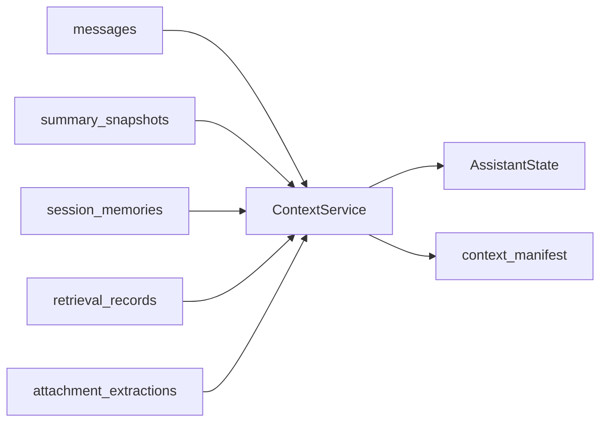

### Sequence Diagram

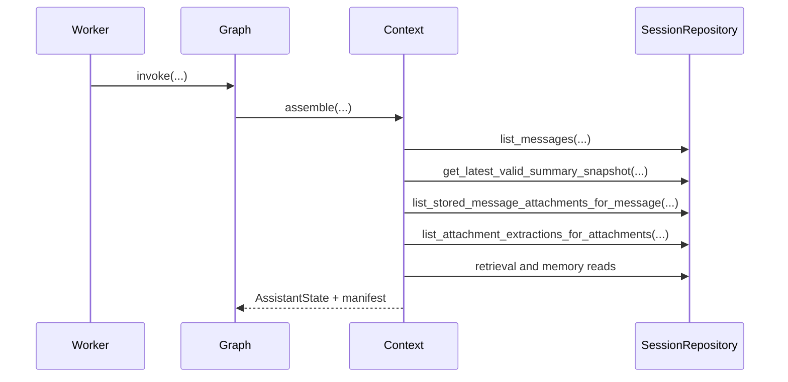

## 8. Step 6: Bind Tools, Build the Prompt, and Call the AI Model

### What happens

Once the `AssistantState` exists, the graph runtime prepares the AI request.

`execute_turn_with_options(...)` in `src/graphs/nodes.py`:

1. Builds policy context
2. Binds only the tools allowed for the current agent and policy profile
3. Builds the prompt payload
4. Calls the model adapter

The model adapter may be:

- `RuleBasedModelAdapter`
- `ProviderBackedModelAdapter`

In provider mode, `ProviderBackedModelAdapter` serializes the prompt and sends it to the provider client in `src/providers/models.py`.

### Code structures used

| Type | Module | Responsibility |
| --- | --- | --- |
| Graph wrapper | `src/graphs/assistant_graph.py` | Entry into graph execution |
| Node logic | `src/graphs/nodes.py` | Main turn execution logic |
| Prompt builder | `src/graphs/prompts.py` | Converts runtime state into provider prompt payload |
| Tool registry | `src/tools/registry.py` | Binds visible tools |
| Policy service | `src/policies/service.py` | Builds approval map and tool visibility rules |
| Model adapters | `src/providers/models.py` | Calls the rule-based runtime or external LLM provider |

### Tables used

| Table | Usage in this step |
| --- | --- |
| `active_resources` | Read as part of active approval lookup |
| `resource_approvals` | Read as part of approval lookup |
| `resource_proposals` | Read as part of approval lookup and governance context |
| `sessions` | Read for child-session approval family checks |

### Architecture Diagram

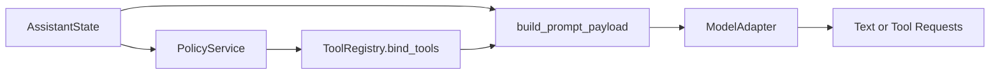

### Sequence Diagram

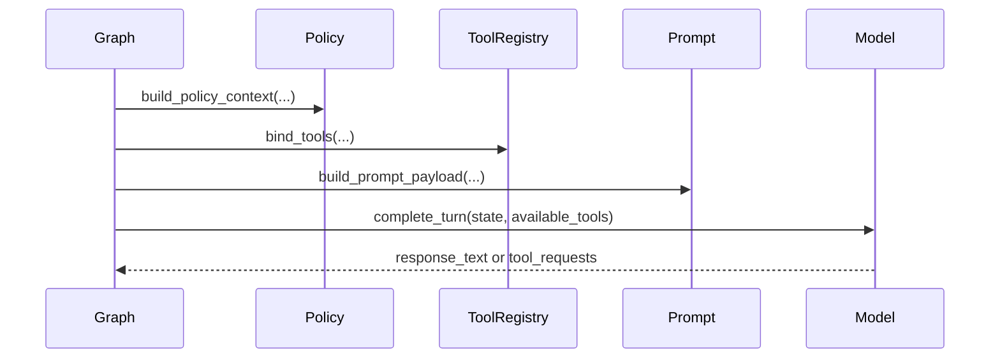

## 9. Step 7: Validate Tool Calls and Enforce Approval Rules

### What happens

If the model requests a tool, the backend does not trust that request blindly.

For each tool request, the graph:

1. Validates the tool exists in the current runtime context
2. Validates the JSON arguments against the tool schema
3. Canonicalizes the arguments
4. Checks whether an exact approval already exists
5. Either executes the tool or creates approval records

This is a core architectural rule of the system: the model suggests actions, but the backend decides what is actually allowed.

### Main tool paths

| Tool | Main code | Notes |
| --- | --- | --- |
| `echo_text` | `src/tools/local_safe.py` | Safe local example tool |
| `send_message` | `src/tools/messaging.py` | Creates outbound intent records |
| `remote_exec` | `src/tools/remote_exec.py` | Approval-gated node-runner execution |
| `delegate_to_agent` | `src/tools/delegation.py` | Creates child-session delegations |

### Tables used

| Table | Usage in this step |
| --- | --- |
| `session_artifacts` | Stores tool proposals, outbound intents, approval prompt artifacts, provider artifacts |
| `tool_audit_events` | Stores durable tool attempt/result audit rows |
| `resource_proposals` | Created when approval is required |
| `resource_versions` | Stores exact approved payload version |
| `governance_transcript_events` | Stores approval/governance event history |
| `resource_approvals` | Created when an approver approves |
| `active_resources` | Activated approval record used for future exact matches |
| `approval_action_prompts` | Materialized shortly after the turn finishes so interactive approval surfaces can render actions |
| `delegations` | Created if delegation tool is used |
| `delegation_events` | Appended as delegation progresses |
| `node_execution_audits` | Created if `remote_exec` reaches the node-runner path |

### Architecture Diagram

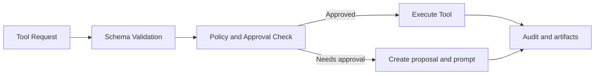

### Sequence Diagram

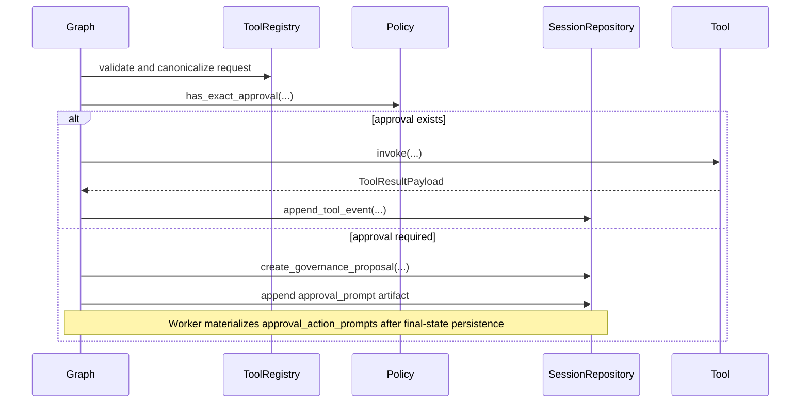

## 10. Step 8: Optional Branches During Tool Execution

This step is optional, but it matters because many real requests branch here.

### 8A. Approval branch

If a tool such as `remote_exec` needs approval, the graph creates a proposal instead of executing it immediately.

When approval later arrives through:

- `approve <proposal_id>` in chat, or
- Slack/Telegram/webchat approval action endpoints

`ApprovalDecisionService`:

1. approves or denies the proposal
2. activates the approved resource
3. updates `approval_action_prompts`
4. may enqueue an automatic continuation run for a child session

#### Approval tables

- `resource_proposals`
- `resource_versions`
- `resource_approvals`
- `active_resources`
- `approval_action_prompts`
- `governance_transcript_events`

#### Approval Diagram

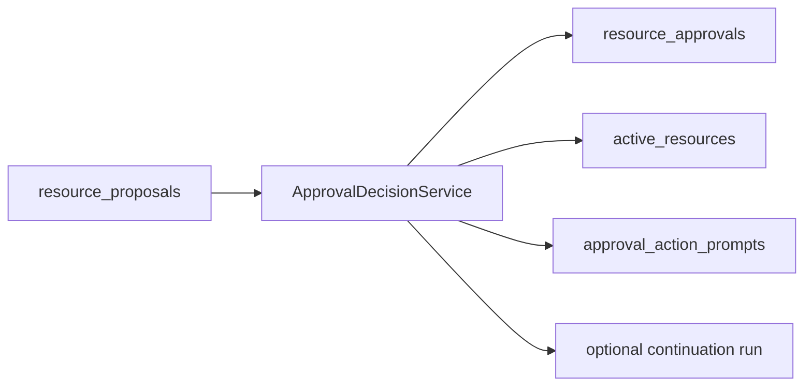

#### Approval Sequence

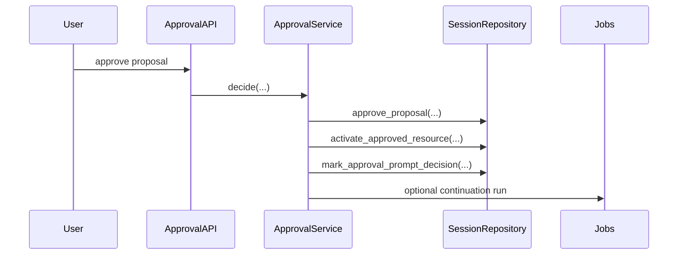

### 8B. Delegation branch

If the model uses `delegate_to_agent`, the system creates a child session and a child run instead of trying to complete that subtask inside the current turn.

This is owned by `src/delegations/service.py`.

#### Delegation tables

- `delegations`
- `delegation_events`
- `sessions` with `session_kind='child'`
- `messages` for the child system prompt
- `execution_runs` for the child run

#### Delegation Diagram

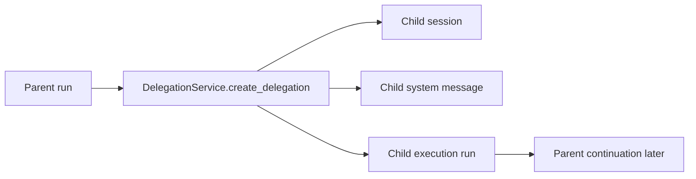

#### Delegation Sequence

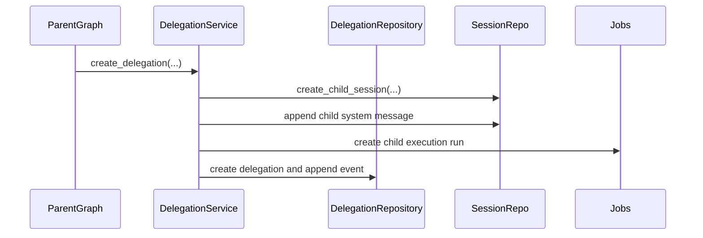

### 8C. Remote execution branch

If `remote_exec` is approved and executed, the backend packages a signed request for the node-runner.

Important modules:

- `src/execution/runtime.py`
- `src/security/signing.py`
- `apps/node_runner/policy.py`
- `apps/node_runner/executor.py`

The node-runner verifies:

1. signature
2. expiry window
3. approved command template
4. sandbox resolution
5. executable allowlist

Then it executes the command and stores the audit record.

## 11. Step 9: Persist the Final Assistant State

### What happens

Once the graph has its final answer for this run, it persists the final state:

1. append the assistant transcript row
2. persist the context manifest
3. keep any tool events, artifacts, or approval prompt records already written during execution

This is done by `persist_final_state(...)` in `src/graphs/nodes.py`.

### Code structures used

| Type | Module | Responsibility |
| --- | --- | --- |
| Graph node helper | `src/graphs/nodes.py` | Persists final assistant row |
| Context service | `src/context/service.py` | Persists the manifest |
| Session repository | `src/sessions/repository.py` | Writes transcript and artifacts |

### Tables used

| Table | Usage in this step |
| --- | --- |
| `messages` | Stores the assistant response |
| `context_manifests` | Stores exactly what context was assembled |
| `session_artifacts` | May already hold outbound intents, approval prompts, provider metadata |
| `tool_audit_events` | May already hold tool execution records |

### Architecture Diagram

```mermaid
flowchart LR
    FINAL[Final graph state] --> MSG[Append assistant message]
    FINAL --> MAN[Persist context manifest]
    MSG --> DB[(messages)]
    MAN --> DB2[(context_manifests)]
```

### Sequence Diagram

```mermaid
sequenceDiagram
    participant Graph
    participant Repo as SessionRepository
    participant Context

    Graph->>Repo: append_message(role='assistant', ...)
    Graph->>Context: persist_manifest(...)
    Context->>Repo: append_context_manifest(...)
```

## 12. Step 10: Dispatch the Reply Back to the User

### What happens

After the graph finishes, the worker sends the response back through the correct channel adapter.

`OutboundDispatcher.dispatch_run(...)`:

1. finds the session's current transport address
2. reads outbound intents for the run
3. creates durable delivery rows
4. sends text, media, or streaming output through the adapter
5. records delivery attempts and provider metadata

For webchat, the dispatcher can stream final-answer text and persist SSE events for replay.

### Code structures used

| Type | Module | Responsibility |
| --- | --- | --- |
| Dispatcher | `src/channels/dispatch.py` | Core outbound orchestration |
| Adapter base | `src/channels/adapters/base.py` | Shared adapter contract |
| Webchat adapter | `src/channels/adapters/webchat.py` | Polling and streaming support |
| Slack adapter | `src/channels/adapters/slack.py` | Slack sends |
| Telegram adapter | `src/channels/adapters/telegram.py` | Telegram sends |
| Dispatch registry | `src/channels/dispatch_registry.py` | Creates dispatcher with configured adapters |

### Tables used

| Table | Usage in this step |
| --- | --- |
| `sessions` | Reads transport address metadata |
| `session_artifacts` | Reads outbound intent payloads |
| `outbound_deliveries` | One durable row per chunk/media/streamed delivery |
| `outbound_delivery_attempts` | One durable row per send attempt |
| `outbound_delivery_stream_events` | Durable streaming events for webchat SSE |

### Architecture Diagram

```mermaid
flowchart LR
    RUN[Completed run] --> DISP[OutboundDispatcher]
    DISP --> ADAPT[Channel Adapter]
    DISP --> DELIV[outbound_deliveries]
    DISP --> ATT[outbound_delivery_attempts]
    DISP --> SSE[outbound_delivery_stream_events]
    ADAPT --> USER[User]
```

### Sequence Diagram

```mermaid
sequenceDiagram
    participant Worker
    participant Dispatcher
    participant Repo as SessionRepository
    participant Adapter
    participant User

    Worker->>Dispatcher: dispatch_run(...)
    Dispatcher->>Repo: list_outbound_intents_for_run(...)
    Dispatcher->>Repo: create_or_get_outbound_delivery(...)
    Dispatcher->>Repo: create_outbound_delivery_attempt(...)
    Dispatcher->>Adapter: send_text_chunk / send_media / begin_text_stream
    Adapter-->>User: outbound message
    Dispatcher->>Repo: mark delivery sent or failed
```

## 13. Step 11: Return the Result to the User Surface

### What happens

The user sees the result in one of three main ways:

- direct channel delivery from Slack or Telegram
- webchat polling via `poll`
- webchat streaming via `stream`

Webchat uses persisted rows, so the frontend is reading durable delivery state rather than volatile in-memory events.

### Code structures used

| Surface | Module | Notes |
| --- | --- | --- |
| Webchat polling | `apps/gateway/api/webchat.py` | Reads `outbound_deliveries` |
| Webchat SSE | `apps/gateway/api/webchat.py` | Reads `outbound_delivery_stream_events` |
| Slack reply path | `src/channels/adapters/slack.py` | Provider send |
| Telegram reply path | `src/channels/adapters/telegram.py` | Provider send |

### Tables used

| Table | Usage in this step |
| --- | --- |
| `outbound_deliveries` | Polled delivery history |
| `outbound_delivery_stream_events` | SSE replay and incremental streaming |
| `approval_action_prompts` | Read by webchat approval prompt surfaces |

### Architecture Diagram

```mermaid
flowchart LR
    DELIV[(outbound_deliveries)] --> POLL[webchat poll API]
    STREAM[(outbound_delivery_stream_events)] --> SSE[webchat SSE API]
    PROMPTS[(approval_action_prompts)] --> AP[approval prompt API]
    POLL --> UI[User UI]
    SSE --> UI
    AP --> UI
```

### Sequence Diagram

```mermaid
sequenceDiagram
    participant UI as User UI
    participant WebchatAPI
    participant Repo as SessionRepository

    UI->>WebchatAPI: GET /poll or /stream
    WebchatAPI->>Repo: list_webchat_deliveries(...) or list_webchat_stream_events(...)
    Repo-->>WebchatAPI: durable rows
    WebchatAPI-->>UI: response items or SSE events
```

## 14. Step 12: After-Turn Enrichment for Future Requests

### What happens

After the user gets the reply, background work may still continue. This is how future turns become smarter.

`RunExecutionService` enqueues after-turn jobs, and `OutboxWorker` later processes them:

1. summary generation
2. memory extraction
3. retrieval indexing
4. attachment extraction
5. continuity repair

These jobs do not change the canonical transcript. They create additive state that future turns can read.

### Code structures used

| Type | Module | Responsibility |
| --- | --- | --- |
| Outbox worker | `src/context/outbox.py` | Claims and executes pending outbox jobs |
| Memory service | `src/memory/service.py` | Extracts durable memories |
| Retrieval service | `src/retrieval/service.py` | Creates retrieval records |
| Media extraction | `src/media/extraction.py` | Creates attachment extraction rows |

### Tables used

| Table | Usage in this step |
| --- | --- |
| `outbox_jobs` | Queues and tracks derived-state jobs |
| `summary_snapshots` | Stores compact summary state |
| `session_memories` | Stores extracted memories |
| `retrieval_records` | Stores searchable context chunks |
| `attachment_extractions` | Stores extracted attachment content |

### Architecture Diagram

```mermaid
flowchart LR
    RUN[Completed run] --> OUT[outbox_jobs]
    OUT --> SUM[summary_snapshots]
    OUT --> MEM[session_memories]
    OUT --> RET[retrieval_records]
    OUT --> ATT[attachment_extractions]
```

### Sequence Diagram

```mermaid
sequenceDiagram
    participant Worker
    participant Outbox
    participant Repo as SessionRepository
    participant Memory
    participant Retrieval

    Worker->>Repo: enqueue_outbox_job(...)
    Outbox->>Repo: claim_outbox_jobs(...)
    Outbox->>Repo: append_summary_snapshot(...)
    Outbox->>Memory: extract_from_message / extract_from_summary
    Outbox->>Retrieval: index_message / index_summary / index_memory
    Outbox->>Repo: complete_outbox_job(...)
```

## 15. Table Cheat Sheet by Phase

| Phase | Most important tables |
| --- | --- |
| Ingress | `rate_limit_counters` |
| Canonical intake | `sessions`, `messages`, `inbound_dedupe`, `inbound_message_attachments`, `execution_runs` |
| Worker claiming | `execution_runs`, `session_run_leases`, `global_run_leases` |
| Media prep | `message_attachments`, `attachment_extractions` |
| Context assembly | `messages`, `summary_snapshots`, `session_memories`, `retrieval_records`, `attachment_extractions` |
| Tool and approval path | `session_artifacts`, `tool_audit_events`, `resource_proposals`, `resource_versions`, `resource_approvals`, `active_resources`, `approval_action_prompts` |
| Delegation | `delegations`, `delegation_events`, child `sessions`, child `messages`, child `execution_runs` |
| Final persistence | `messages`, `context_manifests` |
| Delivery | `outbound_deliveries`, `outbound_delivery_attempts`, `outbound_delivery_stream_events` |
| Future-turn enrichment | `outbox_jobs`, `summary_snapshots`, `session_memories`, `retrieval_records`, `attachment_extractions` |

## 16. The Most Important Rules to Remember

If you are new to this codebase, these rules will keep you oriented:

1. The gateway accepts the message, but the worker owns execution.
2. `messages` is the canonical transcript. Everything else is supporting state.
3. The model never executes tools directly. The backend validates every tool request.
4. Approval-gated actions become durable proposals first, not immediate execution.
5. Delivery is durable. The system stores what it tried to send and what actually got sent.
6. Child-agent work is a separate session and a separate run, not a recursive in-memory call.
7. Webchat streaming is replayable because stream events are stored in the database.
8. Summaries, memories, retrieval, and attachment extractions improve future turns but do not replace transcript truth.

## 17. Best Files to Read Next

If you want to follow the flow in code after reading this document, read these files in order:

1. `apps/gateway/api/inbound.py`
2. `src/sessions/service.py`
3. `src/jobs/service.py`
4. `src/context/service.py`
5. `src/graphs/assistant_graph.py`
6. `src/graphs/nodes.py`
7. `src/providers/models.py`
8. `src/policies/service.py`
9. `src/channels/dispatch.py`
10. `docs/Database.md`
