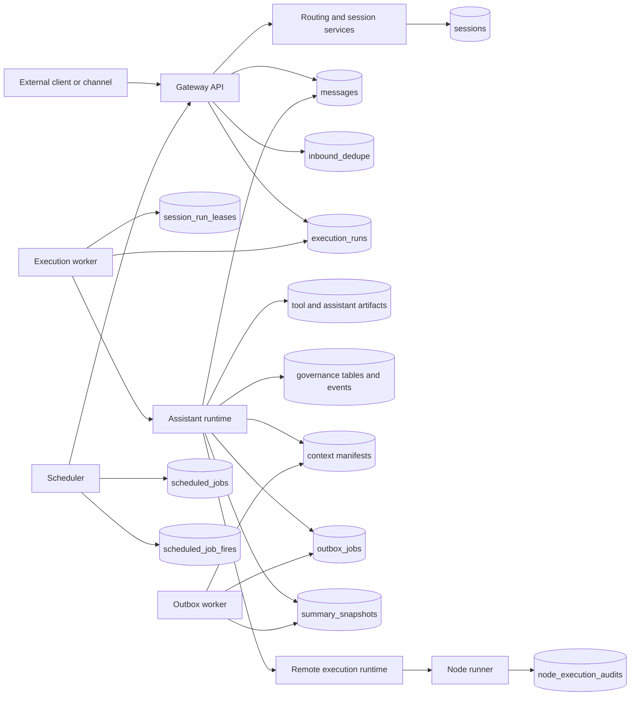
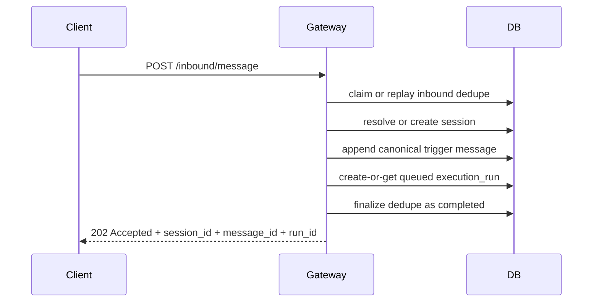
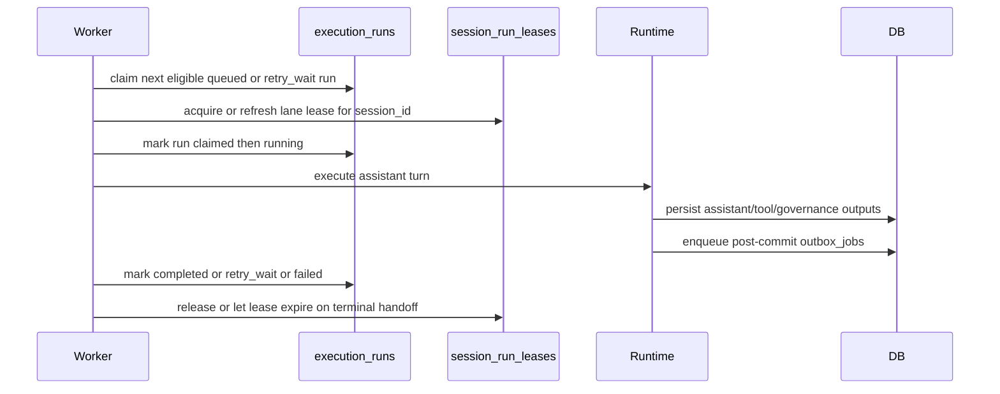
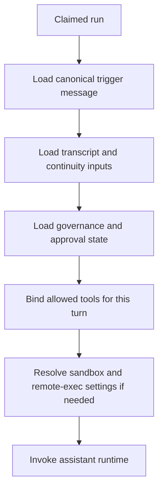
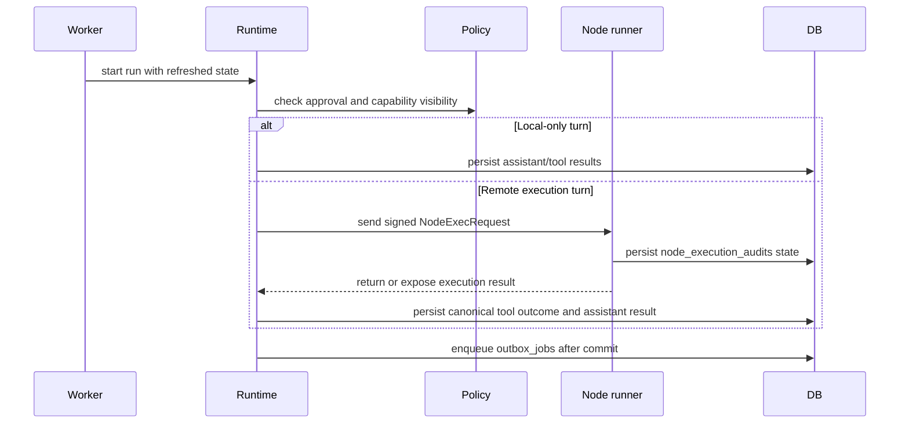
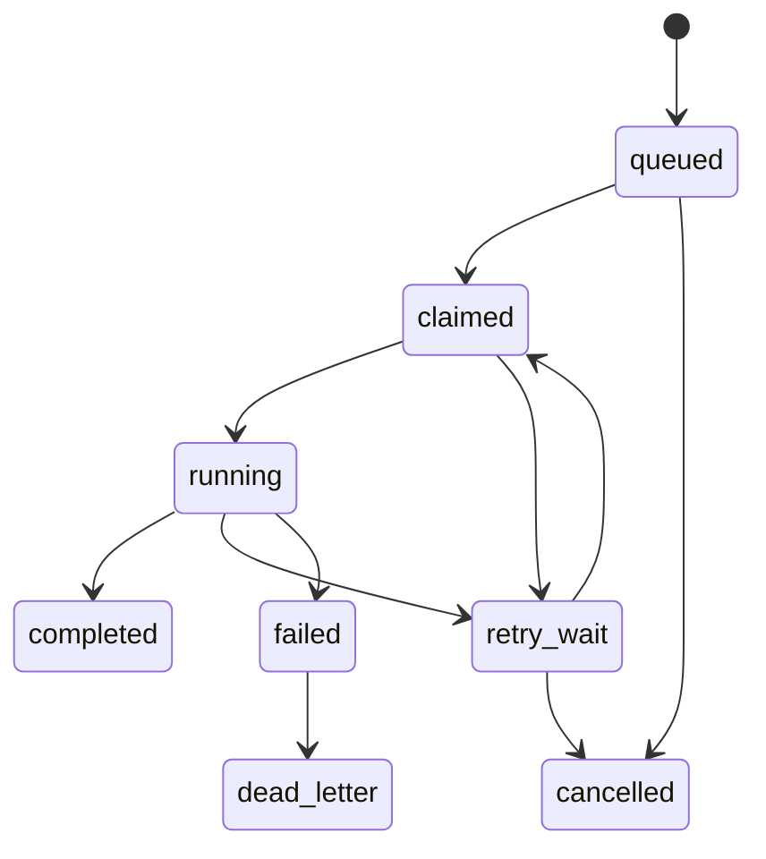
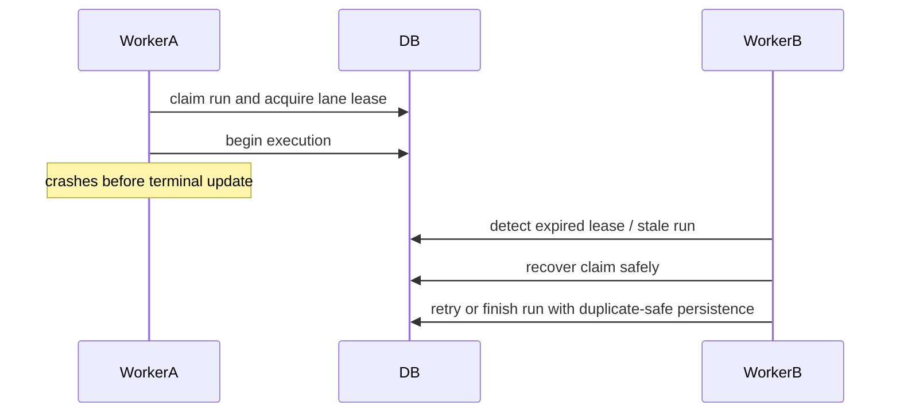
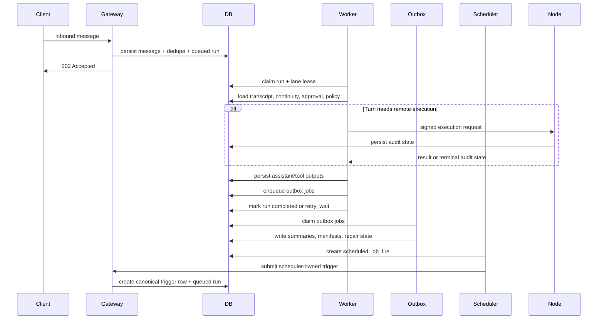

# Worker Process Overview

This document explains how the worker side of `python-claw` is expected to run when the behavior described by Specs 001 through 006 is fully in place.

## Short answer

The `README.md` command in Step 7:

```python
from apps.worker.jobs import run_once
```

is a local development helper. It runs one pass of the queue consumer, processes at most one eligible execution run, commits, and exits.

When Specs 001 through 006 are complete, the normal worker model is not "manually call `run_once()` after each inbound message." The normal model is:

1. The gateway accepts inbound or scheduler-triggered work and persists a queued `execution_runs` record.
2. One or more long-running worker processes continuously poll for eligible queued runs.
3. A worker claims a run, acquires the session lane lease, refreshes runtime state, and executes the assistant turn.
4. The worker persists the terminal run state, or schedules deterministic retry/dead-letter handling.
5. Separate post-commit derived-state work continues through `outbox_jobs`.
6. If the turn uses approved remote execution, the worker talks to the node runner, but the node runner remains a separate service.

## Architecture diagram



This is the intended steady-state shape:

- the gateway accepts and persists work
- the execution worker consumes `execution_runs`
- the outbox worker handles derived-state maintenance from Spec 004
- the scheduler creates work but still re-enters through the gateway-owned path
- the node runner is separate from the worker and is only used for approved remote execution

## What the worker owns

Based on Specs 001 through 006, the worker is responsible for user-visible turn execution after the gateway has already durably accepted the trigger.

The worker owns:

- claiming eligible `execution_runs`
- enforcing one active run per `session_id` through `session_run_leases`
- respecting the global graph-execution concurrency cap
- reloading policy, approval, and continuity state at execution time
- invoking the same runtime introduced in Specs 002 through 004
- persisting completion, retry, failure, or dead-letter outcomes
- recovering safely after crashes or expired leases

The worker does not own:

- receiving external inbound messages directly
- bypassing the gateway to create transcript rows
- directly activating approvals
- directly replacing Spec 004 `outbox_jobs`
- acting as the node runner

## End-state execution flow

### 1. Gateway accepts and queues work

From Spec 005 onward, `POST /inbound/message` commits three things together before returning `202 Accepted`:

- the canonical inbound transcript row
- the dedupe finalization from Spec 001
- the initial `execution_runs` row in `queued` state

Scheduler fires follow the same pattern. They must re-enter through the gateway-owned path, create a canonical scheduler-authored trigger message when needed, and enqueue an `execution_runs` row instead of calling graph code directly.



### 2. Worker continuously claims runs

In the finished model, the worker runs as a long-lived service loop rather than a one-shot helper. Conceptually, it does something like this:

1. Look for the next eligible run ordered by `available_at`, `created_at`, and `id`.
2. Claim it exclusively.
3. Acquire or refresh the session-lane lease for that run's `session_id`.
4. Verify global concurrency capacity.
5. Move the run into `running`.
6. Execute the turn.
7. Persist `completed`, `retry_wait`, `failed`, or `dead_letter`.

Multiple worker processes may run at the same time, but only one may actively execute a turn for a given session lane.



### 3. Worker refreshes execution-time state

The worker must not rely on request-time in-memory state. Before execution it reloads:

- transcript and continuity inputs from Specs 001 and 004
- tool/runtime bindings from Spec 002
- approval, activation, and revocation state from Spec 003
- queued-run metadata and retry state from Spec 005
- sandbox and remote-execution policy state from Spec 006 when relevant

This matters because approval and revocation are evaluated at execution time, not frozen when the run was first queued.



### 4. Worker executes the turn

For a normal turn, the worker runs the gateway-owned assistant runtime:

- assemble continuity inputs
- bind only allowed tools
- execute tool calls if needed
- persist assistant output and tool artifacts
- enqueue any post-commit derived-state `outbox_jobs`

If the run needs approved remote execution, the worker constructs a signed `NodeExecRequest` and sends it to the node runner. The worker still remains the owner of the overall run and of the final tool outcome persistence.



### 5. Worker handles retries and recovery

Spec 005 requires durable retry classification and recovery:

- transient failures move the run to `retry_wait` with a deterministic future `available_at`
- non-retryable failures become `failed`
- exhausted failures can become `dead_letter`
- abandoned claimed/running work must be recoverable after lease expiry or worker crash

That means a production worker loop must keep running continuously and must be safe to restart. The queue state in PostgreSQL is the source of truth.





## Related background processes

The completed system is likely to run more than one background process type.

### Execution worker

This is the main worker discussed above. It consumes `execution_runs` and performs user-visible assistant turns.

### Outbox worker

Spec 004 keeps derived-state work in `outbox_jobs`, separate from user-visible execution runs. Those jobs handle summary generation, indexing, repair, and other post-commit continuity maintenance. They should run in their own worker loop or worker component.

### Scheduler process

Spec 005 also introduces persisted `scheduled_jobs` and `scheduled_job_fires`. A scheduler loop loads enabled schedules, creates idempotent fire records, and submits them back through the gateway-owned execution contract so they become normal queued runs.

### Node runner service

Spec 006 keeps privileged execution in a separate node-runner service. The worker may call it, but it is not the same process as the worker.

## End-to-end sequence



## How Step 7 should be understood

Step 7 in `README.md` is best understood as a scaffold/debug command for local development:

- useful now for manually processing one queued run
- useful later for smoke tests and debugging queue behavior
- not the intended production operating model once the full queue, scheduler, retry, lease, and node-runner architecture is in place

In the finished system, an operator would normally run:

- the gateway API
- one or more long-running execution workers
- an outbox worker or equivalent post-commit worker
- the scheduler process
- the node runner when remote execution is enabled

## Practical final answer

When all currently reviewed specs are complete, the worker process should run continuously as a durable queue consumer, not as a one-off `run_once()` command. The gateway will accept work and write `execution_runs`; the worker will claim runs, enforce per-session exclusivity and global concurrency, reload current approvals and context, execute the turn, persist terminal or retry state, and hand off any privileged command execution to the separate node runner. `run_once()` should remain a convenience entry point for local development, tests, or manual operational recovery, not the primary production pattern.
