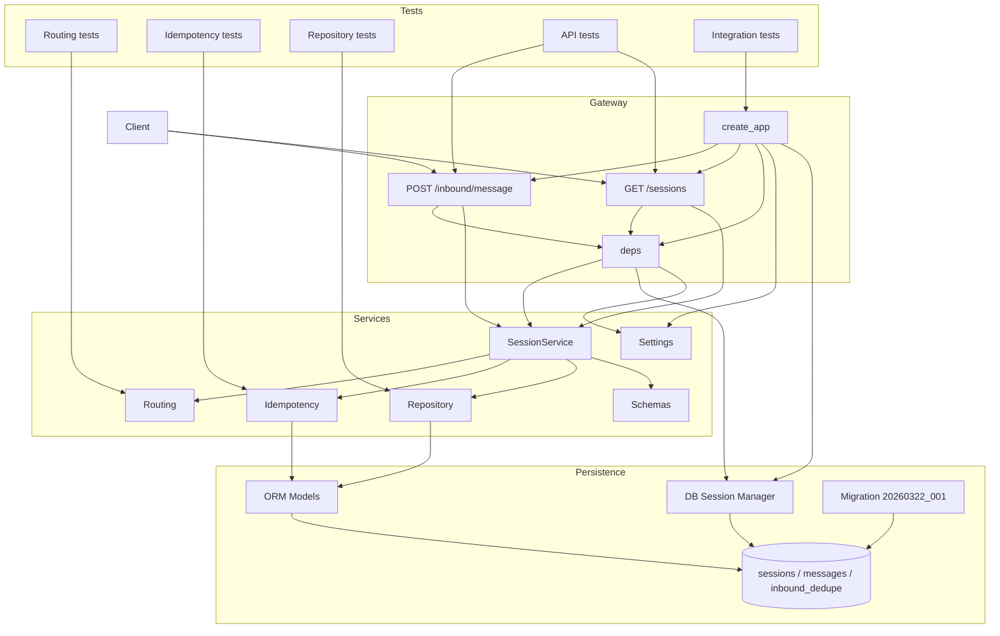
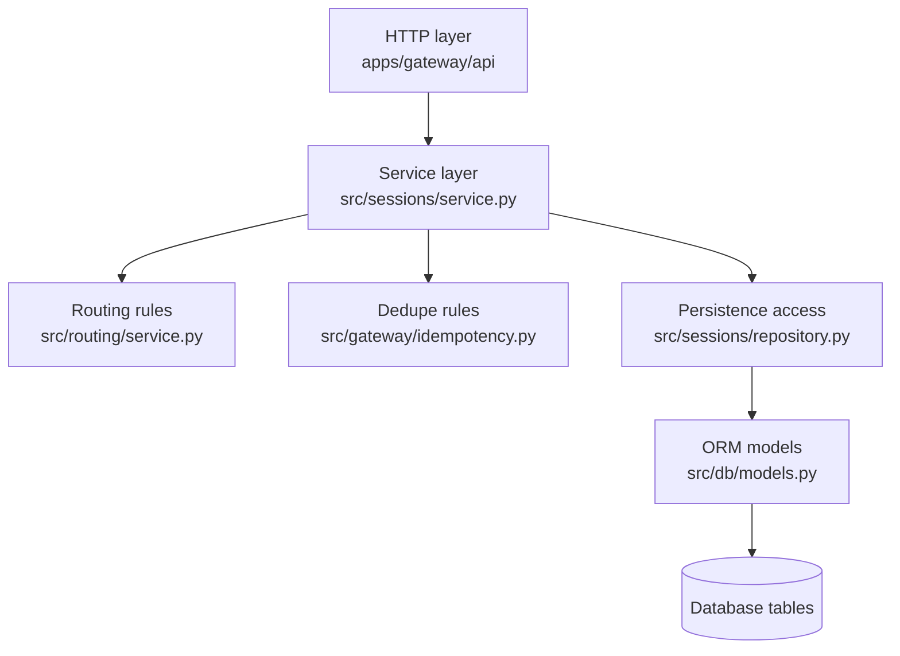

# Spec 001 Architecture Overview

This version is formatted to print more cleanly on 8.5 x 11 paper with shorter labels and a top-to-bottom layout.

## Runtime Architecture

## Layer Map

## Legend

- `Gateway`: FastAPI app, routes, and dependency wiring.
- `SessionService`: orchestration point for inbound processing and read-only queries.
- `Routing`: canonical routing normalization and `session_key` creation.
- `Idempotency`: dedupe claim/finalize lifecycle.
- `Repository`: session lookup/create and append-only message history.
