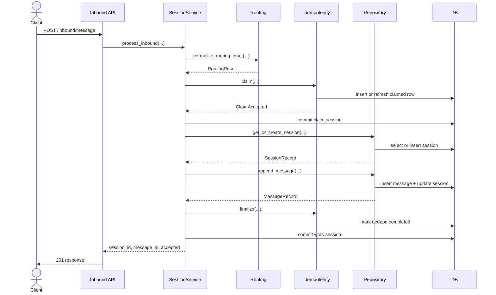
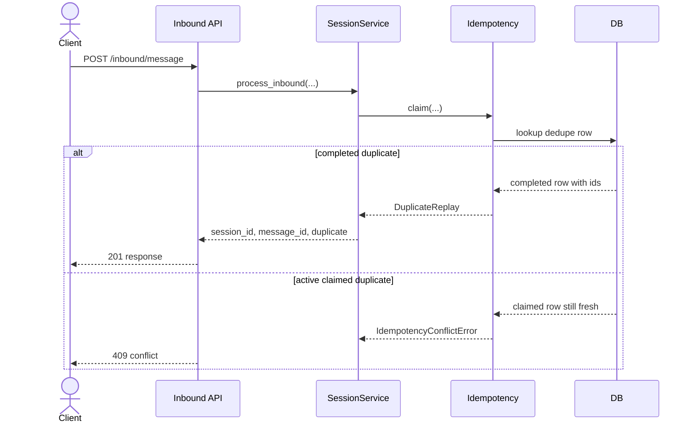
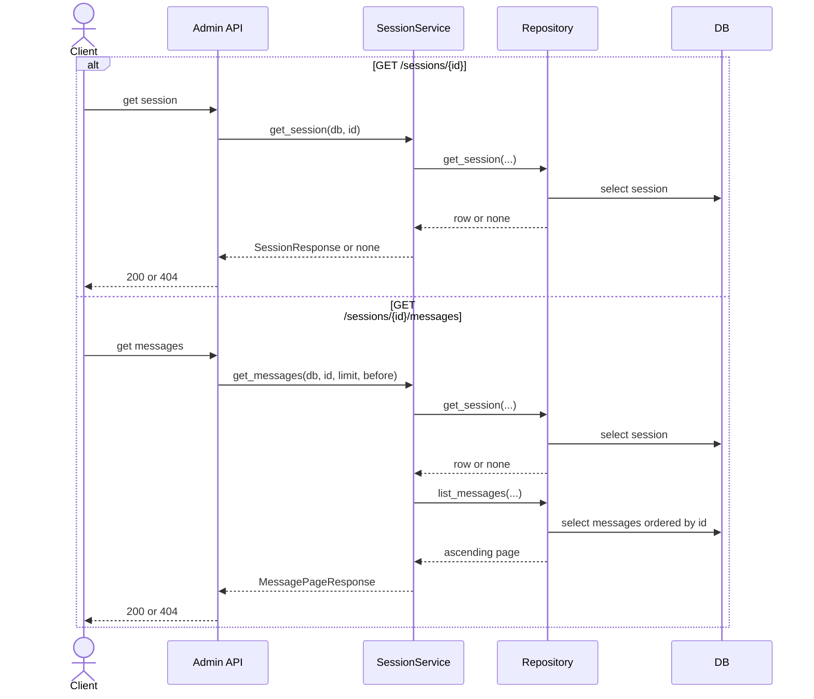

# Spec 001 Sequence Diagrams

This version is split into smaller diagrams so it prints more cleanly on 8.5 x 11 paper.

## 1. Accepted Inbound Message

## 2. Duplicate And Conflict Paths

## 3. Read-Only Session Queries

## Notes

- The inbound path uses two DB sessions in code: one for the dedupe claim and one for the write/finalize work.
- Duplicate replay returns the original `session_id` and `message_id`.
- Message history is fetched in descending DB order and reversed before returning so the API stays append-ordered.
