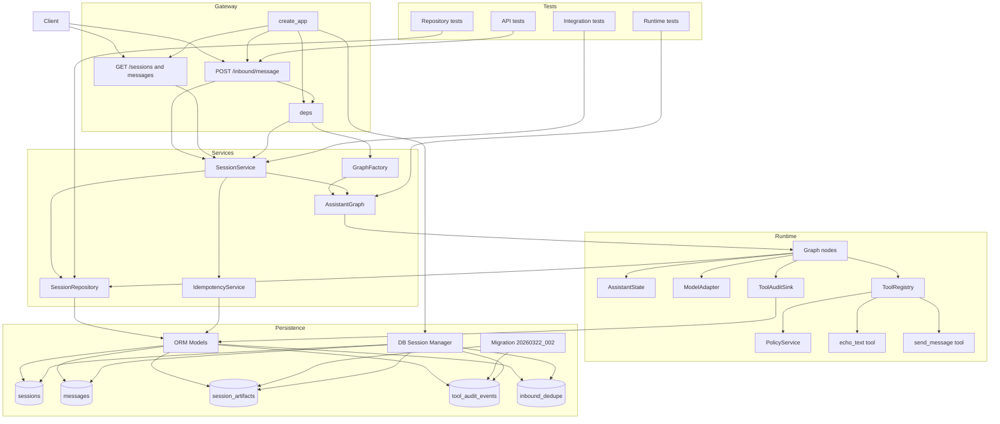
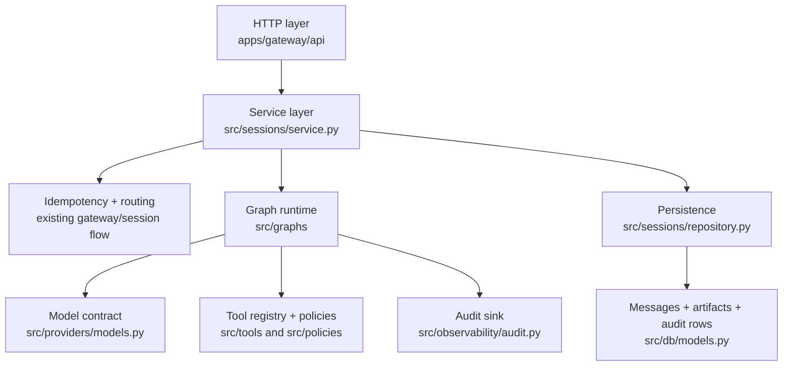

# Spec 002 Architecture Overview

## Runtime Architecture

## Layer Map

## Notes

- The gateway still owns runtime invocation through `SessionService`.
- The graph is a single-turn runtime, not a background workflow engine.
- Tool execution stays local and policy-filtered in this spec.
- Outbound messaging creates runtime-owned intent records; it does not dispatch transports.
