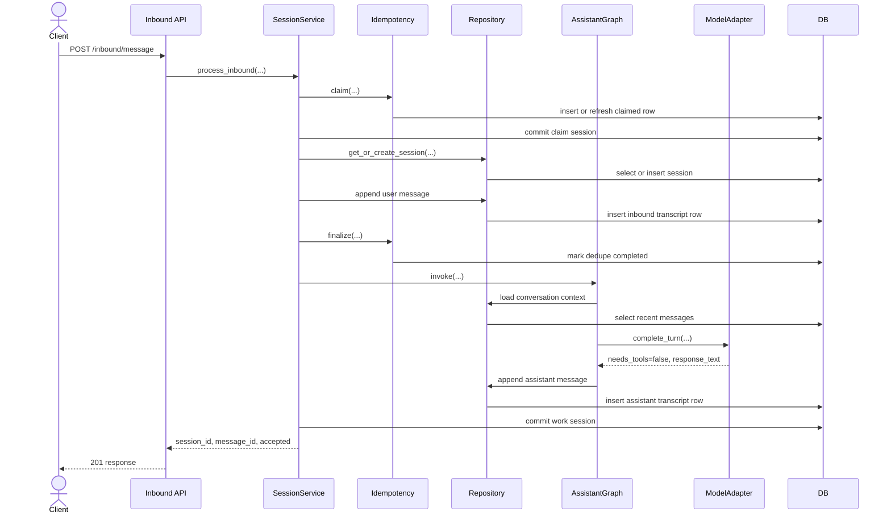
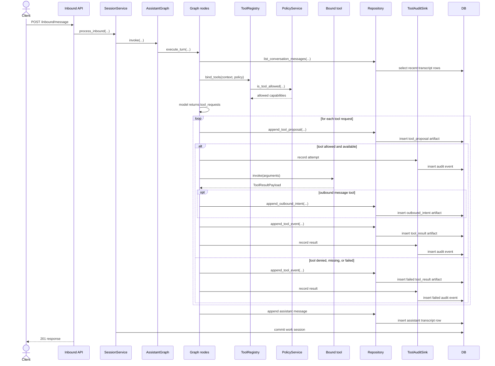
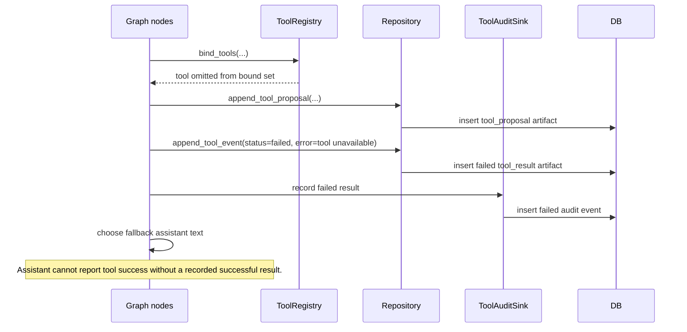

# Spec 002 Sequence Diagrams

## 1. Inbound Message With Plain Assistant Response

```mermaid
sequenceDiagram
    actor Client
    participant API as Inbound API
    participant Svc as SessionService
    participant Idem as Idempotency
    participant Repo as Repository
    participant Graph as AssistantGraph
    participant Model as ModelAdapter
    participant DB as DB

    Client->>API: POST /inbound/message
    API->>Svc: process_inbound(...)
    Svc->>Idem: claim(...)
    Idem->>DB: insert or refresh claimed row
    Svc->>DB: commit claim session
    Svc->>Repo: get_or_create_session(...)
    Repo->>DB: select or insert session
    Svc->>Repo: append user message
    Repo->>DB: insert inbound transcript row
    Svc->>Idem: finalize(...)
    Idem->>DB: mark dedupe completed
    Svc->>Graph: invoke(...)
    Graph->>Repo: load conversation context
    Repo->>DB: select recent messages
    Graph->>Model: complete_turn(...)
    Model-->>Graph: needs_tools=false, response_text
    Graph->>Repo: append assistant message
    Repo->>DB: insert assistant transcript row
    Svc->>DB: commit work session
    Svc-->>API: session_id, message_id, accepted
    API-->>Client: 201 response
```

## 2. Tool-Using Turn With Runtime Artifacts And Audit

```mermaid
sequenceDiagram
    actor Client
    participant API as Inbound API
    participant Svc as SessionService
    participant Graph as AssistantGraph
    participant Nodes as Graph nodes
    participant Registry as ToolRegistry
    participant Policy as PolicyService
    participant Tool as Bound tool
    participant Repo as Repository
    participant Audit as ToolAuditSink
    participant DB as DB

    Client->>API: POST /inbound/message
    API->>Svc: process_inbound(...)
    Svc->>Graph: invoke(...)
    Graph->>Nodes: execute_turn(...)
    Nodes->>Repo: list_conversation_messages(...)
    Repo->>DB: select recent transcript rows
    Nodes->>Registry: bind_tools(context, policy)
    Registry->>Policy: is_tool_allowed(...)
    Policy-->>Registry: allowed capabilities
    Nodes->>Nodes: model returns tool_requests

    loop for each tool request
        Nodes->>Repo: append_tool_proposal(...)
        Repo->>DB: insert tool_proposal artifact
        alt tool allowed and available
            Nodes->>Audit: record attempt
            Audit->>DB: insert audit event
            Nodes->>Tool: invoke(arguments)
            Tool-->>Nodes: ToolResultPayload
            opt outbound message tool
                Nodes->>Repo: append_outbound_intent(...)
                Repo->>DB: insert outbound_intent artifact
            end
            Nodes->>Repo: append_tool_event(...)
            Repo->>DB: insert tool_result artifact
            Nodes->>Audit: record result
            Audit->>DB: insert audit event
        else tool denied, missing, or failed
            Nodes->>Repo: append_tool_event(...)
            Repo->>DB: insert failed tool_result artifact
            Nodes->>Audit: record result
            Audit->>DB: insert failed audit event
        end
    end

    Nodes->>Repo: append assistant message
    Repo->>DB: insert assistant transcript row
    Svc->>DB: commit work session
    API-->>Client: 201 response
```

## 3. Policy-Denied Or Failed Tool Path

```mermaid
sequenceDiagram
    participant Nodes as Graph nodes
    participant Registry as ToolRegistry
    participant Repo as Repository
    participant Audit as ToolAuditSink
    participant DB as DB

    Nodes->>Registry: bind_tools(...)
    Registry-->>Nodes: tool omitted from bound set
    Nodes->>Repo: append_tool_proposal(...)
    Repo->>DB: insert tool_proposal artifact
    Nodes->>Repo: append_tool_event(status=failed, error=tool unavailable)
    Repo->>DB: insert failed tool_result artifact
    Nodes->>Audit: record failed result
    Audit->>DB: insert failed audit event
    Nodes->>Nodes: choose fallback assistant text
    Note over Nodes: Assistant cannot report tool success without a recorded successful result.
```
