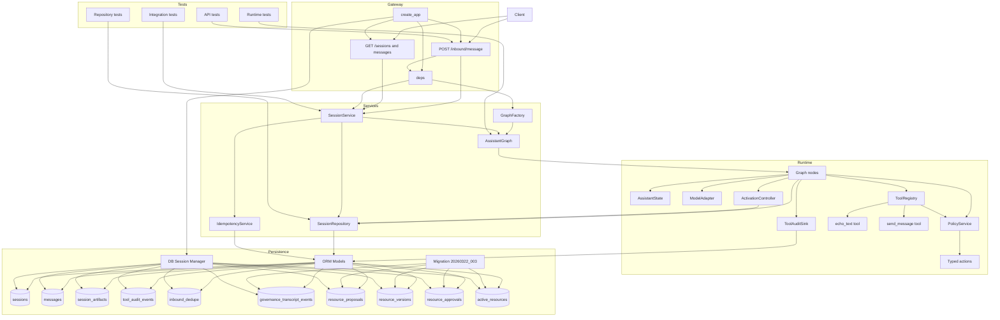
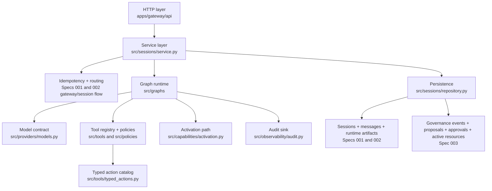
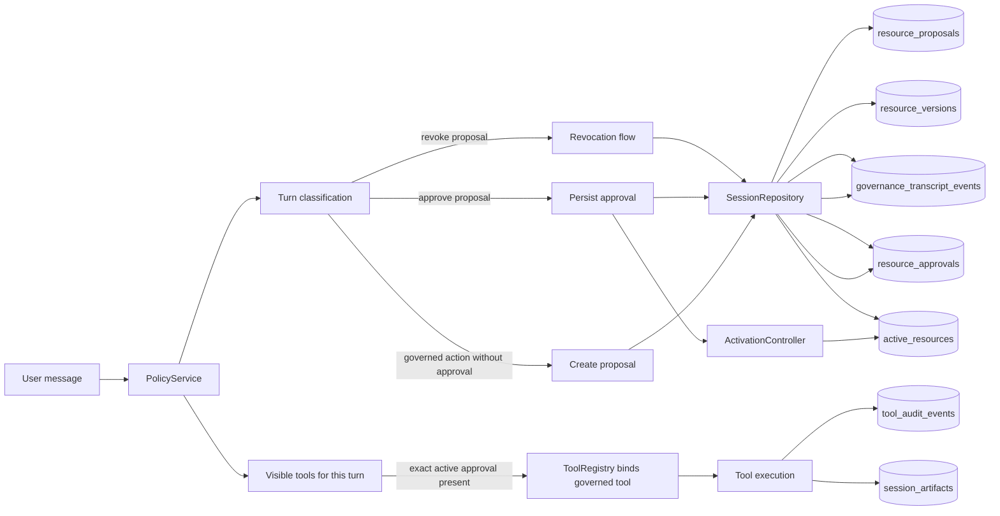

# Spec 003 Architecture Overview

This diagram set shows the implementation after Specs 001, 002, and 003 are all in place.

Spec 001 established the gateway, canonical sessions, append-only messages, and inbound dedupe.
Spec 002 added the gateway-owned single-turn runtime, tool registry, runtime artifacts, and tool audit rows.
Spec 003 adds approval-aware capability governance, transcript-linked governance events, and gateway-owned activation and revocation handling.

## Runtime Architecture

## Layer Map

## Governance View

## Notes

- Spec 001 behavior is still the foundation: all work begins with canonical routing, dedupe, session reuse, and append-only transcript writes.
- Spec 002 behavior still owns runtime orchestration: the gateway invokes a single-turn graph after the inbound message is persisted.
- Spec 003 adds a policy and activation layer on top of that runtime rather than bypassing it.
- `send_message` is the current governed capability used to prove the approval flow.
- Approval and activation remain on the gateway-owned path through `SessionService`, `AssistantGraph`, `PolicyService`, `SessionRepository`, and `ActivationController`.
