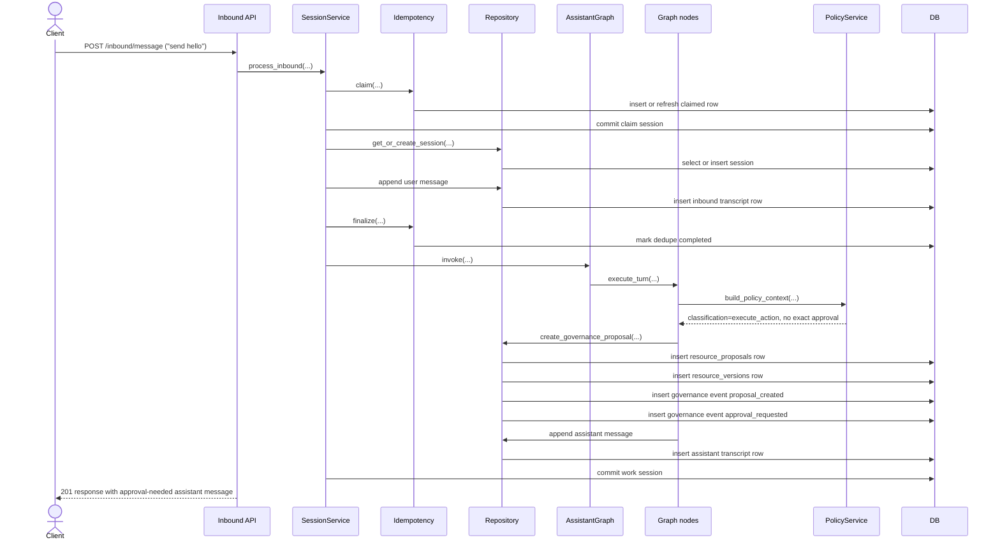
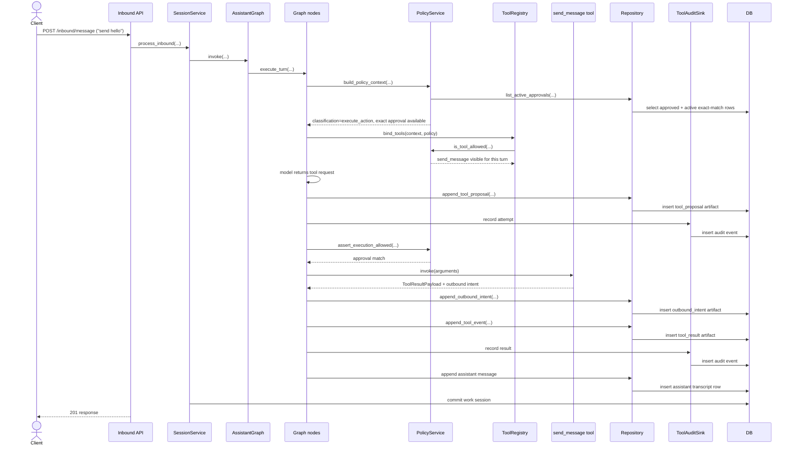
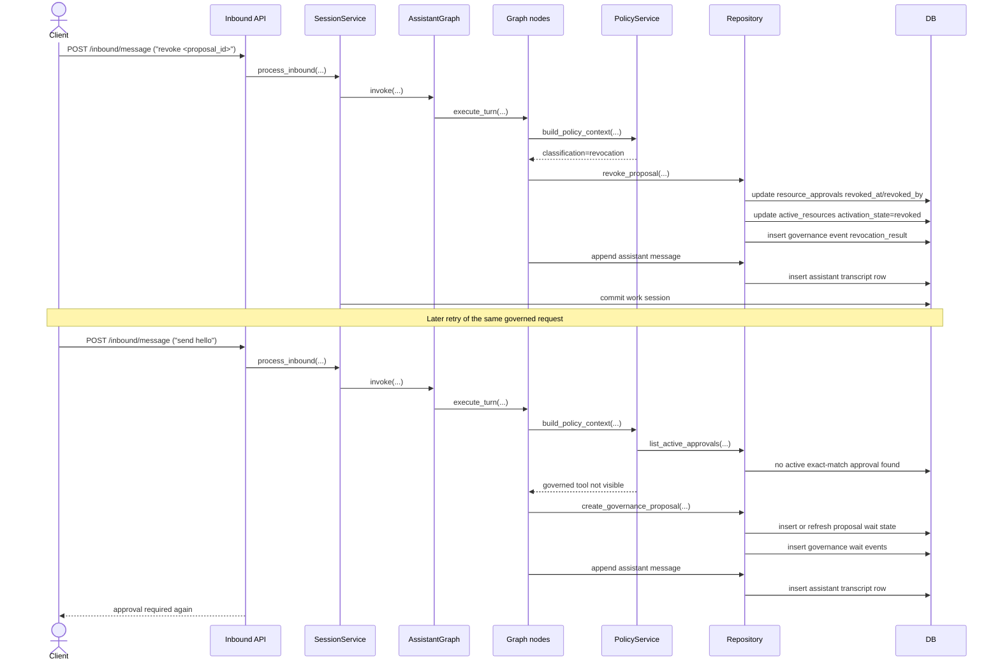

# Spec 003 Sequence Diagrams

These diagrams show the runtime after Specs 001, 002, and 003 are combined.

Spec 001 still owns the canonical inbound session flow.
Spec 002 still owns the single-turn runtime path.
Spec 003 adds approval-aware proposal, approval, activation, execution, and revocation behavior on top of that path.

## 1. Governed Request Creates A Persisted Approval Wait



## 2. Approval Turn Persists Approval And Activates Capability

```mermaid
sequenceDiagram
    actor Client
    participant API as Inbound API
    participant Svc as SessionService
    participant Repo as Repository
    participant Graph as AssistantGraph
    participant Nodes as Graph nodes
    participant Policy as PolicyService
    participant Activate as ActivationController
    participant DB as DB

    Client->>API: POST /inbound/message ("approve <proposal_id>")
    API->>Svc: process_inbound(...)
    Svc->>Graph: invoke(...)
    Graph->>Nodes: execute_turn(...)
    Nodes->>Policy: build_policy_context(...)
    Policy-->>Nodes: classification=approval_decision
    Nodes->>Repo: approve_proposal(...)
    Repo->>DB: insert or reuse resource_approvals row
    Repo->>DB: update resource_proposals to approved
    Repo->>DB: insert governance event approval_decision
    Nodes->>Activate: activate(...)
    Activate->>Repo: activate_approved_resource(...)
    Repo->>DB: insert or reuse active_resources row
    Repo->>DB: insert governance event activation_result
    Nodes->>Repo: append assistant message
    Repo->>DB: insert assistant transcript row
    Svc->>DB: commit work session
    API-->>Client: 201 response confirming approval
```

## 3. Later Retry Executes Governed Tool After Rebinding



## 4. Revocation Blocks Future Use



## 5. Full Combined Lifecycle

```mermaid
sequenceDiagram
    actor User
    participant Gateway as Gateway runtime
    participant Policy as PolicyService
    participant Repo as Repository
    participant Activate as ActivationController
    participant Tool as Governed tool
    participant DB as DB

    User->>Gateway: governed request
    Gateway->>Policy: classify + load approvals
    Policy-->>Gateway: no approval
    Gateway->>Repo: create proposal and approval-request artifacts
    Repo->>DB: proposal/version/governance events
    Gateway-->>User: approval required

    User->>Gateway: approve proposal
    Gateway->>Repo: persist approval
    Repo->>DB: approval row + governance event
    Gateway->>Activate: activate approved resource
    Activate->>DB: active resource + governance event
    Gateway-->>User: approved

    User->>Gateway: retry governed request
    Gateway->>Policy: classify + load approvals
    Policy-->>Gateway: exact approval available
    Gateway->>Tool: execute governed action
    Tool-->>Gateway: result
    Gateway->>Repo: runtime artifacts + transcript
    Repo->>DB: tool artifacts + assistant message

    User->>Gateway: revoke proposal
    Gateway->>Repo: revoke approval and active resource
    Repo->>DB: revoked rows + governance event
    Gateway-->>User: revoked
```

## Notes

- Spec 001’s claim-and-finalize dedupe flow still wraps every inbound message before runtime work begins.
- Spec 002’s runtime artifact and audit behavior still applies after approval exists and governed work is allowed to execute.
- Spec 003 changes the path for governed actions only: missing approval now exits through proposal persistence instead of immediate tool execution.
- Approval and activation are separate persisted steps.
- Revocation affects future turns by removing active approval visibility and execution eligibility.
